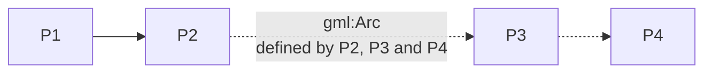
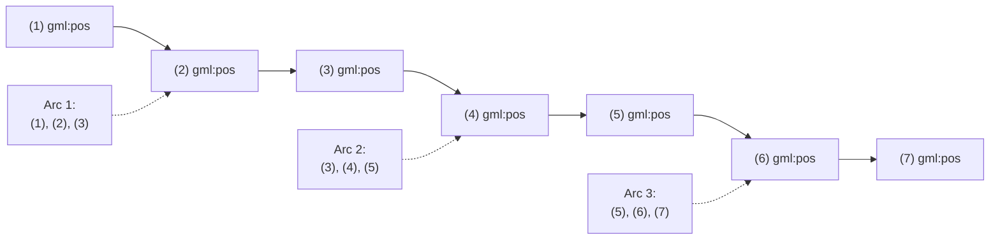

# Arc by Edge

<!--
Source PDF: ACG-ArcbyEdge-280726-0702-29112.pdf

The source wording, GML example, labels, and formula are retained. The two
geometrical figures are represented with Mermaid diagrams and plain-text
descriptions so that Codex and other text-based tools can interpret them.
-->

This is a relatively simple case as it is represented by the element `gml:Arc` in GML, which does not have any ambiguities: 3 points always define a single arc. Unfortunately, this is rarely used in the AI domain.

## Note

When moving towards a fully digital AI chain, the use of this type of arc information should be encouraged and eventually imposed as the unique way for defining arcs.

However, this is not likely to be achieved on short term.

A border that uses arcs by 3 points looks like shown in the figure below:

## Border using an arc defined by three points

### Mermaid representation



The diagram represents:

- a straight border segment from `P1` to `P2`;
- a circular arc from `P2` through `P3` to `P4`;
- the three control points of the `gml:Arc` are therefore `P2`, `P3`, and `P4`.

### Plain-text representation

```text
                         P3
                      ●
                  .-''  ``-.
              .-''          ``-.
          P2 ●                  ● P4
             \
              \
               \
                ● P1

Straight segment: P1 -> P2
Three-point circular arc: P2 -> P3 -> P4
```

A GML encoding example for this type of arcs is provided below.

```xml
...
<gml:PolygonPatch>
    <gml:exterior>
        <gml:Ring gml:id="...">
            ...
            <gml:curveMember>
                <gml:Curve gml:id="...">
                    <gml:segments>
                        <gml:Arc gml:id="...">
                            <gml:pos>P2</gml:pos>
                            <gml:pos>P3</gml:pos>
                            <gml:pos>P4</gml:pos>
                        </gml:Arc>
                    </gml:segments>
                </gml:Curve>
            </gml:curveMember>
...
```

In fact, this is a particular case of the more general GML concept of “ArcString”², which is a curve segment that uses three-point circular arc interpolation in a piecewise fashion to “string” the arc segments together. The number of control points in the string is `(2 x numArc)+1`, where `numArc` is the property defining the number of the arcs in the string, such as shown in the figure below:

## ArcString control-point structure

### Mermaid representation



### Control-point interpretation

For the source example:

```text
numArc = 3
No pos = 2 x numArc + 1 = 7
```

The three circular arc segments share their end/start control points:

```text
Arc 1: positions (1), (2), (3)
Arc 2: positions (3), (4), (5)
Arc 3: positions (5), (6), (7)

Ordered ArcString:
(1) -> (2) -> (3) -> (4) -> (5) -> (6) -> (7)
```

Thus, for an `ArcString` containing `numArc` circular arcs:

```text
numberOfControlPoints = (2 * numArc) + 1
```
