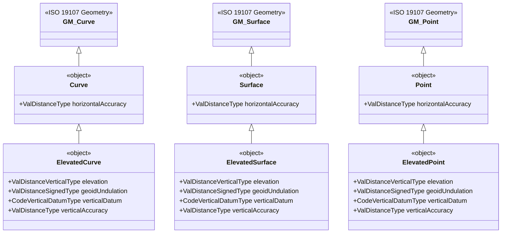
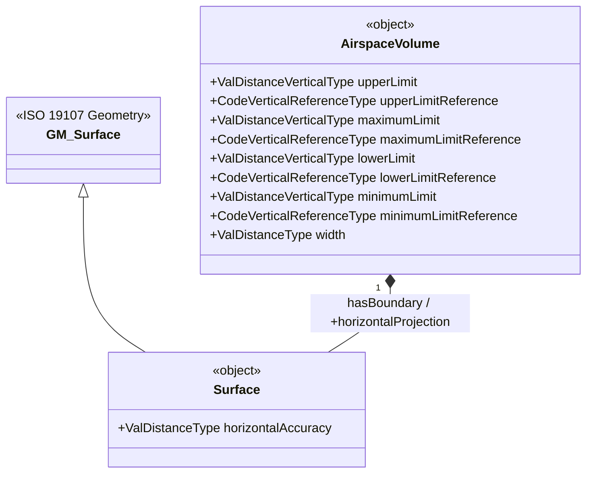

# Geometry

<!--
Source PDF: ACG-Geometry.pdf

The source text, terminology, XML declarations, class names, properties, and
child-page list are retained. The UML diagrams on page 2 are represented as
Mermaid class diagrams so that Codex and other text-based tools can read their
structure directly.
-->

AIXM uses the OGC Geographical Markup Language (GML) version 3.2.1 for the encoding of positional and shape data of aeronautical information items, such as airspace, runway thresholds, navaids, etc.

GML is an implementation of the ISO 19107 spatial schema, which contains an extensive list of geometries, geometric properties and operations. Many of these are not necessary for aeronautical information applications. Therefore, a profile of GML is actually defined for aviation data in the OGC document 12-028r1.

> OGC 12-028r1, Use of Geography Markup Language (GML) for Aviation Data, Publication Date: 2016-03-24

The sub-pages of this section contain the coding guidelines for the geometrical elements in an AIXM 5 data set. The baseline for the content of these pages was the OGC 12-028r1 document. The GML profile definition was not incorporated into the coding guidelines but will remain in the OGC document.

## Declaration of the GML profile

For a particular AIXM data set, conformance with the GML profile shall be declared through the inclusion of the following annotation in the AIXM Schema file. Because the GML Profile schema was moved from the AIXM web site to the OGC web site, this declaration is different between AIXM 5.1 and AIXM 5.1.1, as indicated below.

### AIXM 5.1 - GML Profile declaration

```xml
<annotation>
  <appinfo>
    <gml:gmlProfileSchema>http://www.aixm.aero/schema/GML_profile/gml321forAIXM.xsd</gml:gmlProfileSchema>
  </appinfo>
</annotation>
```

### AIXM 5.1.1 - GML Profile declaration

```xml
<annotation>
  <appinfo>
    <gml:gmlProfileSchema>http://external.schemas.opengis.net/gmlAIXMProfile/1.1/gml321forAIXM.xsd</gml:gmlProfileSchema>
  </appinfo>
</annotation>
```

## AIXM Model Overview

The geometry package of the AIXM 5.1(.1) conceptual model (UML) contains the definition of the classes that model general geometrical aspects. These classes are based on the ISO 19107 Spatial schema.

3D geometries are represented as 2D projections with additional AIXM feature properties specifying the vertical dimension, such as elevation, geoid undulation, vertical datum, upper and lower limit, upper and lower limit reference. This approach is also known as "2.5D", since the vertical dimensions/positions are actually represented as feature properties, not as genuine geometrical elements. This is mainly due to the fact that pressure-based references (such as flight levels) and geoid-based references (altitude above means sea level) are used in the definition of airspace, routes, procedures, etc.

Additional AIXM feature properties are provided for accuracy (horizontal and vertical).

### General AIXM geometry classes



### Surface and AirspaceVolume relationship



In addition, AIXM 5.1(.1) also augments the ISO 1907 geometries with additional geometrical concepts specific to the aeronautical information domain, such as Bearings, Distances from Significant Points, Airspace aggregation etc.

## Child Pages

- Coordinate Reference System
- Point
- Curve (Line) and Surface
- Circle by Center Point
- Point reference (pointProperty)
- Perimeter Encoding Direction
- Corridor
- Other Geometries
- Considerations about Interpolations
