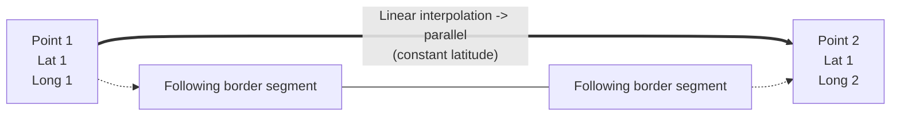

# Parallels

<!--
Source PDF: ACG-Parallels-280726-0605-29092.pdf

The source wording and terminology are retained. The geographical interpolation
figure is represented both as a Mermaid diagram and as a plain-text coordinate
sketch so that it remains readable by Codex and other text-only tools.
-->

In the AI domain, if an Airspace border has two consecutive points at the same geographical latitude, it is assumed that the line between the two points is “along the parallel”. This shall be encoded in AIXM/GML using “linear” GML elements in combination with a geodetic CRS, such as EPSG:4326. The linear interpolation in a 2D geodetic CRS between two points that have the same latitude corresponds to a parallel on the Earth’s surface. This is shown in the figure below:

## Linear interpolation along a parallel

### Mermaid representation



### Plain-text coordinate representation

```text
Latitude axis (NORTH)
        ^
        |
        |          Point 1                         Point 2
        |          Lat 1                           Lat 1
        |          Long 1                          Long 2
        |             ●===============================●
        |                Linear interpolation
        |                     -> parallel
        |                  \                       /
        |                   \____             ____/
        |                        \___________/
        |
        +----------------------------------------------------> Longitude axis
```

The upper segment connects two points whose latitude values are both `Lat 1`. With the geodetic CRS `EPSG:4326`, linear interpolation between these points represents a parallel on the Earth’s surface.

## Note

The current GML 3.2.1 does not allow general “rhumbline” (constant angle with the meridians) interpolations to be specified directly (e.g. using a `RhumbLine` element or a “rhumbline” interpolation). However, linear interpolations in certain conformal projections do correspond to rhumblines on the ellipsoid Earth model.

For example, a `LineStringSegment` with two coordinates (i.e. a line segment with begin and end point) may be used with a `srsName` that references a Mercator projection (e.g. EPSG:3395), which is a well supported conformal projection. Note that the `LineStringSegment` element implies that linear interpolation must be used and `srsName = "urn:ogc:def:crs:EPSG::3395"` implies that the interpolation is done in the Mercator projection plane. Hence this geometry gets realized as a rhumbline on the WGS84 ellipsoid Earth model. Other conformal stereographic and conical projections can also be used to represent rhumblines on the earth ellipsoid model of WGS84 (this may be useful for regions of interest near the poles).

In conclusion:

- in the classical aeronautical information case of two consecutive points having the same latitude, a `gml:LineStringSegment` with "default" CRS EPSG:4326 shall be used for encoding. This is the case for most Airspace data published by States.
- in the particular case where one wants to express a rhumbline whereas the two consecutive latitudes are different, a `gml:LineStringSegment` with a "Mercator" CRS like EPSG:3395 may be used. However, this is a theoretical discussion since no real world aeronautical data like is known to require the use of arbitrary rhumblines.

## Note

If `srsName = EPSG:3395` is specified for the line and nothing is specified for the points defining the line then the inheritance rule applies. The points shall be expressed in the EPSG:3395 coordinates which are meters in the Mercator projection.
