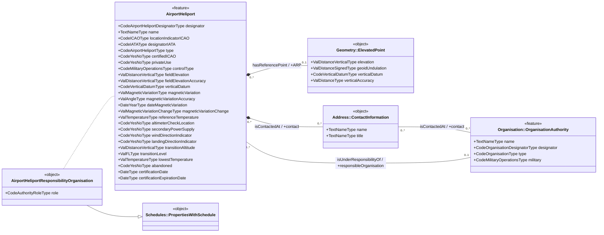

# Point

<!--
Source PDF: ACG-Point.pdf

The source text and the content of the combined XML/UML figure are represented
below in a text-readable form. The XML fragments preserve the values visible in
the source figure. The structure diagram is converted to Mermaid class-diagram
syntax, with an additional plain-text relationship summary for tools that do not
render Mermaid.
-->

A Point is a simple position to indicate the geographical location, e.g. of an airport reference point (ARP), navaid, waypoint, runway threshold, etc.

It is basically a pair of latitude/longitude coordinates.

In AIXM 5.1, simple positions are encoded using the `Point` or `ElevatedPoint` elements, which are extensions of the `gml:Point`:

For the `ElevatedPoint` class, also `elevation` may be specified (e.g. Elevation of the ARP or DME Antenna).

The pairs of lat/long coordinates are coded by using the `gml:pos` element.

The figure below gives an example of the encoding of an aerodrome reference point.

In this example the ARP element does not have a `srsName` defined. The CRS is defined on on a higher level, the `AIXMBasicMessage`, using the `gml:Envelope` element (see page Coordinate Reference System for more details about the usage of the `srsName`).

## Example: encoding of an aerodrome reference point

The original figure combines:

1. an `AirportHeliportTimeSlice` XML fragment;
2. the `ARP` property encoded as an `ElevatedPoint`;
3. a message-level `gml:Envelope` containing the CRS declaration;
4. a UML structure diagram showing the relevant AIXM classes and associations.

### AirportHeliportTimeSlice fragment

```xml
<aixm:AirportHeliportTimeSlice gml:id="ahts1EADD">
    <gml:validTime>
        <gml:TimePeriod gml:id="vtEADH1">
            <gml:beginPosition>2009-01-01T00:00:00.000</gml:beginPosition>
            <gml:endPosition indeterminatePosition="unknown"/>
        </gml:TimePeriod>
    </gml:validTime>
    <aixm:interpretation>BASELINE</aixm:interpretation>
    <aixm:sequenceNumber>1</aixm:sequenceNumber>
    <aixm:correctionNumber>0</aixm:correctionNumber>
    <aixm:featureLifetime>
        <gml:TimePeriod gml:id="ltEADH1">
            <gml:beginPosition>2009-01-01T00:00:00.000</gml:beginPosition>
            <gml:endPosition indeterminatePosition="unknown"/>
        </gml:TimePeriod>
    </aixm:featureLifetime>
    <aixm:designator>EADD</aixm:designator>
    <aixm:name>DONLON</aixm:name>
```

### ARP encoded as an ElevatedPoint

```xml
<aixm:ARP>
    <aixm:ElevatedPoint gml:id="elpoint1EADD">
        <gml:pos>52.388333333333335 -31.949444444444445</gml:pos>
        <aixm:elevation uom="M">30.0</aixm:elevation>
    </aixm:ElevatedPoint>
</aixm:ARP>
```

### CRS declared at AIXMBasicMessage level

The source figure shows the following partial message fragment:

```xml
<message:AIXMBasicMessage
    xmlns:message="http://www.aixm.aero/schema/5.1/message"
    xmlns:aixm="http://www.aixm.aero/schema/5.1"
    xmlns:gml="http://www.opengis.net/gml/3.2"
    xmlns:xlink="http://www.w3.org/1999/xlink"
    xmlns:gmd="http://www.isotc211.org/2005/gmd"
    xmlns:gco="http://www.isotc211.org/2005/gco"
    xmlns:xsi="http://www.w3.org/2001/XMLSchema-instance"
    xsi:schemaLocation="http://www.aixm.aero/schema/5.1/message http://www.aixm.aero/schema/5.1/message/AIXM_BasicMessage.xsd"
    gml:id="uniqueid">
    <gml:boundedBy>
        <gml:Envelope srsName="urn:ogc:def:crs:EPSG::4326">
            <gml:lowerCorner>52.26933333333332 -32.21522162567984</gml:lowerCorner>
            <gml:upperCorner>52.29638464616918 -32.546517283367514</gml:upperCorner>
        </gml:Envelope>
```

## AIXM structure diagram

### Mermaid representation



### Plain-text structure representation

```text
AirportHeliport
├─ +ARP: ElevatedPoint [0..1]
│  ├─ elevation: ValDistanceVerticalType
│  ├─ geoidUndulation: ValDistanceSignedType
│  ├─ verticalDatum: CodeVerticalDatumType
│  └─ verticalAccuracy: ValDistanceType
├─ +contact: Address::ContactInformation [0..*]
│  ├─ name: TextNameType
│  └─ title: TextNameType
├─ +responsibleOrganisation: Organisation::OrganisationAuthority [0..1]
│  ├─ name: TextNameType
│  ├─ designator: CodeOrganisationDesignatorType
│  ├─ type: CodeOrganisationType
│  └─ military: CodeMilitaryOperationsType
└─ AirportHeliportResponsibilityOrganisation
   ├─ role: CodeAuthorityRoleType
   └─ specialises Schedules::PropertiesWithSchedule
```

The highlighted relationship in the source figure is the `AirportHeliport.ARP` association to `Geometry::ElevatedPoint`. The XML fragment implements that relationship with the `aixm:ARP` property containing an `aixm:ElevatedPoint`.
