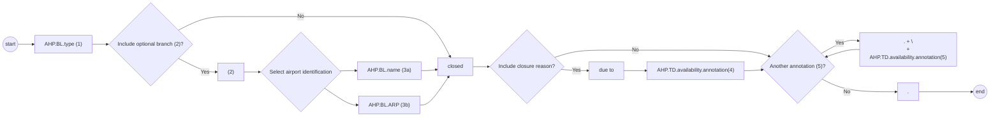
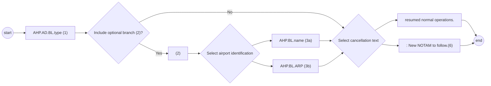

# [2.0] [AD.CLS] Aerodrome/Heliport - closure (NOTAM)

## Text NOTAM production rules

This section provides rules for the automated production of the text NOTAM message items, based on the AIXM 5.1.1 data encoding of the Event. Therefore, AIXM specific terms are used, such as names of features and properties, types of TimeSlices, etc:

- the abbreviation **AHP.BL.** indicates that the corresponding data item must be taken from the valid **BASELINE** of the **AirportHeliport** on which the Event occurs;
- the abbreviation **AHP.TD.** indicates that the corresponding data item must be taken from the **AirportHeliport TEMPDELTA** that was created for the Event.

> **Note:** According to encoding rule ER-02 the **TEMPDELTA** might also include **AirportHeliportAvailability** elements that have been copied from the **BASELINE** data for compliance with the AIXM Temporality rules. The current practice is to not include such static information in the NOTAM text. Therefore, all **AirportHeliportAvailability** that have `operationalStatus='NORMAL'` will be ignored for NOTAM generation.

## Item A

The item A shall be generated according to the general production rules for item A using the `Event.concernedAirportHeliport`,

## Item Q

Apply the common NOTAM production rules for item Q, complemented by the following specific rules for this particular scenario:

### Q code

The following mapping shall be used:

| AHP.BL.type | Corresponding Q code |
|---|---|
| any other value than ”HP” | QFALC |
| HP | QFPLC |

### Scope

Insert the value ‘A’.

### Lower limit / Upper limit

Use “000/999”

### Geographical reference

Insert the coordinate of the ARP (aerodrome reference point) of the airport, formatted as follows:

- the set of coordinates comprises 11 characters rounded up or down to the nearest minute; i.e. Latitude (N/S) in 5 characters; Longitude (E/W) in 6 characters;
- the radius value is “005”.

## Items B, C and D

Items B and C shall be decoded following the common production rules.

If at least one `AHP.TD.availability.AirportHeliportAvailability.timeInterval` exists (the Event has an associated schedule), then it shall be represented in item D according to the common NOTAM production rules for Item D, E - Schedules. Otherwise, item D shall be left empty.

## Item E

The following pattern should be used for automatically generating the E field text from the AIXM data:

### Original syntax diagram


### Machine-readable Mermaid representation



Railroad-style textual equivalent:

```text
AHP.BL.type (1)
  -> [ (2) -> ( AHP.BL.name (3a) | AHP.BL.ARP (3b) ) ]
  -> closed
  -> [ due to -> AHP.TD.availability.annotation(4) ]
  -> { "." -> "\n" -> AHP.TD.availability.annotation(5) }
  -> "."
```

### EBNF Code

```ebnf
template = "AHP.BL.type (1)" ["(2)" ("AHP.BL.name (3a)" | "AHP.BL.ARP (3b)")] "closed" ["due to" "AHP.TD.availability.annotation(4)"] \n
{"." "\n" "AHP.TD.availability.annotation(5)"} ".".
```

### Reference rules

#### (1)

Insert here the type of the airport decoded as follows

| AHP.BL.type | Text to be inserted in Item E |
|---|---|
| AD or AH | "AD" |
| HP | "Heliport" |
| LS or OTHER | "Landing site" |

#### (2)

If `AHP.BL.locationIndicatorICAO` is not null, then ignore this branch.

#### (3) - name

(a) If `AHP.BL.name` is not null, then insert it here. (b) Otherwise, insert here the text "located at" followed by the `AHP.BL.ARP.ElevatedPoint` decoded according to the text NOTAM production rules for `aixm:Point`

#### (4) - closure reason

If there exists a `AHP.TD.availability.annotation` having `propertyName='operationalStatus'` and `purpose='REMARK'` (the reason for closure, according to the coding rules), then translate it into free text according to the decoding rules for annotations.

#### (5) - note

Annotations of `AHP.TD.AirportHeliportAvailability` shall be translated into free text according to the decoding rules for annotations.

> **Note:** The objective is to full automatic generation, without human intervention. However, the implementers of the specification might consider reducing the cost of a fully automated generation by allowing the operator to fine-tune the text in order to improve its readability (with the inherent risk for human error, when re-typing is allowed).

## Items F & G

Leave empty.

## Event Update

The eventual update of this type of event shall be encoded following the general rules for Event updates or cancellation, which provide instructions for all NOTAM fields, except for item E and the condition part of the Q code, in the case of a NOTAM C.

**If a NOTAM C is produced**, then the 4th and 5th letters (the "condition") of the Q code shall be "AK", except for the situation of a “new NOTAM to follow", in which case “XX” shall be used.

The following pattern should be used for automatically generating the E field text from the AIXM data:

### Original cancellation syntax diagram


### Machine-readable Mermaid representation



Railroad-style textual equivalent:

```text
AHP.AD.BL.type (1)
  -> [ (2) -> ( AHP.BL.name (3a) | AHP.BL.ARP (3b) ) ]
  -> ( "resumed normal operations." | ": New NOTAM to follow.(6)" )
```

### EBNF Code

```ebnf
template_cancel = "AHP.AD.BL.type (1)" ["(2)" ("AHP.BL.name (3a)" | "AHP.BL.ARP (3b)")] ("resumed normal operations." | ": New NOTAM to follow.(6)").
```

### Reference rule

#### (6)

If the NOTAM will be followed by a new NOTAM concerning the same situation, then the operator shall have the possibility to choose the "New NOTAM to follow" branch. This branch cannot be selected automatically because this information is only known by the operator.

Note: in this case, the 4th and 5th letters of the Q code shall also be changed into “XX”.
