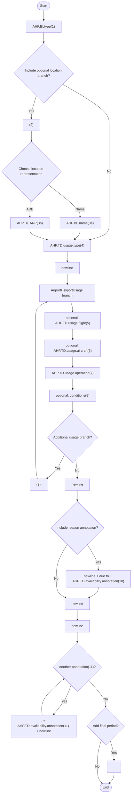
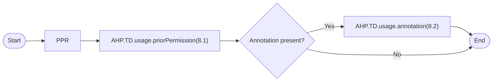
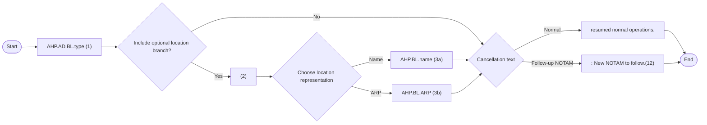

# [2.0] [AD.LIM] Aerodrome/Heliport - limitation (NOTAM)

## Text NOTAM production rules

This section provides rules for the automated production of the text NOTAM message items, based on the AIXM 5.1.1 data encoding of the Event. Therefore, AIXM specific terms are used, such as names of features and properties, types of TimeSlices, etc:

- the abbreviation **AHP.BL.** indicates that the corresponding data item must be taken from the **AirportHeliport BASELINE**;
- the abbreviation **AHP.TD.** indicates that the corresponding data item must be taken from the **AirportHeliport TEMPDELTA** that was created for the Event.

> **Note:** According to encoding rule ER-02 the TEMPDELTA might also include AirportHeliportAvailability elements that have been copied from the BASELINE data for compliance with the AIXM Temporality rules. The current practice is to not include such static information in the NOTAM text. Therefore, all AirportHeliportAvailability that have operationalStatus=NORMAL will be ignored for the NOTAM generation.

## Item A

The item A shall be generated according to the general [production rules for item A](https://ext.eurocontrol.int/aixm_confluence/display/DNOTAM/Item+A) using the **Event.concernedAirportHeliport**,

## Item Q

Apply the common NOTAM production rules for item Q, complemented by the following specific rules for this particular scenario:

### Q code

The following mapping shall be used:

> **Note:** In this table, *"any" means "any value or no value (NIL)"*.

| `AHP.TD.availability.AirportHeliportAvailability.timeInterval` | `usage.AirportHeliportUsage.type` | `usage.AirportHeliportUsage.operation` | `usage.AirportHeliportUsage.priorPermission` | `../FlightCharacteristics` | `../AircraftCharacteristics` | Corresponding Q code: `AHP.BL.type` different from `'HP'` | Corresponding Q code: `AHP.BL.type` = `'HP'` |
|---|---|---|---|---|---|---|---|
| not NIL | `'PERMIT'` | `'ALL'` | NIL | NIL | NIL | `QFAAH` | `QFPAH` |
| any | `'RESERVE'` | any | any | only `military='MIL'` | any | `QFAAM` | `QFPAM` |
| any | `'CONDITIONAL'` | any | not NIL | any | any | `QFAAP` | `QFPAP` |
| any | `'PERMIT'` | any | NIL | any | any | `QFAAR` | `QFPAR` |
| any | `'RESERVE'` | any | any | only `origin='HOME_BASED'` | any | `QFALB` | `QFPLB` |
| any | `'FORBID'` | any | any | any | `weight` not NIL | `QFALH` | `QFPLT` |
| any | `'FORBID'` | any | any | `rule = 'IFR'` | any | `QFALI` | `QFPLI` |
| any | `'FORBID'` | any | any | `rule = 'VFR'` | any | `QFALV` | `QFPLV` |
| any other combination |  |  |  |  |  | `QFALT` | `QFPLT` |

### Scope

Insert the value ‘A’.

### Lower limit / Upper limit

Use “000/999”

### Geographical reference

Insert the coordinate of the ARP (aerodrome reference point) of the airport, formatted as follows:

- the set of coordinates comprises 11 characters rounded up or down to the nearest minute; i.e. Latitude (N/S) in 5 characters; Longitude (E/W) in 6 characters;
- the radius value is “005”.

## Items B, C and D

Items B and C shall be decoded following the common production rules.

If at least one `AHP.TD.availability.AirportHeliportAvailability.timeInterval` exists (the Event has an associated schedule), then it shall be represented in item D according to the common NOTAM production rules for `{{Item D, E - Schedules}}`. Otherwise, item D shall be left empty.

## Item E

The following pattern should be used for automatically generating the E field text from the AIXM data:

### `template` diagram - Mermaid representation



### `template` diagram - plain-text structure

```text
AHP.BLtype(1)
[ (2) ( AHP.BL.name(3a) | AHP.BL.ARP(3b) ) ]
AHP.TD.usage.type(4)
NEWLINE

(
  [AHP.TD.usage.flight(5)]
  [AHP.TD.usage.aircraft(6)]
  AHP.TD.usage.operation(7)
  [conditions(8)]
)
{
  (9) ","
  (
    [AHP.TD.usage.flight(5)]
    [AHP.TD.usage.aircraft(6)]
    AHP.TD.usage.operation(7)
    [conditions(8)]
  )
}
NEWLINE

[ NEWLINE "due to" AHP.TD.availability.annotation(10) ]
NEWLINE
NEWLINE
{ "." AHP.TD.availability.annotation(11) NEWLINE }
[ "." ]
```

### EBNF Code

```ebnf
template = "AHP.BLtype(1)" ["(2)" ("AHP.BL.name(3a)" | "AHP.BL.ARP(3b)")] "AHP.TD.usage.type(4)" \n
(["AHP.TD.usage.flight(5)"] ["AHP.TD.usage.aircraft(6)"] "AHP.TD.usage.operation(7)" ["conditions(8)"]) {
"(9)" "," (["AHP.TD.usage.flight(5)"] ["AHP.TD.usage.aircraft(6)"] "AHP.TD.usage.operation(7)" ["conditions(8)"])} \n.

template_bottom = ["\n" "due to" "AHP.TD.availability.annotation(10)"] "\n" \n
{"." "AHP.TD.availability.annotation(11)" "\n"} ["."].
```

### Reference rules

#### (1)

Insert here the type of the airport decoded as follows

| `AHP.BL.type` | Text to be inserted in Item E |
|---|---|
| AD or AH | "AD" |
| HP | "Heliport" |
| LS or OTHER | "Landing site" |

#### (2)

If `AHP.BL.locationIndicatorICAO` is not null, then ignore this branch.

#### (3) - name

(a) If `AHP.BL.name` is not null, then insert it here. (b) Otherwise, insert here the text "located at" followed by the `AHP.BL.ARP`. ElevatedPoint decoded according to the text NOTAM production rules for `aixm:Point`

#### (4) - conditional for / closed, except for / prohibited for / additionally allowed for

Insert here `AHP.TD.availability.AirportHeliportAvailability.usage.AirportHeliportUsage` as follows:

| type | Text to be inserted in item E |
|---|---|
| `"CONDITIONAL"` | "available for" |
| `"RESERV"` | "closed, except for" |
| `"FORBID"` | "prohibited for" |
| `"PERMIT"` | "now available for" |

#### (5) - flight

Decode here each FlightCharacteristics property that was specified, as detailed below. If more than one FlightCharacteristics property was used, insert a blank space between consecutive properties.

##### FlightCharacteristics.type

| `FlightCharacteristics.type*` | Text to be inserted in Item E |
|---|---|
| OAT | "Operational Air Traffic" |
| GAT | "General Air Traffic" |
| ALL | "Operational Air Traffic/General Air Traffic" |
| OTHER:MY_TEXT | "my text" (replace "_" with blanks and convert to lowercase) |

> **\*Note:** type is unlikely to be used in a NOTAM, its decoding is provided for completeness sake.

##### FlightCharacteristics.rule

| `FlightCharacteristics.rule` | Text to be inserted in Item E |
|---|---|
| IFR | "IFR" |
| VFR | "VFR" |
| ALL* | "IFR/VFR" |
| OTHER:MY_TEXT* | "my text" (replace "_" with blanks and convert to lowercase) |

> **\*Note:** value is unlikely to be used in a NOTAM, its decoding is provided for completeness sake.

##### FlightCharacteristics.status

| `FlightCharacteristics.status` | Text to be inserted in Item E |
|---|---|
| HEAD | "Head of State” |
| STATE | "State acft" |
| HUM | "HUM" |
| HOSP | "HOSP" |
| SAR | "SAR" |
| EMERGENCY* | "EMERG" |
| ALL | "State acft/HUM/HOSP/SAR/EMERG" |
| OTHER:MEDEVAC | “MEDEVAC” |
| OTHER:FIRE_FIGHTING | ‘fire fighting” |
| OTHER:MY_TEXT | "my text" (replace "_" with blanks and convert to lowercase) |

> **\*Note:** value is unlikely to be used in a NOTAM, its decoding is provided for completeness sake.

##### FlightCharacteristics.military

| `FlightCharacteristics.military` | Text to be inserted in Item E |
|---|---|
| MIL | “MIL acft" |
| CIVIL | "civil acft" |
| ALL* | "civil/MIL acft" |
| OTHER:MY_TEXT* | "my text" (replace "_" with blanks and convert to lowercase) |

##### FlightCharacteristics.origin

| `FlightCharacteristics.origin` | Text to be inserted in Item E |
|---|---|
| NTL | "domestic" |
| INTL | "intl" |
| HOME_BASED | "home based" |
| ALL* | "domestic/international" |
| OTHER:MY_TEXT* | "my text" (replace "_" with blanks and convert to lowercase) |

##### FlightCharacteristics.purpose

| `FlightCharacteristics.purpose` | Text to be inserted in Item E |
|---|---|
| SCHEDULED | "scheduled" |
| NON_SCHEDULED* | "not scheduled" |
| PRIVATE* | "private" |
| AIR_TRAINING* | "training" |
| AIR_WORK* | "aerial work" |
| PARTICIPANT | "participating acft" |
| ALL | "scheduled/not scheduled/private/training/aerial work/participating acft" |
| OTHER:MY_TEXT | "my text" (replace "_" with blanks) |

> **\*Note:** value is unlikely to be used in a NOTAM, its decoding is provided for completeness sake.

#### (6) - aircraft

Decode here each AircraftCharacteristics property that was specified, as detailed below. If more than one AircraftCharacteristics property was used, insert a blank space between consecutive properties.

##### AircraftCharacteristics.type

| `AircraftCharacteristics.type` | Text to be inserted in Item E |
|---|---|
| LANDPLANE | "landplanes" |
| SEAPLANE | "seaplanes" |
| AMPHIBIAN | "amphibians" |
| HELICOPTER | "hel" |
| GYROCOPTER | "gyrocopters" |
| TILT_WING | "tilt wing acft" |
| STOL | "short take-off and landing acft" |
| GLIDER | "gliders" |
| HANGGLIDER* | "hang-gliders" |
| PARAGLIDER* | "paragliders" |
| ULTRA_LIGHT* | "ultra lights" |
| BALLOON* | "balloons" |
| UAV* | "unmanned acft " |
| ALL | "all acft types" |
| OTHER:MY_TEXT | "my text" (replace "_" with blanks) |

> **\*Note:** value is unlikely to be used in a NOTAM, its decoding is provided for completeness sake.

##### AircraftCharacteristics.engine

| `AircraftCharacteristics.engine` | Text to be inserted in Item E |
|---|---|
| JET | "jet acft" |
| PISTON | "piston acft" |
| TURBOPROP | "turboprop acft" |
| ELECTRIC** | “electric engine acft” |
| ALL | "all engine types" |
| OTHER:MY_TEXT | "my text" (replace "_" with blanks) |

> **\*\*Note:** new in AIXM 5.1.1.

##### AircraftCharacteristics.wingSpan

`AircraftCharacteristics.wingSpan` - insert the value followed by the value of the `uom` attribute. Prefix with the value of `AircraftCharacteristics.wingSpanInterpretation`, decoded as indicated in the following table:

| `AircraftCharacteristics.wingSpanInterpretation` | Text to be inserted in Item E |
|---|---|
| ABOVE | "acft with wingspan more than" |
| AT_OR_ABOVE | "acft with wingspan equal to or more than |
| AT_OR_BELOW | "acft with wingspan equal to or less than" |
| BELOW | "acft with wingspan less than” |
| OTHER:MY_TEXT | "my text" (replace "_" with blanks) |

##### AircraftCharacteristics.weight

`AircraftCharacteristics.weight` - insert the value followed by the value of the `uom` attribute. Prefix with the value of `AircraftCharacteristics.weightInterpretation`, decoded as indicated in the following table:

| `AircraftCharacteristics.weightInterpretation` | Text to be inserted in Item E |
|---|---|
| ABOVE | "acft mass heavier than" |
| AT_OR_ABOVE | "acft mass equal to or heavier than" |
| AT_OR_BELOW | "acft mass equal to or lighter than” |
| BELOW | "acft mass lighter than" |
| OTHER:MY_TEXT* | "my text" (replace "_" with blanks) |

#### (7) - operation

Decode here the `AHP.TD.availability.usage.operation` as follows:

| `AHP.TD.usage.operation` | Text to be inserted in Item E |
|---|---|
| LANDING | "landing" |
| TAKEOFF* | "take-off" |
| TOUCHGO | "touch and go" |
| TRAIN_APPROACH | "practice of low approaches" |
| ALTN_LANDING | "alternate" |
| AIRSHOW | "acft participating in air display" |
| ALL | "flights" |
| OTHER:MY_TEXT | "my text" (replace "_" with blanks and convert to lowercase) |

> **\* Note:** value is unlikely to be used in a NOTAM, its decoding is provided for completeness sake.

#### (8) - PPR time / PPR details

If `AHP.TD.usage.priorPermission` is not NIL, then insert here the decoding of the PPR information as detailed in the following diagram:

##### `template_PPR` diagram - Mermaid representation



##### `template_PPR` diagram - plain-text structure

```text
"PPR "
AHP.TD.usage.priorPermission(8.1)
[ AHP.TD.usage.annotation(8.2) ]
```

##### EBNF Code

```ebnf
template_PPR = "PPR " "AHP.TD.usage.priorPermission(8.1)" ["AHP.TD.usage.annotation(8.2)"].
```

##### (8.1)

Insert here the value of the `priorPermission` attribute followed by the value of the `uom` attribute decoded as follows:

| uom value | Text to be inserted in Item E |
|---|---|
| HR | "HR" |
| MIN | "min" |
| SEC | "sec" |
| OTHER:MY_TEXT | "my text" (replace "_" with blanks and convert to lowercase) |

##### (8.2)

Decode here the annotation with `propertyName="priorPermission"` and `purpose="REMARK"`, according to the decoding rules for annotations.

#### (9)

If more than one `AHD.TD.availability.AirportHeliportAvailability.usage` element is present, then select and decode the additional AirportHeliportUsage branch consecutively.

#### (10) - reason

If there exists a `AHP.TD.availability.annotation` having `propertyName="operationalStatus"` and `purpose="REMARK"` (the reason for closure, according to the coding rules), then translate it into free text according to the decoding rules for annotations.

#### (11) - note

Annotations of `AHP.TD.AirportHeliportAvailability` shall be translated into free text according to the decoding rules for annotations.

> **Note:** The objective is to full automatic generation, without human intervention. However, the implementers of the specification might consider reducing the cost of a fully automated generation by allowing the operator to fine-tune the text in order to improve its readability (with the inherent risk for human error, when re-typing is allowed).

## Items F & G

Leave empty.

## Event Update

The eventual update of this type of event shall be encoded following the general rules for [Event update or cancellation](https://ext.eurocontrol.int/aixm_confluence/display/DNOTAM/Event+update+or+cancellation), which provide instructions for all NOTAM fields, except for item E and the condition part of the Q code, in the case of a NOTAM C.

**If a NOTAM C is produced**, then the 4th and 5th letters (the "condition") of the Q code shall be "AK", except for the situation of a “new NOTAM to follow", in which case “XX” shall be used.

The following pattern should be used for automatically generating the E field text from the AIXM data:

### `template_cancel` diagram - Mermaid representation



### `template_cancel` diagram - plain-text structure

```text
AHP.AD.BL.type (1)
[ (2) ( AHP.BL.name (3a) | AHP.BL.ARP (3b) ) ]
(
  "resumed normal operations."
  |
  " : New NOTAM to follow.(12)"
)
```

### EBNF Code

```ebnf
template_cancel = "AHP.AD.BL.type (1)" ["(2)" ("AHP.BL.name (3a)" | "AHP.BL.ARP (3b)")] ("resumed normal
operations." | " : New NOTAM to follow.(12)").
```

### Reference rule

#### (12)

If the NOTAM will be followed by a new NOTAM concerning the same situation, then the operator shall have the possibility to choose the "New NOTAM to follow" branch. This branch cannot be selected automatically because this information is only known by the operator.

> **Note:** in this case, the 4th and 5th letters of the Q code shall also be changed into “XX”.
