```mermaid
flowchart LR
    START([template_deactivation]) --> TYPE["ASE.BL.type(1)"]
    TYPE --> NAME1["ASE.BL.name(2)"]

    NAME1 --> DESIGNATOR1_Q{"ASE.BL.designator?"}
    DESIGNATOR1_Q -->|included| DESIGNATOR1["ASE.BL.designator"]
    DESIGNATOR1_Q -->|omitted| CLASS1_Q{"class information?"}
    DESIGNATOR1 --> CLASS1_Q

    CLASS1_Q -->|included| OPEN1["("]
    OPEN1 --> CLASS1["class"]
    CLASS1 --> CLASS_VALUE1["ASE.BL.classification(3)"]
    CLASS_VALUE1 --> CLOSE1[")"]
    CLASS1_Q -->|omitted| MORE_Q{"another airspace/sector?"}
    CLOSE1 --> MORE_Q

    MORE_Q -->|yes| SEP["(4)"]
    SEP --> NAME2["ASE.BL.name(2)"]

    NAME2 --> DESIGNATOR2_Q{"ASE.BL.designator?"}
    DESIGNATOR2_Q -->|included| DESIGNATOR2["ASE.BL.designator"]
    DESIGNATOR2_Q -->|omitted| CLASS2_Q{"class information?"}
    DESIGNATOR2 --> CLASS2_Q

    CLASS2_Q -->|included| OPEN2["("]
    OPEN2 --> CLASS2["class"]
    CLASS2 --> CLASS_VALUE2["ASE.BL.classification(3)"]
    CLASS_VALUE2 --> CLOSE2[")"]
    CLASS2_Q -->|omitted| MORE_Q
    CLOSE2 --> MORE_Q

    MORE_Q -->|no| DEACTIVATED["deactivated"]
    DEACTIVATED --> NEWLINE["\\n"]
    NEWLINE --> NOTE_Q{"ASE.TD.annotation(8)?"}
    NOTE_Q -->|included| NOTE["ASE.TD.annotation(8)"]
    NOTE_Q -->|omitted| END_NODE([end])
    NOTE --> END_NODE
```

```mermaid
flowchart LR
    START([template_activation]) --> TYPE["ASE.BL.type(1)"]
    TYPE --> NAME1["ASE.BL.name(2)"]

    NAME1 --> DESIGNATOR1_Q{"ASE.BL.designator?"}
    DESIGNATOR1_Q -->|included| DESIGNATOR1["ASE.BL.designator"]
    DESIGNATOR1_Q -->|omitted| CLASS1_Q{"class information?"}
    DESIGNATOR1 --> CLASS1_Q

    CLASS1_Q -->|included| OPEN1["("]
    OPEN1 --> CLASS1["class"]
    CLASS1 --> CLASS_VALUE1["ASE.BL.classification(3)"]
    CLASS_VALUE1 --> CLOSE1[")"]
    CLASS1_Q -->|omitted| MORE_Q{"another airspace/sector?"}
    CLOSE1 --> MORE_Q

    MORE_Q -->|yes| SEP["(4)"]
    SEP --> NAME2["ASE.BL.name(2)"]

    NAME2 --> DESIGNATOR2_Q{"ASE.BL.designator?"}
    DESIGNATOR2_Q -->|included| DESIGNATOR2["ASE.BL.designator"]
    DESIGNATOR2_Q -->|omitted| CLASS2_Q{"class information?"}
    DESIGNATOR2 --> CLASS2_Q

    CLASS2_Q -->|included| OPEN2["("]
    OPEN2 --> CLASS2["class"]
    CLASS2 --> CLASS_VALUE2["ASE.BL.classification(3)"]
    CLASS_VALUE2 --> CLOSE2[")"]
    CLASS2_Q -->|omitted| MORE_Q
    CLOSE2 --> MORE_Q

    MORE_Q -->|no| MODE_Q{"activation text"}

    MODE_Q -->|unique ACTIVE element| ACTIVATED["activated(5)"]
    ACTIVATED --> NL1["\\n"]
    NL1 --> NOTE_Q{"ASE.TD.annotation(8)?"}

    MODE_Q -->|ACTIVE and INACTIVE elements| AS_FOLLOWS["activated as follows(6):"]
    AS_FOLLOWS --> NL2["\\n"]
    NL2 --> SCHEDULE["schedule(7)"]
    SCHEDULE --> PERIOD["."]
    PERIOD --> NL3["\\n"]
    NL3 --> NOTE_Q

    NOTE_Q -->|included| NOTE["ASE.TD.annotation(8)"]
    NOTE_Q -->|omitted| END_NODE([end])
    NOTE --> END_NODE
```

```mermaid
flowchart LR
    START([template_deactivation_cancel]) --> TYPE["ASE.BL.type(1)"]
    TYPE --> NAME1["ASE.BL.name(2)"]

    NAME1 --> DESIGNATOR1_Q{"ASE.BL.designator?"}
    DESIGNATOR1_Q -->|included| DESIGNATOR1["ASE.BL.designator"]
    DESIGNATOR1_Q -->|omitted| CLASS1_Q{"class information?"}
    DESIGNATOR1 --> CLASS1_Q

    CLASS1_Q -->|included| OPEN1["("]
    OPEN1 --> CLASS1["class"]
    CLASS1 --> CLASS_VALUE1["ASE.BL.classification(3)"]
    CLASS_VALUE1 --> CLOSE1[")"]
    CLASS1_Q -->|omitted| MORE_Q{"another airspace/sector?"}
    CLOSE1 --> MORE_Q

    MORE_Q -->|yes| SEP["(4)"]
    SEP --> NAME2["ASE.BL.name(2)"]

    NAME2 --> DESIGNATOR2_Q{"ASE.BL.designator?"}
    DESIGNATOR2_Q -->|included| DESIGNATOR2["ASE.BL.designator"]
    DESIGNATOR2_Q -->|omitted| CLASS2_Q{"class information?"}
    DESIGNATOR2 --> CLASS2_Q

    CLASS2_Q -->|included| OPEN2["("]
    OPEN2 --> CLASS2["class"]
    CLASS2 --> CLASS_VALUE2["ASE.BL.classification(3)"]
    CLASS_VALUE2 --> CLOSE2[")"]
    CLASS2_Q -->|omitted| MORE_Q
    CLOSE2 --> MORE_Q

    MORE_Q -->|no| RESULT_Q{"cancellation text"}
    RESULT_Q -->|cancel de-activation| CANCELLED["deactivation cancelled."]
    RESULT_Q -->|new NOTAM follows| FOLLOW[": New NOTAM to follow.(9)"]
    CANCELLED --> END_NODE([end])
    FOLLOW --> END_NODE
```

```mermaid
flowchart LR
    START([template_activation_cancel]) --> TYPE["ASE.BL.type(1)"]
    TYPE --> NAME1["ASE.BL.name(2)"]

    NAME1 --> DESIGNATOR1_Q{"ASE.BL.designator?"}
    DESIGNATOR1_Q -->|included| DESIGNATOR1["ASE.BL.designator"]
    DESIGNATOR1_Q -->|omitted| CLASS1_Q{"class information?"}
    DESIGNATOR1 --> CLASS1_Q

    CLASS1_Q -->|included| OPEN1["("]
    OPEN1 --> CLASS1["class"]
    CLASS1 --> CLASS_VALUE1["ASE.BL.classification(3)"]
    CLASS_VALUE1 --> CLOSE1[")"]
    CLASS1_Q -->|omitted| MORE_Q{"another airspace/sector?"}
    CLOSE1 --> MORE_Q

    MORE_Q -->|yes| SEP["(4)"]
    SEP --> NAME2["ASE.BL.name(2)"]

    NAME2 --> DESIGNATOR2_Q{"ASE.BL.designator?"}
    DESIGNATOR2_Q -->|included| DESIGNATOR2["ASE.BL.designator"]
    DESIGNATOR2_Q -->|omitted| CLASS2_Q{"class information?"}
    DESIGNATOR2 --> CLASS2_Q

    CLASS2_Q -->|included| OPEN2["("]
    OPEN2 --> CLASS2["class"]
    CLASS2 --> CLASS_VALUE2["ASE.BL.classification(3)"]
    CLASS_VALUE2 --> CLOSE2[")"]
    CLASS2_Q -->|omitted| MORE_Q
    CLOSE2 --> MORE_Q

    MORE_Q -->|no| RESULT_Q{"cancellation text"}
    RESULT_Q -->|cancel activation| CANCELLED["activation cancelled."]
    RESULT_Q -->|new NOTAM follows| FOLLOW[": New NOTAM to follow.(9)"]
    CANCELLED --> END_NODE([end])
    FOLLOW --> END_NODE
```

# [2.0] [ATSA.ACT] Published ATS airspace - activation or deactivation (NOTAM)

<!--
Source PDF:
[2.0] [ATSA.ACT] Published ATS airspace - activation or deactivation (NOTAM).pdf

The wording, terminology, tables, identifiers, code values, and EBNF expressions
below follow the source document. The railroad syntax diagrams from the PDF are
also represented as Mermaid flowcharts so that they remain directly readable by
Codex and other text-based tools.
-->

## Text NOTAM Production Rules

This section provides rules for the automated production of the text NOTAM message items, based on the AIXM 5.1 data encoding of the Event. Therefore, AIXM specific terms are used, such as names of features and properties, types of TimeSlices, etc:

- the abbreviation **ASE.BL** indicates that the corresponding data item must be taken from the Airspace BASELINE, which is valid at the start time of the Event;
- the abbreviation **ASE.TD** indicates that the corresponding data item must be taken from the Airspace TEMPDELTA that was created for the Event.

> **Important note:** According to encoding rules for ATSA.ACT, the TEMPDELTA might also include AirspaceActivation elements that have been copied from the BASELINE data for compliance with the AIXM Temporality rules. The current practice is to not include such static information in the NOTAM text. Therefore, all AirspaceActivation that have an associated annotation with `purpose=REMARK` and the `text="Baseline data copy. Not included in the NOTAM text generation"` shall be excepted from the text NOTAM generation algorithm!

## Several NOTAM possible

Some ATS airspace are established in order to protect flights to/from airports. Depending on size and/or purpose, they serve one or more airports. In exceptional cases, they may impact more than one FIR. Explicit associations between the Event and one or more AirportHeliport or Airspace may be coded. Then, there exist dedicated provision in the OPADD (v4.1, section 2.3.9.3) with regard to the NOTAM that need to be issued in order to ensure that the NOTAM appear correctly in the relevant en-route and airport Pre-Flight Information Bulletins (PIB). Further details are provided in the “several NOTAM possible” section.

The NOTAM production rules provided on this page, unless specified otherwise, are applicable to the “first NOTAM” and the NOTAM containing one or more FIR in Item A.

| `Event.concernedAirspace` | `Event.concernedAirportHeliport` | NOTAM to be generated |
|---|---|---|
| `1..*` | None | produce a single NOTAM with scope E for all the FIR(s) identified |
| `1..*` | `1..*` | Produce a "first" NOTAM with scope E for all FIR and additional (scope A) NOTAM for each airport concerned. |
| `1` | `1..*` | Produce a "first" NOTAM with scope AE for the FIR and one of the aerodromes associated with the Event and additional (scope A) NOTAM for each additional airport. |

## Item A

The item A shall be generated according to the general production rules for item A using the `concernedAirspace(s)` or the `concernedAirportHeliport`, according to the rules specified in table above.

## Item Q

Apply the common NOTAM production rules for item Q, complemented by the following specific rules for this particular scenario:

### Q code

The following mapping shall be used:

#### A unique `ASE.TD.AirspaceActivation` with `status='INACTIVE'`

| `ASE.BL.type` | code |
|---|---|
| CTR, CTR_P | `QACCD` |
| ADIZ | `QADCD` |
| CTA, CTA_P | `QAECD` |
| FIR, FIR_P | `QAFCD` |
| UTA, UTA_P | `QAHCD` |
| OCA, OCA_P | `QAOCD` |
| TMA, TMA_P | `QATCD` |
| ADV | `QAVCD` |
| UDAV | `QAVCD` |
| ATZ, ATZ_P | `QAZCD` |
| RAS | `QXXXX` |
| any other | `QXXCD` |

#### At least one `ASE.TD.AirspaceActivation` with `status='ACTIVE'`

| `ASE.BL.type` | code |
|---|---|
| CTR, CTR_P | `QACCA` |
| ADIZ | `QADCA` |
| CTA, CTA_P | `QAECA` |
| FIR, FIR_P | `QAFCA` |
| UTA, UTA_P | `QAHCA` |
| OCA, OCA_P | `QAOCA` |
| TMA, TMA_P | `QATCA` |
| ADV | `QAVCA` |
| UDAV | `QAVCA` |
| ATZ, ATZ_P | `QAZCA` |
| RAS | `QXXXX` |
| any other | `QXXCA` |

### Scope

For each NOTAM that is generated:

- If Item A contains the designator of one (or more) FIR, insert E.
- If item A contains the ICAO code of an airport, then insert AE for the first such NOTAM and value A for the rest of the NOTAM.

### Lower limit / Upper limit

Apply the common NOTAM production rules for Lower limit / Upper limit.

In case of multiple sectors affected by activation/deactivation, the lowest and highest values shall be considered.

### Geographical reference

Calculate the centre and the radius (in NM) of a circle that encompasses the whole ATS airspace (in the case of multiple sectors, encompass all these sectors, taken together). Insert these values in the geographical reference item, formatted as follows:

- the set of coordinates comprises 11 characters rounded up or down to the nearest minute; i.e. Latitude (N/S) in 5 characters; Longitude (E/W) in 6 characters. The radius consists of 3 figures rounded up to the next higher whole Nautical Mile; e.g. 10.2NM shall be indicated as 011.

See also the Note with regard to the risk that the circle/radius does not encompass the whole area, as discussed in the Location and radius}} common rules for the NOTAM text generation.

## Items B, C and D

Items B and C shall be decoded following the common production rules.

Item D shall be left empty. If at least one `ASE.TD.activation.AirspaceActivation.timeInterval` exists (the Event has an associated schedule), it shall be decoded in item E.

## Item E

One of the following patterns should be used for automatically generating the E field text from the AIXM data:

### De-activation

If the `ASE.TD` associated with the Event contains a single `ASE.TD.AirspaceActivation` and this one has `status='INACTIVE'`

#### Railroad diagram represented as Mermaid



#### EBNF Code

```ebnf
template_deactivation = "ASE.BL.type(1)" "ASE.BL.name(2)" ["ASE.BL.designator"] ["(" "class" "ASE.BL.
classification(3)" ")"] {"(4)" "ASE.BL.name(2)" ["ASE.BL.designator"] ["(" "class" "ASE.BL.classification
(3)" ")"]} "deactivated" "\n" ["ASE.TD.annotation(8)"].
```

### Activation (eventually with schedule)

If the `ASE.TD` associated with the Event contains at least one `ASE.TD.AirspaceActivation` with `status='ACTIVE'`

#### Railroad diagram represented as Mermaid



#### EBNF Code

```ebnf
template_activation = "ASE.BL.type(1)" "ASE.BL.name(2)" ["ASE.BL.designator"] ["(" "class" "ASE.BL.
classification(3)" ")"] {"(4)" "ASE.BL.name(2)" ["ASE.BL.designator"] ["(" "class" "ASE.BL.classification
(3)" ")"]} ("activated(5)" "\n" | "activated as follows(6):" "\n" "schedule(7)" "." "\n") \n
["ASE.TD.annotation(8)"].
```

### Production rules

#### (1) type

The area type shall be included according to the following decoding table:

| `ASE.BL.type` | Text to be inserted in Item E |
|---|---|
| CTA | `"CTA"` |
| CTA_P | `"CTA part"` |
| UTA | `"UTA"` |
| UTA_P | `"UTA part"` |
| TMA | `"TMA"` |
| TMA_P | `"TMA part"` |
| CTR | `"CTR"` |
| CTR_P | `"CTR part"` |
| OCA | `"OCA"` |
| OCA_P | `"OCA part"` |
| OTA* | `"Oceanic Transition Area"` |
| SECTOR* | `"ATS sector"` |
| SECTOR_C* | `"collapsed ATS sector"` |
| RAS* | `"regulated ATS airspace"` |
| ADIZ | `"ADIZ"` |
| CLASS* | `"airspace class"` |
| ADV* | `"Advisory Area"` |
| UADV | `"Upper Advisory Area"` |
| ATZ | `"ATZ"` |
| ATZ_P | `"ATZ part"` |
| HTZ* | `"Helicopter Traffic Zone"` |
| FIR | `"FIR"` |
| FIR_P | `"FIR part"` |
| OTHER:TMZ | `"Transponder Mandatory Zone"` |
| OTHER:RMZ | `"Radio Mandatory Zone"` |

Note: the values marked with * are unlikely to occur in reality; they are provided for completeness sake.

#### (2)

The name and designator (if applicable) of the area shall be included if present in the BASELINE data.

#### (3)

If `ASE.BL` has an associated `AirspaceLayerClass`, then insert the value of the `AirspaceLayerClass.classification` attribute in the following format: `"(class X)"` where X is the value of the `AirspaceLayerClass.classification`.

#### (4)

Insert `","` after every sector and `"and"` before the last entry.

#### (5) activation status

Use this element if there exists a unique `ASE.TD.AirspaceActivity` and it has `status='ACTIVE'`.

#### (6) activation status

Use these elements if there exist more than one `ASE.TD.AirspaceActivity` (some with `status='ACTIVE'`, some with `status='INACTIVE'`).

#### (7) schedule

Collect all `ASE.TD.activation.AirspaceActivation.timeInterval` that are associated with one `ASE.TD.AirspaceActivation` with `status='ACTIVE'` and decode according to the general decoding rules for Item D, E - Schedules.

#### (8) note

Annotations shall be translated into free text according to the common rules for annotations decoding.

> **Note:** The objective is the full automatic generation, without human intervention. However, the implementers of the specification might consider reducing the cost of a fully automated generation by allowing the operator to fine-tune the text in order to improve its readability (with the inherent risk for human error, when re-typing is allowed).

## Items F & G

Item F and item G shall be left empty.

> **Note:** Values for item F & G are only required for Navigation Warnings (QW) and Airspace Reservations (QR). Inclusion of applicable vertical limits in Item E) for changes of Airspace organisation (QA) can be considered, but is not applicable for this scenario as it does not cover modification of vertical limits.

## Event Update

The eventual update of this type of event shall be encoded following the general rules for Event update or cancellation, which provide instructions for all NOTAM fields, except for item E and the condition part of the Q code, in the case of a NOTAM C

If a NOTAM C is produced, then the 4th and 5th letters (the "condition") of the Q code shall be `"CN"`, except for the situation of a “new NOTAM to follow”, in which case `"XX"` shall be used.

The following pattern should be used for automatically generating the E field text from the AIXM data:

### De-activation cancelled

If `ASE.TD` contains a single `ASE.TD.AirspaceActivation` and this one has `status='INACTIVE'`

#### Railroad diagram represented as Mermaid



#### EBNF Code

```ebnf
template_deactivation_cancel = "ASE.BL.type(1)" "ASE.BL.name(2)" ["ASE.BL.designator"] ["(" "class" "ASE.BL.
classification(3)" ")"] {"(4)" "ASE.BL.name(2)" ["ASE.BL.designator"] ["(" "class" "ASE.BL.classification
(3)" ")"]} ("deactivation cancelled." | " : New NOTAM to follow.(9)").
```

### Activation cancelled

If `ASE.TD` contains at least one `ASE.TD.AirspaceActivation` with `status='ACTIVE'`

#### Railroad diagram represented as Mermaid



#### EBNF Code

```ebnf
template_activation_cancel = "ASE.BL.type(1)" "ASE.BL.name(2)" ["ASE.BL.designator"] ["(" "class" "ASE.BL.
classification(3)" ")"] {"(4)" "ASE.BL.name(2)" ["ASE.BL.designator"] ["(" "class" "ASE.BL.classification
(3)" ")"]} ("activation cancelled." | " : New NOTAM to follow.(9)").
```

### Cancellation production rule

| Reference | Rule |
|---|---|
| (9) | If the NOTAM will be followed by a new NOTAM concerning the same situation, then the operator shall have the possibility to choose the `"New NOTAM to follow"` branch. This branch cannot be selected automatically because this information is only known by the operator.<br><br>Note: in this case, the 4th and 5th letters of the Q code shall also be changed into `"XX"`. |
