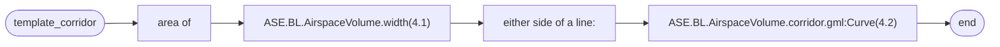
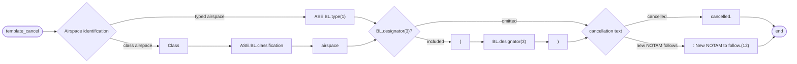

# [2.0] [ATSA.NEW] Ad-hoc ATS airspace - creation (NOTAM)

<!--
Source PDF:
[2.0] [ATSA.NEW] Ad-hoc ATS airspace - creation (NOTAM).pdf

The source wording, terminology, identifiers, Q codes, tables, EBNF expressions,
and production-rule numbering are retained. The three railroad syntax diagrams
in the PDF are represented as Mermaid flowcharts so that they remain readable
by Codex and other text-based tools.
-->

## Text NOTAM production rules

This section provides rules for the automated production of the text NOTAM message items, based on the AIXM 5.1 data encoding of the Event. Therefore, AIXM specific terms are used, such as names of features and properties, types of TimeSlices, etc:

- the abbreviation **ASE.BL** indicates that the corresponding data item must be taken from the Airspace BASELINE that is created by the Event;

## Several NOTAMs possible

Some ATS airspace are established in order to protect flights to/from airports. Depending on size and/or purpose, they serve one or more airports. In exceptional cases, they may impact more than one FIR. Explicit associations between the Event and one or more AirportHeliport or Airspace may be coded. Then, there exist dedicated provision in the OPADD (v4.1, section 2.3.9.3) with regard to the NOTAM that need to be issued in order to ensure that the NOTAM appear correctly in the relevant en-route and airport Pre-Flight Information Bulletins (PIB). Further details are provided in the “several NOTAM possible” section.

The NOTAM production rules provided on this page, unless specified otherwise, are applicable to the “first NOTAM” and the NOTAM containing one or more FIR in Item A.

| `Event.concernedAirspace` | `Event.concernedAirportHeliport` | NOTAM to be generated |
|---|---|---|
| `1..*` | None | produce a single NOTAM with scope E for all the FIR(s) identified |
| `1..*` | `1..*` | Produce a "first" NOTAM with scope E for all FIR and additional (scope A) NOTAM for each airport concerned. |
| `1` | `1..*` | Produce a "first" NOTAM with scope AE for the FIR and one of the aerodromes associated with the Event and additional (scope A) NOTAM for each additional airport. |

## Item A

The item A shall be generated according to the general production rules for item A using the `concernedAirspace(s)` or the `concernedAirportHeliport`, according to the rules specified in table above.

## Item Q

Apply the common NOTAM production rules for item Q, complemented by the following specific rules for this particular scenario:

### Q code

The following mapping shall be used:

| `ASE.BL.type` values | Corresponding Q codes |
|---|---|
| CTR | `QACCS` |
| ADIZ | `QADCS` |
| CTA | `QAECS` |
| UTA | `QAHCS` |
| OCA | `QAOCS` |
| AWY | `QARCS` |
| TMA | `QATCS` |
| ADV | `QAVCS` |
| UADV | `QAVCS` |
| ATZ | `QAZCS` |
| FIR | `QAFCS` |
| any other | `QXXXX` |

Notes:

- *the operator shall have the possibility to change the Q code completely (for example, by using "XX").*

### Scope

For each NOTAM that is generated:

- If Item A contains the designator of one (or more) FIR, insert E.
- If Item A contains the ICAO code of an airport, insert AE for the first such NOTAM and value A for the rest of the NOTAM.

### Lower limit / Upper limit

Apply the common NOTAM production rules for Lower limit / Upper limit.

### Geographical reference

Calculate the centre and the radius (in NM) of a circle that encompasses the whole area. Insert these values in the geographical reference item, formatted as follows:

- the set of coordinates comprises 11 characters rounded up or down to the nearest minute; i.e. Latitude (N/S) in 5 characters; Longitude (E/W) in 6 characters. The radius consists of 3 figures rounded up to the next higher whole Nautical Mile; e.g. 10.2NM shall be indicated as 011.

See also the Note with regard to the risk that the circle/radius does not encompass the whole area, as discussed in the Location and radius common rules for the NOTAM text generation.

## Items B, C and D

Items B and C shall be decoded following the common production rules.

Item D shall be left empty. An eventual schedule shall be decoded in item E.

## Item E

The following pattern should be used for automatically generating the E field text from the AIXM data:

### Template diagram

```mermaid
flowchart TD
    START([template]) --> IDENTIFICATION_Q{"Airspace identification branch"}

    IDENTIFICATION_Q -->|ASE.BL.type is not CLASS| TYPE["ASE.BL.type(1)"]
    TYPE --> NAME_Q{"ASE.BL.name(2)?"}
    NAME_Q -->|included| NAME["ASE.BL.name(2)"]
    NAME_Q -->|omitted| DESIGNATOR_Q{"ASE.BL.designator(3)?"}
    NAME --> DESIGNATOR_Q
    DESIGNATOR_Q -->|included| DESIGNATOR["ASE.BL.designator(3)"]
    DESIGNATOR_Q -->|omitted| CLASS_INFO_Q{"class information?"}
    DESIGNATOR --> CLASS_INFO_Q
    CLASS_INFO_Q -->|included| OPEN_CLASS["("]
    OPEN_CLASS --> CLASS_WORD["class"]
    CLASS_WORD --> CLASS_VALUE["ASE.BL.classification"]
    CLASS_VALUE --> CLOSE_CLASS[")"]
    CLASS_INFO_Q -->|omitted| ESTABLISHED["established within:"]
    CLOSE_CLASS --> ESTABLISHED

    IDENTIFICATION_Q -->|ASE.BL.type is CLASS| CLASS_PREFIX["Class"]
    CLASS_PREFIX --> CLASS_ONLY["ASE.BL.classification"]
    CLASS_ONLY --> AIRSPACE_WORD["airspace"]
    AIRSPACE_WORD --> CLASS_DESIGNATOR_Q{"ASE.BL.designator(3)?"}
    CLASS_DESIGNATOR_Q -->|included| OPEN_DESIGNATOR["("]
    OPEN_DESIGNATOR --> CLASS_DESIGNATOR["ASE.BL.designator(3)"]
    CLASS_DESIGNATOR --> CLOSE_DESIGNATOR[")"]
    CLASS_DESIGNATOR_Q -->|omitted| CLASS_NAME_Q{"ASE.BL.name(2)?"}
    CLOSE_DESIGNATOR --> CLASS_NAME_Q
    CLASS_NAME_Q -->|included| CLASS_NAME["ASE.BL.name(2)"]
    CLASS_NAME_Q -->|omitted| ESTABLISHED
    CLASS_NAME --> ESTABLISHED

    ESTABLISHED --> NL1["\\n"]
    NL1 --> HORIZONTAL["ASE.BL.geometryComponent.horizontalProjection(4)"]

    HORIZONTAL --> WIDTH_Q{"ASE.BL.AirspaceVolume.width(4)?"}
    WIDTH_Q -->|included| WIDTH["ASE.BL.AirspaceVolume.width(4)"]
    WIDTH_Q -->|omitted| LOCATION_Q{"ASE.BL.annotation(5)?"}
    WIDTH --> LOCATION_Q

    LOCATION_Q -->|included| OPEN_LOCATION["("]
    OPEN_LOCATION --> LOCATION["ASE.BL.annotation(5)"]
    LOCATION --> CLOSE_LOCATION[")"]
    LOCATION_Q -->|omitted| COMMA1[","]
    CLOSE_LOCATION --> COMMA1

    COMMA1 --> NL2["\\n"]
    NL2 --> FROM["from"]
    FROM --> LOWER["ASE.BL.geometryComponent.lowerLimit(6)"]
    LOWER --> UP_TO["up to"]
    UP_TO --> UPPER["ASE.BL.geometryComponent.upperLimit(6)"]

    UPPER --> EXCLUSION_Q{"another excluded airspace?"}
    EXCLUSION_Q -->|yes| COMMA2[","]
    COMMA2 --> EXCLUDING["excluding"]
    EXCLUDING --> EXCLUSION["ASE.BL.geometryComponent(7)"]
    EXCLUSION --> EXCLUSION_Q
    EXCLUSION_Q -->|no| PERIOD1["."]

    PERIOD1 --> NL3["\\n"]
    NL3 --> ACTIVITY_Q{"activation status/schedule line?"}
    ACTIVITY_Q -->|included| ACTIVITY["(8)ASE.BL.AirspaceActivation.status"]
    ACTIVITY --> SCHEDULE["ASE.BL.AirspaceActivation.timeInterval(9)"]
    SCHEDULE --> PERIOD2["."]
    ACTIVITY_Q -->|omitted| CONTROL_NOTE_Q{"controlling unit annotation(10)?"}
    PERIOD2 --> CONTROL_NOTE_Q

    CONTROL_NOTE_Q -->|included| NL4["\\n"]
    NL4 --> CONTROL_NOTE["ASE.BL.AirspaceActivation.annotation(10)"]
    CONTROL_NOTE --> PERIOD3["."]
    CONTROL_NOTE_Q -->|omitted| NOTE_Q{"another ASE.BL.annotation(11)?"}
    PERIOD3 --> NOTE_Q

    NOTE_Q -->|yes| NL5["\\n"]
    NL5 --> NOTE["ASE.BL.annotation(11)"]
    NOTE --> PERIOD4["."]
    PERIOD4 --> NOTE_Q
    NOTE_Q -->|no| END_NODE([end])
```



### EBNF Code

```ebnf
template = ("ASE.BL.type(1)" ["ASE.BL.name(2)"] ["ASE.BL.designator(3)"] ["(" "class" "ASE.BL.
classification" ")"] | "Class" "ASE.BL.classification" "airspace" ["(" "ASE.BL.designator(3)" ")"] ["ASE.BL.
name(2)"]) "established within:" "\n" \n
"ASE.BL.geometryComponent.horizontalProjection(4)" ["ASE.BL.AirspaceVolume.width(4)"] ["(" "ASE.BL.annotation
(5)" ")"] "," \n
"from" "ASE.BL.geometryComponent.lowerLimit(6)" "up to" "ASE.BL.geometryComponent.upperLimit(6)"
{"," "excluding" "ASE.BL.geometryComponent(7)"} "." \n
["\n" "(8)ASE.BL.AirspaceActivation.status" "ASE.BL.AirspaceActivation.timeInterval(9)" "."] \n
["\n" "ASE.BL.AirspaceActivation.annotation(10)" "."] \n
{"\n" "ASE.BL.annotation(11)" "."}.
```

### Production rules

#### (1) type

If `ASE.BL.type` does not have the value `"CLASS"`, then use this branch. Otherwise use the other branch, which inserts just the airspace classification.

The area type shall be included according to the following decoding table:

| `ASE.BL.type` | Text to be inserted in Item E |
|---|---|
| CTR | `"CTR"` |
| ADIZ | `"ADIZ"` |
| CTA | `"CTA"` |
| UTA | `"UTA"` |
| OCA | `"OCA"` |
| OTA | `"Oceanic Transition Area"` |
| AWY | `"AWY"` |
| SECTOR | `"ATS sector"` |
| SECTOR_C | `"collapsed ATS sector"` |
| RAS | `"regulated ATS airspace"` |
| TMA | `"TMA"` |
| ADV* | `"Advisory Area"` |
| UADV | `"Upper Advisory Area"` |
| ATZ | `"ATZ"` |
| HTZ | `"Helicopter Traffic Zone"` |
| FIR | `"FIR"` |
| OTHER:TMZ | `"Transponder Mandatory Zone"` |
| OTHER:RMZ | `"Radio Mandatory Zone"` |
| any other | `"area"` |

#### (2) name

If specified, insert here the `ASE.BL.name`.

#### (3) designator

If specified, insert here the `ASE.BL.designator`.

#### (4) horizontal limit (corridor width)

If the geometry is in the form of a polygon or circle, provided as `AirspaceVolume.horizontalProjection (gml:Surface)`, then it shall be translated into human readable text, using latitude/longitude values, as detailed in Item E - Geometrical and geographical data.

If the geometry is in the form of a corridor, provided as `AirspaceVolume,corridor (gml:Curve)` and `AirspaceVolume.width`, then the following template shall be used:

##### Corridor template diagram



##### EBNF Code

```ebnf
template_corridor = "area of" "ASE.BL.AirspaceVolume.width(4.1)" "either side of a
line:" "ASE.BL.AirspaceVolume.corridor.gml:Curve(4.2)".
```

| Reference | Rule |
|---|---|
| (4.1) | Insert the width value divided by 2 and followed by the `width@uom` value (for example: `"2.5NM"`) |
| (4.2) | Translate the `gml:Curve` data into human readable text, using latitude/longitude values, as detailed in Item E - Geometrical and geographical data. |

#### (5) location note

If specified, insert here only the `ASE.BL.annotation` that has `propertyName='geometryComponent'`, which represents the encoding of the `"location note"` information. Annotations shall be translated into free text according to the decoding rules for annotations.

#### (6) lower limit, uper limit

Decode the `ASE.BL.geometryComponent.lowerLimit/upperLimit` (that is part of a `ASE.BL.geometryComponent` with `operation='BASE'` or not specified), including reference and unit of measurement, according to the decoding rules for vertical limits.

#### (7) excluded airspace

If specified as a `BL.geometryComponent` with `operation='SUBTR'`, insert here the designator and the type of the `BL.geometryComponent.contributorAirspace`. This requires interpreting the `xlink:href` value in order to recuperate the relevant data from the `contributorAirspace` BASELINE. If more than one airspace is excluded from the preceding `horizontalProjection`, then the word `"AND"` shall be included before the second, third, etc. exclusion.

#### (8) activation status, schedule

Decode `ASE.BL.AirspaceActivation.status` the as detailed below:

| `ASE.BL.AirspaceActivation.status` | `ASE.BL.activation.AirspaceActivation.timeInterval` | Insert |
|---|---|---|
| `'INTERMITENT'` | none | `'Intermittently active'.` |
| `'INTERMITENT'` | one ore more | `'Intermittently active within the following periods:'` |
| `'ACTIVE'` | none | `-` |
| `'ACTIVE'` | one ore more | `'Active as follows:'` |

#### (9) schedule

If at least one `ASE.BL.activation.AirspaceActivation.timeInterval` exists (the Event has an associated schedule), then it shall be inserted here according to the general NOTAM conversion rules for Event schedules. Attention: `timeInterval(s)` that appear as child of `ASE.BL.activation.AirspaceActivation` with `status=INACTIVE` shall not be translated (because this was created for the completeness of the digital data encoding, see rule ER-05).

#### (10) controlling unit note

Insert `ASE.BL.AirspaceActivation.annotation` (if any) translated into free text according to the decoding rules for annotations.

#### (11) note

Insert `ASE.BL.annotation` (if any) translated into free text according to the decoding rules for annotations.

## Items F & G

Items F and G shall be left empty. The vertical limits are part of item E.

## Event Update

The eventual update of this type of event shall be encoded following the general rules for Event update or cancellation, which provide instructions for all NOTAM fields, except for item E and the condition part of the Q code, in the case of a NOTAM C.

If a NOTAM C is produced, then the 4th and 5th letters (the `"condition"`) of the Q code shall be `"CN"`, except for the situation of a “new NOTAM to follow”, in which case `"XX"` shall be used.

The following pattern should be used for automatically generating the E field text from the AIXM data:

### Cancellation template diagram



### EBNF Code

```ebnf
template_cancel = ("ASE.BL.type(1)" | "Class" "ASE.BL.classification" "airspace") ["(" "BL.designator(3)"
")"] ("cancelled." | " : New NOTAM to follow.(12)").
```

### Cancellation production rule

| Reference | Rule |
|---|---|
| (12) | If the NOTAM will be followed by a new NOTAM concerning the same situation, then the operator shall have the possibility to choose the `"New NOTAM to follow"` branch. This branch cannot be selected automatically because this information is only known by the operator.<br><br>Note: in this case, the 4th and 5th letters of the Q code shall also be changed into `"XX"`. |
