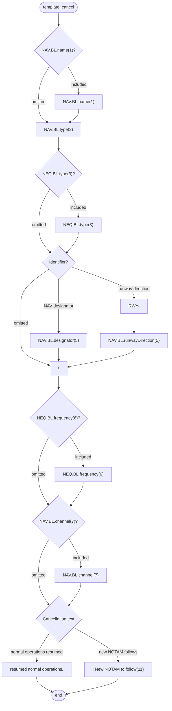

# [2.0] [NAV.UNS] Navaid unserviceable (NOTAM)

<!--
Source PDF: [2.0] [NAV.UNS] Navaid unserviceable (NOTAM).pdf

The source document wording, terminology, identifiers, Q codes, tables, and EBNF
expressions are retained. The railroad syntax diagrams are also represented as
Mermaid flowcharts so that they remain directly readable by Codex.
-->

## Text NOTAM production rules

This section provides rules for the automated production of the text NOTAM message items, based on the AIXM 5.1 data encoding of the Event. Therefore, AIXM specific terms are used, such as names of features and properties, types of TimeSlices, etc:

- the abbreviation **NAV.TD** indicates that the corresponding data item must be taken from the Navaid TEMPDELTA associated with the Event;
- the abbreviation **NAV.BL** indicates that the corresponding data item must be taken from the Navaid BASELINE;
- the abbreviation **NEQ.TD** indicates that the corresponding data item must be taken from the NavaidEquipment specialisation (VOR, DME, Localizer, etc.) TEMPDELTA associated with the Event;
  - **Important note:** According to encoding rule ER-11, the TEMPDELTA might also include NavaidOperationalStatus elements that have been copied from the BASELINE data for compliance with the AIXM Temporality rules. The current practice is to not include such static information in the NOTAM text. Therefore, all NavaidOperationalStatus that have an associated annotation with `purpose='REMARK'` and the `text='Baseline data copy. Not included in the NOTAM text generation'` shall be excepted from the text NOTAM generation algorithm!
- the abbreviation **NEQ.BL** indicates that the corresponding data item must be taken from the NavaidEquipment specialisation (VOR, DME, Localizer, etc.) BASELINE;

## Several NOTAMs possible

Note that if the navaid is used for instrument approach or departures from one or more airports or affects the en-route navigation in one or more FIR, explicit associations between the Event and one or more AirportHeliport and/or Airspace may be coded. Then, there exist dedicated provision in the OPADD (v4.1, section 2.3.9.3) with regard to the NOTAM that need to be issued in order to ensure that the NOTAM appear correctly in the relevant en-route and airport Pre-Flight Information Bulletins (PIB). Further details are provided in the “several NOTAM possible” section.

The NOTAM production rules provided on this page, unless specified otherwise, are applicable to the “first NOTAM” and the NOTAM containing one or more FIR in Item A.

| `Event.concernedAirspace` | `Event.concernedAirportHeliport` | NOTAM to be generated |
|---|---|---|
| `1..*` | None | produce a single NOTAM with scope E for all the FIR(s) identified |
| `1..*` | `1..*` | Produce a "first" NOTAM with scope E for all FIR and additional (scope A) NOTAM for each airport concerned. |
| `1` | `1..*` | Produce a "first" NOTAM with scope AE for the FIR and one of the aerodromes associated with the Event and additional (scope A) NOTAM for each additional airport. |

## Item A

The item A shall be generated according to the general production rules for item A using the `concernedAirspace(s)` or the `concernedAirportHeliport`, according to the rules specified in table above.

## Item Q

Apply the common NOTAM production rules for item Q, complemented by the following specific rules for this particular scenario:

### Q code

The mapping provided in the tables below shall be used.

#### `NAV.BL.type` - Corresponding Q codes (2nd and 3rd letters)

| `NAV.BL.type` | Corresponding Q codes (2nd and 3rd letters) |
|---|---|
| ILS or ILS_DME | `QIC` - if both the Localizer and the Glidepath components have a (E)TD associated with the Event<br><br>`QID` - if only its DME component has (E)TD associated with the Event<br><br>`QIG` - if only its Glidepath component has (E)TD associated with the Event<br><br>`QIL` - if only its Localizer component has (E)TD associated with the Event<br><br>`QII` - if only its MKR component has (E)TD associated with the Event and its `(N)BL.NavaidComponent.markerPosition=INNER`<br><br>`QIM` - if only its MKR component has (E)TD associated with the Event and its `(N)BL.NavaidComponent.markerPosition=MIDDLE`<br><br>`QIO` - if only its MKR component has (E)TD associated with the Event and its `(N)BL.NavaidComponent.markerPosition=OUTER`<br><br>`QIY` - if only its NDB component has (E)TD associated with the Event and its `(N)BL.NavaidComponent.markerPosition=MIDDLE`<br><br>`QIX` - if only its NDB component has (E)TD associated with the Event and its `(N)BL.NavaidComponent.markerPosition=OUTER` |
| MLS or MLS_DME | `QIW` |
| NDB or NDB_MKR | `QNB` - if NDB component `(E)BL.class=ENR`<br><br>`QNL` - if NDB component `(E)BL.class=L` |
| LOC or LOC_DME | `QIN` |
| DME | `QND` |
| MKR | `QNF` |
| VOR_DME | `QNM` |
| TACAN | `QNN` |
| VORTAC | `QNT` |
| VOR | `QNV` |
| DF | `QNX` |
| NDB_DME, TLS or OTHER | `QXX` |

and

#### `NAV.TD.operationalStatus` - Corresponding Q codes (4th and 5th letters)

| `NAV.TD.operationalStatus` | Corresponding Q codes (4th and 5th letters) |
|---|---|
| UNSERVICEABLE | `AS` |
| ONTEST | `CT` |
| INTERRUPT | `LS` |
| PARTIAL | `AS` |
| FALSE_INDICATION | `XX` |
| IN_CONSTRUCTION | `XX` |
| OTHER | `XX` |

### Scope

As general rules, for each NOTAM that is generated:

- If Item A contains the designator of one (or more) FIR, insert E.
- If Item A contains the ICAO code of an AirportHeliport, insert AE, for the first such NOTAM and value A for the rest of the NOTAM.

However, more specific rules may be applied, depending on the split in NOTAM series, actual configuration of the FIR, etc. These have to be taken into consideration for each implementation.

### Lower limit/Upper limit

The default values `"000/999"` shall be inserted.

### Geographical reference

According to OPADD 4.1, item 2.3.12:

- if the NOTAM scope is A, then the coordinates shall be derived from the ARP of the related concerned AerodromeHeliport
- if the NOTAM scope is E or AE, then the coordinates shall be derived from the `NAV.BL` position. If the `NAV.BL` does not have a specified position, then the position of one of its primary components `NEQ.BL` shall be used.

Insert these values in the geographical reference item, formatted as follows:

- the set of coordinates comprises 11 characters rounded up or down to the nearest minute; i.e. Latitude (N/S) in 5 characters; Longitude (E/W) in 6 characters. The radius consists of 3 figures rounded up to the next higher whole Nautical Mile; e.g. 10.2NM shall be indicated as 011.

Concerning the radius, according to OPADD 4.1, item 2.3.13.6:

- if the NOTAM scope is A, then the default value `'005'` shall be used
- if the NOTAM scope is E or AE, then the default value `'025'` shall be used. Note that a NOTAM operator might change this default value based on operational circumstances, as indicated in the OPADD 4.1 document.

## Items B, C and D

Items B and C shall be decoded from the values of `NAV.TD.validTime` following the common production rules.

If at least one `NAV.TD.NavaidOperationalStatus.timeInterval` exists (the Event has an associated schedule), then the associated Timesheets(s) shall be decoded in item D according to the common NOTAM production rules for Item D, E - Schedules. Otherwise, item D shall be left empty.

## Item E

The following pattern should be used for automatically generating the E field text from the AIXM data:

### Template diagram

```mermaid
flowchart TD
    START([template]) --> NAME_Q{"NAV.BL.name(1)?"}
    NAME_Q -->|included| NAME["NAV.BL.name(1)"]
    NAME_Q -->|omitted| NAV_TYPE["NAV.BL.type(2)"]
    NAME --> NAV_TYPE

    NAV_TYPE --> NEQ_TYPE_Q{"NEQ.BL.type(3)?"}
    NEQ_TYPE_Q -->|included| NEQ_TYPE["NEQ.BL.type(3)"]
    NEQ_TYPE_Q -->|omitted| SIGNAL_Q{"NEQ.TD.availability.signalType(4)?"}
    NEQ_TYPE --> SIGNAL_Q

    SIGNAL_Q -->|included| SIGNAL["NEQ.TD.availability.signalType(4)"]
    SIGNAL_Q -->|omitted| IDENTIFIER_Q{"Identifier?"}
    SIGNAL --> IDENTIFIER_Q

    IDENTIFIER_Q -->|NAV designator| NAV_DESIGNATOR["NAV.BL.designator(5)"]
    IDENTIFIER_Q -->|runway direction| RWY_PREFIX["RWY-"]
    RWY_PREFIX --> RWY_DIRECTION["NAV.BL.runwayDirection(5)"]
    IDENTIFIER_Q -->|omitted| NEWLINE1["\\n"]
    NAV_DESIGNATOR --> NEWLINE1
    RWY_DIRECTION --> NEWLINE1

    NEWLINE1 --> FREQUENCY_Q{"NEQ.BL.frequency(6)?"}
    FREQUENCY_Q -->|included| FREQUENCY["NEQ.BL.frequency(6)"]
    FREQUENCY_Q -->|omitted| CHANNEL_Q{"NEQ.BL.channel(7)?"}
    FREQUENCY --> CHANNEL_Q

    CHANNEL_Q -->|included| CHANNEL["NEQ.BL.channel(7)"]
    CHANNEL_Q -->|omitted| STATUS["NEQ.TD.operational status(8)"]
    CHANNEL --> STATUS

    STATUS --> PERIOD1["."]
    PERIOD1 --> NEWLINE2["\\n"]

    NEWLINE2 --> REASON_Q{"Reason annotation(9)?"}
    REASON_Q -->|included| REASON_NL["\\n"]
    REASON_NL --> DUE_TO["due to"]
    DUE_TO --> REASON["NAV.TD.NavaidOperationalStatus.annotation(9)"]
    REASON --> PERIOD2["."]
    PERIOD2 --> NOTES_Q{"Another annotation(10)?"}
    REASON_Q -->|omitted| NOTES_Q

    NOTES_Q -->|yes| NOTE_NL["\\n"]
    NOTE_NL --> NOTE["NAV.TD.NavaidOperationalStatus.annotation(10)"]
    NOTE --> PERIOD3["."]
    PERIOD3 --> NOTES_Q

    NOTES_Q -->|no| END_NODE([end])
```



### EBNF Code

```ebnf
template = ["NAV.BL.name(1)"] "NAV.BL.type(2)" ["NEQ.BL.type(3)"] ["NEQ.TD.availability.signalType(4)"] [(
"NAV.BL.designator(5)" | "RWY-" "NAV.BL.runwayDirection(5)")] \n ["NEQ.BL.frequency(6)"] ["NEQ.BL.channel
(7)"] "NEQ.TD.operational status(8)" "." \n
["\n" "due to" "NAV.TD.NavaidOperationalStatus.annotation(9)" "."] \n
{"\n" "NAV.TD.NavaidOperationalStatus.annotation(10)" "."}.
```

### Production rules

#### (1)

The name of the Navaid shall be included if present in the `NAV.BL` data.

#### (2)

Insert the type from the Navaid baseline, according to the following decoding rule:

| `NAV.BL.type` | Text to be inserted in item E |
|---|---|
| VOR | `"VOR"` |
| DME | `"DME"` |
| NDB | If `(E)BL.class='L'` then use the word `"LOCATOR"`, otherwise use the word `"NDB"` |
| TACAN | `"TACAN"` |
| MKR | If used as NavaidComponent of an ILS or ILS_DME Navaid, then insert `(N)BL.markerPosition` first followed by `"MKR"`, otherwise insert just the word `"MKR"` |
| ILS | `"ILS"` |
| ILS_DME | `"ILS"` |
| MLS | `"MLS"` |
| MLS_DME | `"MLS"` |
| VORTAC | `"VORTAC"` |
| VOR_DME | `"VOR/DME"` |
| DNB_DME | `"NDB/DME"` |
| TLS | `"Transponder Landing System"` |
| LOC | `"LOC"` |
| LOC_DME | `"LOC/DME"` |
| NDB_MKR | `"NDB/MKR"` |
| DF | `"DF service"` |
| SDF | `"Simplified Directional Facility eqpt"` |
| OTHER | None |

#### (3)

If the Navaid Baseline has more than one NavaidEquipment primary components and only one of its primary component NavaidEquipment has a `NEQ.TD` associated with the Event, then insert the type of that equipment, according to the following decoding rule:

| `NEQ.BL` | Text to be inserted in Item E |
|---|---|
| DME | `"DME part"` |
| VOR | `"VOR part"` |
| TACAN | `"TACAN part"` |
| Glidepath | `"GP part"` |
| Localizer | `"LOC part"` |
| Azimuth | `"azm signal"` |
| Elevation | `"elev signal"` |
| SDF | `"Simplified Directional Facility eqpt"` |
| Direction Finder | `"DF"` |
| NDB | If `(E)BL.class='L'` then use the word `" LOCATOR"`, otherwise use the word `"NDB"` |
| MarkerBeacon | If used as NavaidComponent of an ILS or ILS_DME Navaid, then insert `(N)BL.NavaidComponent.markerPosition` first followed by `"MKR"`, otherwise insert just the word `"MKR"` |

#### (4)

If `NAV.BL.type` is `'TACAN'` or `'VORTAC'` and its `TACAN.TD.availability.signalType` is specified, then insert its value here.

#### (5)

The following rules apply:

- If `NAV.BL.type` has the value `'ILS'`, `'ILS_DME'`, `'LOC'`, `'LOC_DME'`, `'MLS'` or `'MLS_DME'`, then insert the `RunwayDirection.BL.designator` of the associated `NAV.BL.runwayDirection`, if available;
- Otherwise, insert the `NAV.BL.designator`, if available.

#### (6)

Apply the following rules:

| `NAV.BL.type` | Use the following value |
|---|---|
| VOR, VOR_DME, VORTAC | `(VOR)BL.frequency` followed by its `uom` value |
| NDB, NDB_MKR, NDB_DME | `(NDB)BL.frequency` followed by its `uom` value |
| SDF | `(SDF)BL.frequency` followed by its `uom` value |
| any other | leave empty |

#### (7)

Apply the following rules:

| `NAV.BL.type` | Use the following value |
|---|---|
| VOR_DME, DME, NDB_DME | `(DME)BL.channel` |
| TACAN, VORTAC | `(TACAN)BL.channel` |
| any other | leave empty |

#### (8)

Insert the `NEQ.TD.operationalStatus` decoded as follows:

| `NEQ.BL.availability/operationalStatus` | Text to be inserted in Item E |
|---|---|
| UNSERVICEABLE | `"unserviceable"` |
| ONTEST | `"On test, do not use. False indication possible."` |
| INTERRUPT | `"subject to interruption"` |
| PARTIAL | `"unserviceable"` (note that this should only occur for TACAN components) |
| FALSE_INDICATION | `"do not use, false indication"` |
| IN_CONSTRUCTION | `"in construction, do not use"` |
| OTHER | `"operational status is affected"` |

#### (9)

If specified, insert here only the `NAV.TD.NavaidOperationalStatus.annotation` that has `propertyName='operationalStatus'` and `purpose='REMARK'`, translated into free text according to the following encoding rules.

#### (10)

Other `NAV.TD.NavaidOperationalStatus.annotation` shall be translated into free text according to the rules for annotations decoding.

> **Note:** The objective is to full automatic generation, without human intervention. However, the implementers of the specification might consider reducing the cost of a fully automated generation by allowing the operator to fine-tune the text in order to improve its readability (with the inherent risk for human error, when re-typing is allowed).

## Items F & G

Leave empty.

## Event Update

The eventual update of this type of event shall be encoded following the general rules for Event update or cancellation, which provide instructions for all NOTAM fields, except for item E and the condition part of the Q code, in the case of a NOTAM C

If a NOTAM C is produced, then the 4th and 5th letters (the `"condition"`) of the Q code shall be `"AK"`, except for the situation of a “new NOTAM to follow”, in which case `"XX"` shall be used.

The following pattern should be used for automatically generating the E field text from the AIXM data:

### Cancellation template diagram



### EBNF Code

```ebnf
template_cancel = ["NAV.BL.name(1)"] "NAV.BL.type(2)" ["NEQ.BL.type(3)"] [( "NAV.BL.designator(5)" | "RWY-"
"NAV.BL.runwayDirection(5)")] \n
["NEQ.BL.frequency(6)"] ["NAV.BL.channel(7)"] ("resumed normal operations." | " : New NOTAM to follow(11)").
```

### Cancellation production rule

| Reference | Rule |
|---|---|
| (11) | If the NOTAM will be followed by a new NOTAM concerning the same situation, then the operator shall have the possibility to choose the `"New NOTAM to follow"` branch. This branch cannot be selected automatically because this information is only known by the operator.<br><br>Note: in this case, the 4th and 5th letters of the Q code shall also be changed into `"XX"`. |
