# [2.0] [RWY.CLS] Runway - closure

<!-- Source: [2.0] [RWY.CLS] Runway - closure.pdf -->

## Definition

The temporary closure of a runway. This scenario relates to a "complete" closure situation. partial (with the exception of particular operations, flights or aircraft categories).

Notes:

- this scenario covers the closure of both entire runway (all landing directions) and single landing directions; For the temporary closure of a portion of a runway, refer to runway portion closure scenario RWE.CLS
- this scenario does not cover "partial" closures (exception of particular operations, flights or aircraft categories) or supplementary restrictions. This will be dealt in RWY.LIM scenario
- this scenario does not cover the temporary change of the operational hours of a runway;
- this scenario does not cover the situation when the runway is operating normally, but subject to a reason for caution (such as "grass cutting in progress", etc.).

## Event data

The following diagram identifies the information items that are usually provided by a data originator for this kind of event.

### Diagram

```mermaid
flowchart LR
    INPUT([input]) --> AD["airport designator"]

    AD --> AN_Q{"airport name?"}
    AN_Q -->|provided| AN["airport name"]
    AN_Q -->|omitted| TARGET{"runway or runway direction"}
    AN --> TARGET

    TARGET -->|runway| RWY["runway"]
    TARGET -->|runway direction| RWYD["runway direction"]

    RWY --> SURFACE_Q{"runway surface composition?"}
    RWYD --> SURFACE_Q

    SURFACE_Q -->|provided| SURFACE["runway surface composition"]
    SURFACE_Q -->|omitted| CLOSED["status=CLOSED"]
    SURFACE --> CLOSED

    CLOSED --> REASON_Q{"closure reason?"}
    REASON_Q -->|provided| REASON["closure reason"]
    REASON_Q -->|omitted| START["start time"]
    REASON --> START

    START --> END_TIME["end time"]

    END_TIME --> SCHEDULE_Q{"schedule?"}
    SCHEDULE_Q -->|provided| SCHEDULE["schedule"]
    SCHEDULE_Q -->|omitted| NOTE_Q{"another note?"}
    SCHEDULE --> NOTE_Q

    NOTE_Q -->|yes| NOTE["note"]
    NOTE --> NOTE_Q
    NOTE_Q -->|no| FINISH([end])
```



### EBNF Code

```ebnf
input = "airport designator" ["airport name"] ("runway" | "runway direction") ["runway surface composition"]
"status=CLOSED" ["closure reason"]\n
"start time" "end time" [schedule] \n
{note}.
```

The table below provides more details about each information item contained in the diagram. It also provides the mapping of each information item within the AIXM 5.1.1 structure. The name of the variable (first column) is recommended for use as label of the data field in human-machine interfaces (HMI).

| Data item | Value | AIXM mapping |
|---|---|---|
| airport designator | The published designator of the airport where the runway is located, used in combination with airport name, runway or landing direction in order to identify the runway concerned. | `AirportHeliport.designator` |
| airport name | The published name of the airport where the runway is located, used in order to identify the runway concerned. | `AirportHeliport.name` |
| runway | The published designator of the runway (or FATO) concerned. This information is used in combination with the airport designator/name in order to identify the runway (or FATO), for which it is assumed that both landing directions are concerned by the closure. | `Runway.designator` |
| runway direction | The published designator of the runway direction concerned. This information is used in combination with the airport designator/name in order to identify the concerned landing direction. | `RunwayDirection.designator` |
| runway surface composition | In cases where there are two runways with the same designator but different surfaces (for instance RWY 07/25, one concrete and the second gravel or grass), the surface composition needs to be provided. | `Runway.surfaceProperties/SurfaceCaracteristics.composition` |
| status=CLOSED | The operational status of the runway. In this scenario, it is only possible to indicate a complete closure. | `RunwayDirection/ManoeuvringAreaAvailability.operationalStatus` |
| closure reason | The reason for the runway closure. | `RunwayDirection/ManoeuvringAreaAvailability.annotation` with `propertyName="operationalStatus"` and `purpose="REMARK"`. Note that the property `"warning"` of the `ManoeuvringAreaAvailability` class is not used here because it represents a reason for caution when allowed to operate on the runway, not a reason for a closure. |
| start time | The effective date & time when the runway closure starts. This might be further detailed in a "schedule". | `RunwayDirection/RunwayDirectionTimeSlice/TimePeriod.beginPosition`, `Event/EventTimeSlice.validTime/timePosition` and `Event/EventTimeSlice.featureLifetime/beginPosition` |
| end time | The end date & time when the runway closure ends. | `RunwayDirection/RunwayDirectionTimeSlice/TimePeriod.endPosition` and `Event/EventTimeSlice.featureLifetime/endPosition` also applying the rules for `{{Events with estimated end time}}` |
| schedule | A schedule might be provided, in case the runway is effectively closed according to a regular timetable, within the overall closure period. | `RunwayDirection/ManoeuvringAreaAvailability/Timesheet/...` according to the rules for `{{Schedules}}` |
| note | A free text note that provides further details concerning the runway closure. | `RunwayDirection/ManoeuvringAreaAvailability.annotation` with `purpose="REMARK"` |

## Assumptions for baseline data

It is assumed that following BASELINE TimeSlices covering the entire duration of the event exist and have been coded as specified in the Coding Guidelines for the (ICAO) AIP Data Set:

- AirportHeliport BASELINE as specified in the Basic Data for Airport/Heliport,
- Runway BASELINE according to the coding rules for Basic Data for Runway;
- RunwayDirection BASELINE according to the coding rules for Basic Data Runway Direction.

## Data encoding rules

The data encoding rules provided in this section shall be followed in order to ensure the harmonisation of the digital encodings provided by different sources. The compliance with some of these encoding rules can be checked with automatic data validation rules. When this is the case, the number of the encoding rule is mentioned in the data validation rule.

| Identifier | Data encoding rule |
|---|---|
| ER-01 | The temporary closure of a runway shall be encoded as:<br><br>- a new Event with a BASELINE Timeslice (`scenario="RWY.CLS"`, `version="2.0"`) for which a PERMDELTA TimeSlice may also be provided and<br>- a TimeSlice of type TEMPDELTA for each affected RunwayDirection feature, for which the `"event:theEvent"` property points to the Event instance created above. Note that in case a full runway is concerned by the closure, then a TEMPDELTA shall be encoded for each of its RunwayDirection features. |
| ER-02 | First, all the BASELINE `availability.ManoeuvringAreaAvailability` (with `operationalStatus=NORMAL`), if present, shall be copied in the TEMPDELTA (see Usage limitation and closure scenarios).<br><br>Then, an additional `availability.ManoeuvringAreaAvailability` element having `operationalStatus=CLOSED` shall be coded in the RunwayDirection TEMPDELTA. |
| ER-03 | If the runway closure is limited to a discrete schedule within the overall time period between the `"start time"` and the `"end time"`, then this shall be encoded using as many as necessary `timeInterval/Timesheet` properties for the `ManoeuvringAreaAvailability` having `operationalStatus=CLOSED` in RunwayDirection TEMPDELTA Timeslice. See the rules for Event Schedules. |
| ER-04 | The system shall automatically identify the FIR where the AerodromeHeliport is located. This shall be coded as corresponding concerned Airspace property in the Event |
| ER-05 | The AirportHeliport concerned by the closure shall also be coded as concernedAirportHeliport property in the Event. |

## Examples

- `DN_RWY.CLS_1_full.xml`
- `DN_RWY.CLS_2_with_schedule.xml`
