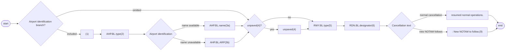

# [2.0] [RWY.CLS] Runway - closure (NOTAM)

<!--
Source PDF: [2.0] [RWY.CLS] Runway - closure (NOTAM).pdf
The original railroad syntax diagrams are represented below as Mermaid diagrams.
The original EBNF code is also retained.
-->

## Text NOTAM production rules

This section provides rules for the automated production of the text NOTAM message items, based on the AIXM 5.1.1 data encoding of the Event. Therefore, AIXM specific terms are used, such as names of features and properties, types of TimeSlices, etc:

- the abbreviation **RDN.BL.** indicates that the corresponding data item must be taken from the RunwayDirection BASELINE;
- the abbreviation **AHP.BL.** indicates that the corresponding data item must be taken from the AirportHeliport BASELINE associated with the Runway that is associated with the RunwayDirection concerned;
- the abbreviation **RWY.BL.** indicates that the corresponding data item must be taken from the Runway BASELINE associated with the RunwayDirection concerned;
- the abbreviation **RDN.TD.** indicates that the corresponding data item must be taken from the RunwayDirection TEMPDELTA that was created for the Event.

### Notes

- According to encoding rule ER-01, each RunwayDirection of the Runway concerned by the closure will have a TEMPDELTA encoded. However, the closure information will be identical for all runway directions. Therefore, if not specified otherwise, the RDN.TD referred in the NOTAM production rules below shall be the one of the RunwayDirection with the lowest designator number;
- According to encoding rule ER-02, the TEMPDELTA might also include ManoeuvringAreaAvailability elements that have been copied from the BASELINE data for compliance with the AIXM Temporality rules. The current practice is to not include such static information in the NOTAM text. Therefore, all ManoeuvringAreaAvailability that have `operationalStatus=NORMAL` will be ignored for the NOTAM generation.

## On this page

- [Item A](#item-a)
- [Item Q](#item-q)
  - [Q code](#q-code)
  - [Scope](#scope)
  - [Lower limit / Upper limit](#lower-limit--upper-limit)
  - [Geographical reference](#geographical-reference)
- [Items B, C and D](#items-b-c-and-d)
- [Item E](#item-e)
- [Items F & G](#items-f--g)
- [Event Update](#event-update)

## Item A

The item A shall be generated according to the general production rules for item A using the `Event.concernedAirportHeliport`.

## Item Q

Apply the common NOTAM production rules for item Q, complemented by the following specific rules for this particular scenario:

### Q code

The following mapping shall be used:

| RWY.BL.type | Corresponding Q codes |
|---|---|
| RWY | QMRLC |
| FATO | QFHLC |

### Scope

Insert the value ‘A’.

### Lower limit / Upper limit

Use “000/999”

### Geographical reference

Insert the coordinate of the ARP (aerodrome reference point) of the airport (`AHP.BL.ARP.ElevatedPoint`), formatted as follows:

- the set of coordinates comprises 11 characters rounded up or down to the nearest minute; i.e. Latitude (N/S) in 5 characters; Longitude (E/W) in 6 characters;
- the radius value is “005”.

## Items B, C and D

Items B and C shall be decoded following the common production rules.

If at least one `RDN.TD.availability.ManoeuvringAreaAvailability.timeInterval` exists (i.e. the Event has an associated schedule), then all such Timesheet(s) shall be represented in item D according to the common NOTAM production rules for `{{Item D, E - Schedules}}`. Otherwise, item D shall be left empty.

## Item E

The following pattern should be used for automatically generating the E field text from the AIXM data:

### Template diagram

```mermaid
flowchart LR
    START([start]) --> PREFIX_Q{"Airport identification branch?"}

    PREFIX_Q -->|included| REF1["(1)"]
    PREFIX_Q -->|omitted| UNPAVED_Q{"unpaved(4)?"}

    REF1 --> AHP_TYPE["AHP.BL.type(2)"]
    AHP_TYPE --> IDENT_Q{"Airport identification"}

    IDENT_Q -->|name available| AHP_NAME["AHP.BL.name(3a)"]
    IDENT_Q -->|name unavailable| AHP_ARP["AHP.BL.ARP(3b)"]

    AHP_NAME --> NEWLINE1["\\n"]
    AHP_ARP --> NEWLINE1
    NEWLINE1 --> UNPAVED_Q

    UNPAVED_Q -->|yes| UNPAVED["unpaved(4)"]
    UNPAVED_Q -->|no| RWY_TYPE["RWY.BL.type(5)"]
    UNPAVED --> RWY_TYPE

    RWY_TYPE --> RDN_DESIGNATOR["RDN.BL.designator(6)"]
    RDN_DESIGNATOR --> CLOSED["closed"]

    CLOSED --> REASON_Q{"closure reason?"}
    REASON_Q -->|present| DUE_TO["due to"]
    DUE_TO --> REASON["RDN.TD.availability.annotation(7)"]
    REASON_Q -->|absent| NOTES_Q{"another annotation(8)?"}
    REASON --> NOTES_Q

    NOTES_Q -->|yes| NOTE_LINE["\\n + TD.availability.annotation(8) + ."]
    NOTE_LINE --> NOTES_Q
    NOTES_Q -->|no| FINAL_PERIOD_Q{"final period?"}

    FINAL_PERIOD_Q -->|yes| FINAL_PERIOD["."]
    FINAL_PERIOD_Q -->|no| END([end])
    FINAL_PERIOD --> END
```



### EBNF Code

```ebnf
template = ["(1)" "AHP.BL.type(2)" ("AHP.BL.name(3a)" | "AHP.BL.ARP(3b)") ] "\n" \n
["unpaved(4)"] "RWY.BL.type(5)" "RDN.BL.designator(6)" "closed" ["due to" "RDN.TD.availability.annotation(7)"]\n
{"\n" "TD.availability.annotation(8)" "."} ["."].
```

### Production rules

| Reference | Data item (from coding scenario) | Rule |
|---|---|---|
| (1) |  | If `AHP.BL.locationIndicatorICAO` is not null, then ignore this branch. |
| (2) |  | Insert here the type of the airport decoded as follows:<br><br><table><thead><tr><th>AHP.BL.type</th><th>Text to be inserted in Item E</th></tr></thead><tbody><tr><td>AD or AH</td><td>"AD"</td></tr><tr><td>HP</td><td>"Heliport"</td></tr><tr><td>LS or OTHER</td><td>"Landing site"</td></tr></tbody></table> |
| (3) |  | a. If `AHP.BL.name` is not NIL, then insert it here. Otherwise:<br>b. insert here the text "located at" followed by the `AHP.BL.ARP.ElevatedPoint` decoded according to the text NOTAM production rules for `aixm:Point` |
| (4) |  | Insert the word “unpaved” if `RWY.BL.SurfaceCharacteristics.composition` has one of the values CLAY, CORAL, EARTH, GRASS, GRAVEL, ICE, LATERITE, MACADAM, SAND, SNOW, WATER, OTHER. Otherwise do not insert anything. |
| (5) |  | Insert here the type of the Runway decoded as follows:<br><br><table><thead><tr><th>RWY.BL.type</th><th>Text to be inserted in Item E</th></tr></thead><tbody><tr><td>RWY</td><td>"RWY"</td></tr><tr><td>FATO</td><td>"FATO"</td></tr></tbody></table> |
| (6) | runway<br><br>runway direction | If more than one RunwayDirection has a TEMPDELTA associated with the Event, then insert the designator of each additional RunwayDirection, preceded by "/", starting with the one with the lower designator number. In general, a runway has two landing directions but there may exist very rare situations with 3-4 landing directions. |
| (7) | closure reason | If there exists a `RDN.TD.availability.annotation` having `propertyName="operationalStatus"` and `purpose="REMARK"`, then translate it into free text according to the decoding rules for annotations. |
| (8) | note | Annotations of `RDN.TD.ManoeuvringAreaAvailability` shall be translated into free text according to the decoding rules for annotations. |

> **Note:** The objective is to full automatic generation, without human intervention. However, the implementers of the specification might consider reducing the cost of a fully automated generation by allowing the operator to fine-tune the text in order to improve its readability (with the inherent risk for human error, when re-typing is allowed).

## Items F & G

Leave empty.

## Event Update

The eventual update of this type of event shall be encoded following the general rules for Event update or cancellation, which provide instructions for all NOTAM fields, except for item E and the condition part of the Q code, in the case of a NOTAM C

If a NOTAM C is produced, then the 4th and 5th letters (the "condition") of the Q code shall be "AK", except for the situation of a “New NOTAM to follow” in which case “XX” shall be used.

The following pattern should be used for automatically generating the E field text from the AIXM data:

### Cancellation template diagram



### EBNF Code

```ebnf
template_cancel = ["(1)" "AHP.BL.type (2)" ("AHP.BL.name (3a)" | "AHP.BL.ARP (3b)") ] ["unpaved(4)"] "RWY.BL.type(5)" "RDN.BL.designator(6)" ("resumed normal operations." | " : New NOTAM to follow.(9)").
```

### Cancellation production rule

| Reference | Rule |
|---|---|
| (9) | If the NOTAM will be followed by a new NOTAM concerning the same situation, then the operator shall have the possibility to choose the "New NOTAM to follow" branch. This branch cannot be selected automatically because this information is only known by the operator.<br><br>Note: in this case, the 4th and 5th letters of the Q code shall also be changed into “XX”. |
