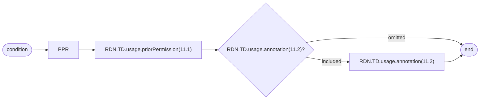
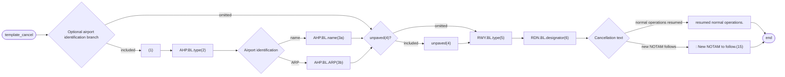

# [2.0] [RWY.LIM] Runway - usage limitation change (NOTAM)

<!--
Source PDF: [2.0] [RWY.LIM] Runway - usage limitation change (NOTAM).pdf

The original EBNF code is retained. Railroad syntax diagrams in the PDF are
represented as Mermaid flowcharts. Where a visual flowchart and the EBNF differ
in expressive precision, the EBNF is authoritative.
-->

## Text NOTAM production rules

This section provides rules for the automated production of the text NOTAM message items, based on the AIXM 5.1.1 data encoding of the Event. Therefore, AIXM specific terms are used, such as names of features and properties, types of TimeSlices, etc:

- the abbreviation **RDN.BL.** indicates that the corresponding data item must be taken from the RunwayDirection BASELINE;
- the abbreviation **AHP.BL.** indicates that the corresponding data item must be taken from the AirportHeliport BASELINE associated with the Runway that is associated with the RunwayDirection concerned;
- the abbreviation **RWY.BL.** indicates that the corresponding data item must be taken from the Runway BASELINE associated with the RunwayDirection concerned;
- the abbreviation **RDN.TD.** indicates that the corresponding data item must be taken from the RunwayDirection TEMPDELTA that was created for the Event.

### Notes

- According to encoding rule ER-01, each RunwayDirection of the Runway concerned by the closure will have a TEMPDELTA encoded. However, the closure information will be identical for all runway directions. Therefore, if not specified otherwise, the RDN.TD referred in the NOTAM production rules below shall be the one of the RunwayDirection with the lowest designator number;
- According to encoding rule ER-02, the TEMPDELTA might also include ManoeuvringAreaAvailability elements that have been copied from the BASELINE data for compliance with the AIXM Temporality rules. The current practice is to not include such static information in the NOTAM text. Therefore, all ManoeuvringAreaAvailability that have `operationalStatus=NORMAL` (they also have an associated annotation with `purpose=REMARK` and the `text="Baseline data copy. Not included in the NOTAM text generation"`) will be ignored for the NOTAM generation.

## Item A

The item A shall be generated according to the general production rules for item A using the `Event.concernedAirportHeliport`,

## Item Q

Apply the common NOTAM production rules for item Q, complemented by the following specific rules for this particular scenario:

### Q code

The following mapping shall be used:

> **Note:** In this table, "any" means "any value or no value (NIL)".

| `RDN.TD.availability.ManoeuvringAreaAvailability.timeInterval` | `usage.ManoeuvringAreaUsage.type` | `operation` | `priorPermission` | `../FlightCharacteristics` | `../AircraftCharacteristics` | Corresponding Q code: `RWY.BL.type='RWY'` | Corresponding Q code: `RWY.BL.type='FATO'` |
|---|---|---|---|---|---|---|---|
| not NIL | `'PERMIT'` | `'ALL'` | NIL | NIL | NIL | `QMRAH` | `QFPAH` |
| any | `'RESERVE'` | any | any | only `military='MIL'` | any | `QMRAM` | `QFPAM` |
| any | `'CONDITIONAL'` | any | not NIL | any | any | `QMRAP` | `QFPAP` |
| any | `'PERMIT'` | any | NIL | any | any | `QMRAR` | `QFPAR` |
| any | `'RESERVE'` | any | any | only `origin='HOME_BASED'` | any | `QMRLB` | `QFPLB` |
| any | `'FORBID'` | any | any | any | `weight` not NIL | `QMRLH` | `QFPLT` |
| any | `'FORBID'` | any | any | `rule = 'IFR'` | any | `QMRLI` | `QFPLI` |
| any | `'CONDITIONAL'` | any | any | any | `wingSpan` not NIL | `QMRLL` | `N/A` |
| any | `'FORBID'` | any | any | `rule = 'VFR'` | any | `QMRLV` | `QFPLV` |
| any other combination |  |  |  |  |  | `QMRLT` | `QFPLT` |

### Scope

Insert the value ‘A’.

### Lower limit / Upper limit

Use “000/999”

### Geographical reference

Insert the coordinate of the ARP (aerodrome reference point) of the airport (`AHP.BL.ARP.ElevatedPoint`), formatted as follows:

- the set of coordinates comprises 11 characters rounded up or down to the nearest minute; i.e. Latitude (N/S) in 5 characters; Longitude (E/W) in 6 characters;
- the radius value is “005”.

## Items B, C and D

Items B and C shall be decoded following the common production rules.

If at least one `RDN.TD.availability.ManouevringAreaAvailability.timeInterval` exists (i.e. the Event has an associated schedule), then all such Timesheet(s) shall be represented in item D according to the common NOTAM production rules for `{{Item D, E - Schedules}}`. Otherwise, item D shall be left empty.

## Item E

The following pattern should be used for automatically generating the E field text from the AIXM data:

### Template diagram

```mermaid
flowchart TD
    START([template]) --> PREFIX_Q{"Optional airport identification branch"}

    PREFIX_Q -->|included| REF1["(1)"]
    PREFIX_Q -->|omitted| UNPAVED_Q{"unpaved(4)?"}

    REF1 --> AHP_TYPE["AHP.BL.type(2)"]
    AHP_TYPE --> AIRPORT_ID_Q{"Airport identification"}
    AIRPORT_ID_Q -->|name| AHP_NAME["AHP.BL.name(3a)"]
    AIRPORT_ID_Q -->|ARP| AHP_ARP["AHP.BL.ARP(3b)"]
    AHP_NAME --> NL1["\\n"]
    AHP_ARP --> NL1
    NL1 --> UNPAVED_Q

    UNPAVED_Q -->|yes| UNPAVED["unpaved(4)"]
    UNPAVED_Q -->|no| RWY_TYPE["RWY.BL.type(5)"]
    UNPAVED --> RWY_TYPE

    RWY_TYPE --> RDN_DESIGNATOR["RDN.BL.designator(6)"]
    RDN_DESIGNATOR --> USAGE_TYPE["RDN.TD.usage.type(7)"]

    USAGE_TYPE --> FLIGHT_Q{"RDN.TD.usage.flight(8)?"}
    FLIGHT_Q -->|included| FLIGHT["RDN.TD.usage.flight(8)"]
    FLIGHT_Q -->|omitted| AIRCRAFT_Q{"RDN.TD.usage.aircraft(9)?"}
    FLIGHT --> AIRCRAFT_Q

    AIRCRAFT_Q -->|included| AIRCRAFT["RDN.TD.usage.aircraft(9)"]
    AIRCRAFT_Q -->|omitted| OPERATION["RDN.TD.usage.operation(10)"]
    AIRCRAFT --> OPERATION

    OPERATION --> CONDITIONS_Q{"conditions(11)?"}
    CONDITIONS_Q -->|included| CONDITIONS["conditions(11)"]
    CONDITIONS_Q -->|omitted| MORE_USAGE_Q{"Additional usage branch?"}
    CONDITIONS --> MORE_USAGE_Q

    MORE_USAGE_Q -->|yes| SEP["(12), comma"]
    SEP --> FLIGHT_Q
    MORE_USAGE_Q -->|no| REASON_Q{"Reason annotation(13)?"}

    REASON_Q -->|included| REASON_LINE["\\n + due to + RDN.TD.availability.annotation(13) + \\n"]
    REASON_Q -->|omitted| NOTE_Q{"Another annotation(14)?"}
    REASON_LINE --> NOTE_Q

    NOTE_Q -->|yes| NOTE_LINE[". + RDN.TD.availability.annotation(14) + \\n"]
    NOTE_LINE --> NOTE_Q
    NOTE_Q -->|no| FINAL_PERIOD_Q{"Final period?"}

    FINAL_PERIOD_Q -->|included| PERIOD["."]
    FINAL_PERIOD_Q -->|omitted| END_NODE([end])
    PERIOD --> END_NODE
```



### EBNF Code

```ebnf
template = ["(1)" "AHP.BL.type(2)" ("AHP.BL.name(3a)" | "AHP.BL.ARP(3b)") ] "\n" \n
["unpaved(4)"] "RWY.BL.type(5)" "RDN.BL.designator(6)" "RDN.TD.usage.type(7)" \n
(["RDN.TD.usage.flight(8)"] ["RDN.TD.usage.aircraft(9)"] "RDN.TD.usage.operation(10)" ["conditions(11)"]) {
"(12)" "," (["RDN.TD.usage.flight(8)"] ["RDN.TD.usage.aircraft(9)"] "RDN.TD.usage.operation(10)" ["conditions
(11)"])} \n

template_bottom =
["\n" "due to" "RDN.TD.availability.annotation(13)" "\n"] \n
{"." "RDN.TD.availability.annotation(14)" "\n"} ["."].
```

### Production rules

#### (1)

If `AHP.BL.locationIndicatorICAO` is not null, then ignore this branch.

#### (2)

Insert here the type of the airport decoded as follows:

| `AHP.BL.type` | Text to be inserted in Item E |
|---|---|
| AD or AH | `"AD"` |
| HP | `"Heliport"` |
| LS or OTHER | `"Landing site"` |

#### (3) airport name

a. If `AHP.BL.name` is not NIL, then insert it here. Otherwise:  
b. insert here the text `"located at"` followed by the `AHP.BL.ARP.ElevatedPoint` decoded according to the text NOTAM production rules for `aixm:Point`

#### (4) runway surface composition

Insert the word “unpaved” if `RWY.BL.SurfaceCharacteristics.composition` has one of the values `'CLAY, CORAL, EARTH, GRASS, GRAVEL, ICE, LATERITE, MACADAM, SAND, SNOW, WATER, OTHER'`. Otherwise do not insert anything.

#### (5) runway

Insert here the type of the Runway decoded as follows:

| `RWY.BL.type` | Text to be inserted in Item E |
|---|---|
| RWY | `"RWY"` |
| FATO | `"FATO"` |

#### (6) runway direction

If more than one RunwayDirection has a TEMPDELTA associated with the Event, then insert the designator of each additional RunwayDirection, preceded by `"/"`, starting with the one with the lower designator number. In general, a runway has two landing directions but there may exist very rare situations with 3-4 landing directions.

#### (7) conditional for / closed, except for / prohibited for / additionally allowed for

Insert here `RDN.TD.availability.ManoeuvringAreaAvailability.usage.ManoeuvringAreaUsage` as follows:

| `type` | Text to be inserted in item E |
|---|---|
| `"CONDITIONAL"` | `"available for"` |
| `"RESERV"` | `"closed, except for"` |
| `"FORBID"` | `"prohibited for"` |
| `"PERMIT"` | `"now available for"` |

#### (8) flight

Decode here each `FlightCharacteristics` property that was specified, as detailed below. If more than one `FlightCharacteristics` property was used, insert blanks between consecutive properties.

##### `FlightCharacteristics.type`

| `FlightCharacteristics.type*` | Text to be inserted in Item E |
|---|---|
| OAT | `"Operational Air Traffic"` |
| GAT | `"General Air Traffic"` |
| ALL | `"Operational Air Traffic/General Air Traffic"` |
| OTHER:FREE_TEXT | `"free text"` (replace `"_"` with blanks) |

\*Note: type is unlikely to be used in a NOTAM, its decoding is provided for completeness sake.

##### `FlightCharacteristics.rule`

| `FlightCharacteristics.rule` | Text to be inserted in Item E |
|---|---|
| IFR | `"IFR"` |
| VFR | `"VFR"` |
| ALL* | `"IFR/VFR"` |
| OTHER:FREE_TEXT | `"free text"` (replace `"_"` with blanks) |

\*Note: value is unlikely to be used in a NOTAM, its decoding is provided for completeness sake.

##### `FlightCharacteristics.status`

| `FlightCharacteristics.status` | Text to be inserted |
|---|---|
| HEAD | `"Head of State"` |
| STATE | `"State acft"` |
| HUM | `"HUM"` |
| HOSP | `"HOSP"` |
| SAR | `"SAR"` |
| EMERGENCY | `"EMERG"` |
| ALL | `"State acft/HUM/HOSP/SAR/EMERG"` |
| OTHER:MEDEVAC | `"MEDEVAC"` |
| OTHER:FIRE_FIGHTING | `"fire fighting"` |
| OTHER:FREE_TEXT | `"free text"` (replace `"_"` with blanks and convert to lowercase) |

##### `FlightCharacteristics.military`

| `FlightCharacteristics.military` | Text to be inserted in Item E |
|---|---|
| MIL | `"MIL acft"` |
| CIVIL | `"civil acft"` |
| ALL* | `"civil/MIL acft"` |
| OTHER:FREE_TEXT* | `"free text"` (replace `"_"` with blanks) |

\*Note: value is unlikely to be used in a NOTAM, its decoding is provided for completeness sake.

##### `FlightCharacteristics.origin`

| `FlightCharacteristics.origin` | Text to be inserted |
|---|---|
| NTL | `"domestic"` |
| INTL | `"intl"` |
| HOME_BASED | `"home based"` |
| ALL* | `"domestic/intl"` |
| OTHER:FREE_TEXT* | `"free text"` (replace `"_"` with blanks) |

\*Note: value is unlikely to be used in a NOTAM, its decoding is provided for completeness sake.

##### `FlightCharacteristics.purpose`

| `FlightCharacteristics.purpose` | Text to be inserted |
|---|---|
| SCHEDULED | `"scheduled"` |
| NON_SCHEDULED | `"not scheduled"` |
| PRIVATE* | `"private"` |
| AIR_TRAINING | `"training"` |
| AIR_WORK* | `"aerial work"` |
| PARTICIPANT | `"participating acft"` |
| ALL* | `"scheduled/not scheduled/private/training/aerial work/participating acft"` |
| OTHER:FREE_TEXT* | `"free text"` (replace `"_"` with blanks) |

\*Note: value is unlikely to be used in a NOTAM, its decoding is provided for completeness sake.

#### (9) aircraft

Decode here each `AircraftCharacteristics` property that was specified, as detailed below. If more than one `AircraftCharacteristics` property was used, insert blanks between consecutive properties.

##### `AircraftCharacteristics.type`

| `AircraftCharacteristics.type` | Text to be inserted in Item E |
|---|---|
| LANDPLANE | `"landplanes"` |
| SEAPLANE* | `"seaplanes"` |
| AMPHIBIAN | `"amphibians"` |
| HELICOPTER | `"hel"` |
| GYROCOPTER | `"gyrocopters"` |
| TILT_WING | `"tilt wing acft"` |
| STOL | `"short take-off and landing acft"` |
| GLIDER* | `"gliders"` |
| HANGGLIDER* | `"hang-gliders"` |
| PARAGLIDER* | `"paragliders"` |
| ULTRA_LIGHT* | `"ultra lights"` |
| BALLOON* | `"balloons"` |
| UAV* | `"unmanned acft"` |
| ALL* | `"all acft types"` |
| OTHER:FREE_TEXT | `"free text"` (replace `"_"` with blanks) |

\*Note: value is unlikely to be used in a NOTAM, its decoding is provided for completeness sake.

##### `AircraftCharacteristics.engine`

| `AircraftCharacteristics.engine` | Text to be inserted in Item E |
|---|---|
| JET | `"jet acft"` |
| PISTON | `"piston acft"` |
| TURBOPROP | `"turboprop acft"` |
| ELECTRIC | `"electric engine acft"` |
| ALL | `"all engine types"` |
| OTHER:FREE_TEXT | `"free text"` (replace `"_"` with blanks) |

##### `AircraftCharacteristics.wingSpan`

`AircraftCharacteristics.wingSpan` - insert the value followed by the value of the `uom` attribute. Prefix with the value of `AircraftCharacteristics.wingSpanInterpretation`, decoded as indicated in the following table:

| `AircraftCharacteristics.wingSpanInterpretation` | Text to be inserted in Item E |
|---|---|
| ABOVE | `"acft with wingspan more than"` |
| AT_OR_ABOVE | `"acft with wingspan equal to or more than"` |
| AT_OR_BELOW | `"acft with wingspan equal to or less than"` |
| BELOW | `"acft with wingspan less than"` |
| OTHER:FREE_TEXT* | `"free text"` (replace `"_"` with blanks) |

\*Note: value is unlikely to be used in a NOTAM, its decoding is provided for completeness sake.

##### `AircraftCharacteristics.weight`

`AircraftCharacteristics.weight` - insert the value followed by the value of the `uom` attribute. Prefix with the value of `AircraftCharacteristics.weightInterpretation`, decoded as indicated in the following table:

| `AircraftCharacteristics.weightInterpretation` | Text to be inserted in Item E |
|---|---|
| ABOVE | `"acft mass heavier than"` |
| AT_OR_ABOVE | `"acft mass equal to or heavier than"` |
| AT_OR_BELOW | `"acft mass equal to or lighter than"` |
| BELOW | `"acft mass lighter than"` |
| OTHER:FREE_TEXT* | `"free text"` (replace `"_"` with blanks) |

\*Note: value is unlikely to be used in a NOTAM, its decoding is provided for completeness sake.

#### (10) operation

Decode here the `RDN.TD.availability.usage.operation` as follows:

| `TD.usage.operation` | Text to be inserted in Item E |
|---|---|
| LANDING | `"landing"` |
| TAKEOFF | `"tkof"` |
| TOUCHGO | `"tgl"` |
| TRAIN_APPROACH | `"practice low approaches"` |
| TAXIING | `"taxiing"` |
| CROSSING | `"crossing"` |
| AIRSHOW | `"acft participating in air display"` |
| ALL* | `"all operations"`* |
| OTHER:MY_TEXT | `"my text"` (replace `"_"` with blanks and convert to lowercase) |

\*Note: if all operations are affected, then either provide the text as described above or do not provide the text at all.

#### (11) PPR time / PPR details

If `RDN.TD.usage.priorPermission` is not NIL, then insert here the decoding of the PPR information as detailed in the following diagram:

##### PPR condition diagram



##### EBNF Code

```ebnf
condition_PPR = "PPR " "RDN.TD.usage.priorPermission(11.1)" ["RDN.TD.usage.
annotation(11.2)"].
```

| Reference | Rule |
|---|---|
| (11.1) | Insert here the value of the `priorPermission` attribute followed by its unit of measurement decoded according to the `{{text NOTAM production rules for duration}}` |
| (11.2) | Decode here the annotation with `propertyName="priorPermission"` and `purpose="REMARK"`, according to the decoding rules for annotations. |

#### (12)

If more than one `RDN.TD.availability.ManoeuvringAreaAvailability.ManoeuvringAreaUsage.type` element is present, then select and decode the additional `ManoeuvringAreaUsage` branch consecutively.

#### (13) reason

If there exists a `RDN.TD.ManoeuvringAreaAvailability.annotation` with `propertyName="operationalStatus"` and `purpose='REMARK'` (the reason for limitation, according to the coding rules), then translate it into free text according to the decoding rules for annotations.

#### (14) note

Annotations of `RDN.TD.ManoeuvringAreaAvailability` shall be translated into free text according to the decoding rules for annotations.

> **Note:** The objective is to full automatic generation, without human intervention. However, the implementers of the specification might consider reducing the cost of a fully automated generation by allowing the operator to fine-tune the text in order to improve its readability (with the inherent risk for human error, when re-typing is allowed).

## Items F & G

Leave empty.

## Event Update

The eventual update of this type of event shall be encoded following the general rules for Event update or cancellation, which provide instructions for all NOTAM fields, except for item E and the condition part of the Q code, in the case of a NOTAM C

If a NOTAM C is produced, then the 4th and 5th letters (the `"condition"`) of the Q code shall be `"AK"`, except for the situation of a “New NOTAM to follow” in which case `"XX"` shall be used.

The following pattern should be used for automatically generating the E field text from the AIXM data:

### Cancellation template diagram



### EBNF Code

```ebnf
template_cancel = ["(1)" "AHP.BL.type (2)" ("AHP.BL.name (3a)" | "AHP.BL.ARP (3b)") ] ["unpaved(4)"] "RWY.
BL.type(5)" "RDN.BL.designator(6)" ("resumed normal operations." | " : New NOTAM to follow.(15)").
```

| Reference | Rule |
|---|---|
| (15) | If the NOTAM will be followed by a new NOTAM concerning the same situation, then the operator shall have the possibility to choose the `"New NOTAM to follow"` branch. This branch cannot be selected automatically because this information is only known by the operator.<br><br>Note: in this case, the 4th and 5th letters of the Q code shall also be changed into `"XX"`. |
