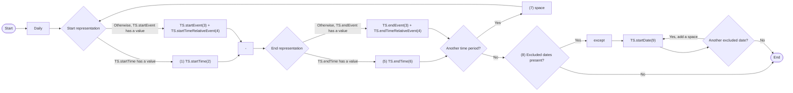
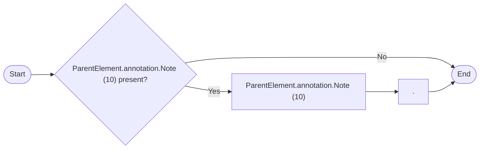

# Production rule - Daily

> Source converted from `DNOTAM-Productionrule-Daily-100726-0300-18226.pdf`.
>
> The PDF line wrapping has been normalized without changing the substantive wording. The original railroad-style syntax diagrams are represented below as Mermaid flowcharts, and the original EBNF source is retained.

## Syntax diagram: `daily`



## Syntax diagram: `remarks`



## EBNF source

```ebnf
daily = Daily ((("(1)" "TS.startTime(2)") | ("TS.startEvent(3)" "TS.startTimeRelativeEvent(4)")) "-" (("(5)" "TS.endTime(6)") | ("TS.endEvent(3)" "TS.endTimeRelativeEvent(4)"))) {"(7)" " " (("(1)" "TS.startTime(2)") | ("TS.startEvent(3)" "TS.startTimeRelativeEvent(4)")) "-" (("(5)" "TS.endTime(6)") | ("TS.endEvent(3)" "TS.endTimeRelativeEvent(4)"))} ["(8)" except "TS.startDate(9)" {" " "TS.startDate(9)"}].

remarks = ["ParentElement.annotation.Note (10)" "."].
```

## Rules

| Reference | Data item (from coding template) | Rule |
|---|---|---|
| (1) |  | If `TS.startTime` has a value then use this path. Otherwise, if `TS.startEvent` has a value, then use the alternate path. |
| (2) | start time | Format the data contained in `TS.startTime` according to NOTAM syntax for this item: *hhmm*. |
| (3) | start event | Decode this value as follows: SR `"SR"`, SS `"SS"` |
| (4) | rel. start | If `TS.startTimeRelativeEvent` has a value, then decode by replacing `'-'` by *'minus'* and `'+'` by *'plus'*, followed by the number of minutes in *mm* format. |
| (5) |  | If `TS.endTime` has a value then use this path. Otherwise, if `TS.endEvent` has a value, then use the alternate path. |
| (6) | end time | Format the data contained in `TS.endTime` according to NOTAM syntax for this item: *hhmm*.<br><br>If `TS.endTime` is `'00:00'`, then the value `"2359"` shall be used as *hhmm* group in the NOTAM. |
| (7) |  | If there are multiple `Timesheet` (i.e. multiple time periods included in the schedule), sort them by `TS.startTime` and `TS.startEvent`.<br><br>**Sugestion**<br><br>For Timesheet sorting purpose, the SR (sunrise) and SS (sunset) codes need to be converted into actual times. For example, consider an airspace is active according to the following schedule:<br><br>• 1st Timesheet: 12:00-14:00, time reference = UTC<br>• 2nd Timesheet : SR - 10:00, time reference = UTC<br>• 3rd Timesheet: SS-21:00, time reference = UTC<br><br>When generating the text for item E or D, these three time periods should appear in a "timeline" order: `"SR-1000 1200-1400 SS-2100"`.<br><br>The Timesheets do not have any `"order"` attribute. There are known algorithms for calculating exact SS and SR time, based on location, which can be derived from the owning feature geometry or from the Event associations with Airport/Heliport and/or FIR. A possibly simpler solution is to pre-define an approximate time for SR/SS, such as 06:00/19:00 local time, which might be good enough for sorting Timesheets. |
| (8) |  | If there are any timesheets containing `TS.excluded` elements with the value `'YES'`, denoting a schedule with exceptions, select all of them and use this path, otherwise go through the bypass path. |
| (9) | excluded date | Use all the Timesheet that have `TS.excluded='YES'` at once and apply the following algorithm:<br><br>• order these Timesheet by the calendar order of `TS.startDate`;<br>• format each `TS.startDate` to show the month abbreviation followed by two digits (MMM DD), eg. `"except AUG 23"`, according to item D NOTAM syntax. Add space (`" "`) between the consecutive values;<br>• if two consecutive values have the same MMM value, then eliminate the repeated MMM value: for example, `"except AUG 23 AUG 30"` needs to be replaced with `"except AUG 23 30"` |
| (10) | schedule note | Annotations of parent object that have `propertyName='timeInterval'` and `purpose='REMARK'`. shall be translated into free text according to the decoding rules for annotations. The resulting text shall be appended at the end of item E. |
