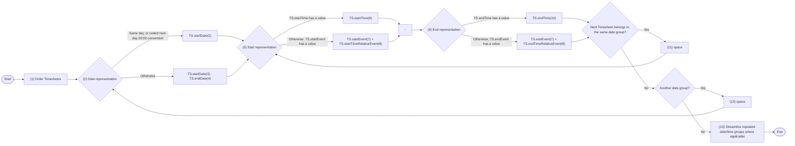
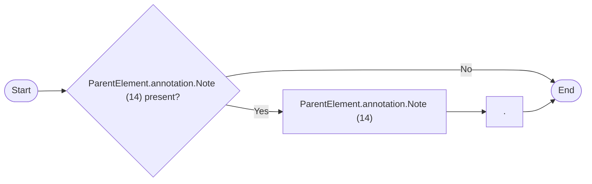

# Production rule - Dates

> Source converted from `DNOTAM-Productionrule-Dates-100726-0301-18232.pdf`.
>
> The PDF line wrapping has been normalized without changing the substantive wording. The original railroad-style syntax diagrams are represented below as Mermaid flowcharts, and the original EBNF source is retained.

## Syntax diagram: `dates`



## Syntax diagram: `remarks`



## EBNF source

```ebnf
dates = "(1)" ("(2)" "TS.startDate(3)" | "TS.startDate(3)" "-" "TS.endDate(4)") ("(5)" "TS.startTime(6)" | "TS.startEvent(7)" "TS.startTimeRelativeEvent(8)") "-" ("(9)" "TS.endTime(10)" | "TS.endEvent(7)" "TS.endTimeRelativeEvent(8)") {"11" " " ("(5)" "TS.startTime(6)" | "TS.startEvent(7)" "TS.startTimeRelativeEvent(8)") "-" ("(9)" "TS.endTime(10)" | "TS.endEvent(7)" "TS.endTimeRelativeEvent(8)")} {"(12)" " " ("(2)" "TS.startDate(3)" | "TS.startDate(3)" "-" "TS.endDate(4)") ("(5)" "TS.startTime(6)" | "TS.startEvent(7)" "TS.startTimeRelativeEvent(8)") "-" ("(9)" "TS.endTime(10)" | "TS.endEvent(7)" "TS.endTimeRelativeEvent(8)") {"11" " " ("(5)" "TS.startTime(6)" | "TS.startEvent(7)" "TS.startTimeRelativeEvent(8)") "-" ("(9)" "TS.endTime(10)" | "TS.endEvent(7)" "TS.endTimeRelativeEvent(8)")}} "(13)".

remarks = ["ParentElement.annotation.Note (14)" "."].
```

## Rules

| Reference | Data item (from coding template) | Rule |
|---|---|---|
| (1) |  | If there are multiple `Timesheet` (i.e. multiple time periods included in the schedule), then the following algorithm is proposed:<br><br>• first, order by `TS.startDate`<br>• then, for each group of consecutive Timesheet that have the same `startDate` and `endDate`, order by `startTime`. Note: see the recommendations provided in rule (7) of the Production rule - Daily with regard to ordering Timesheets by `startTime` and `startEvent`)<br>• then, for each Timesheet apply the rules described in the following lines of this table. |
| (2) |  | Use this branch when:<br><br>• `TS.endDate` is equal to `TS.startDate`, or<br>• `TS.endDate` is has the value of the next calendar day after `TS.startDate` and `TS.endTime` has the value `'00:00'` (the convention for end of day was applied in the coding)<br><br>Otherwise use the alternate branch. |
| (3) | start date | Convert `TS.startDate` into the NOTAM format (*MMM DD*) |
| (4) | end date | If `TS.endTime` has the value `'00:00'` (the convention for end of day was applied in the coding), then use the previous calendar (before the coded `TS.endDate`). Otherwise, use the `TS.endDate`.<br><br>Convert the appropriate value in the NOTAM format (*MMM DD*) |
| (5) |  | If `TS.startTime` has a value then use this path. Otherwise, if `TS.startEvent` has a value, then use the alternate path. |
| (6) | start time | Format the data contained in `TS.startTime` according to NOTAM syntax for this item: *hhmm*. |
| (7) | start event | Decode this value as follows: `'SR'` `"SR"`, `'SS'` `"SS"` |
| (8) | rel. start | If `TS.startTimeRelativeEvent` has a value, then decode by replacing `'-'` by *'minus'* and `'+'` by *'plus'*, followed by the number of minutes in *mm* format. |
| (9) |  | If `TS.endTime` has a value then use this path. Otherwise, if `TS.endEvent` has a value, then use the alternate path. |
| (10) | end time | Format the data contained in `TS.endTime` according to NOTAM syntax for this item: *hhmm*.<br><br>If `TS.endTime` is `'00:00'`, then the value `"2359"` shall be used as *hhmm* group in the NOTAM. |
| (11) (12) |  | If there are multiple Timesheet to process, if the following conditions are met for the next Timesheet (following the ordering specified in rule (1) above):<br><br>• it has identical values for `startDate` and `endDate` with the current Timesheet<br>• it has the same `startDate`, but `endDate` is one day later than the `endDate` of the current Timesheet and `endTime` has the value `'00:00'` (the convention for end of day was applied in the coding)<br><br>then, use the return branch (11) and process only the time/event values of the next Timesheet, Otherwise, return through branch (12) and process the next Timesheet in full. |
| (13) |  | The algorithm proposed above could still result into date/time groups in item D that have the same date range. That's because the ordering/grouping of the Timesheet is done only by similar `starDate`/`endDate`. For example, this could result into the following: `"D) SEP 01-05 0700-0900 1300-1400 SEP 08-13 0700-0900 1300-1400 SEP 15 0700 1100"`. Based on the current NOTAM practice, the first two date/time groups (`"SEP 01-05"` and `"SEP 08-13"`) should be collapsed into a single dates group, because they have the same times: `"D) SEP 01-05 08-13 0700-0900 1300-1400 SEP 15 0700 1100"`.<br><br>This streamlining of the resulting schedule text could be done at the end of the text generation process or directly in the production rule, with a more sophisticated algorithm. The resolution of this issue is left for the implementers. |
| (14) | schedule note | Annotations of parent object that have `propertyName='timeInterval'` and `purpose='REMARK'`. shall be translated into free text according to the decoding rules for annotations. The resulting text shall be appended at the end of item E. |
