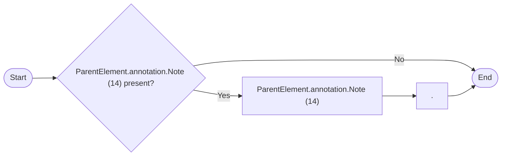

# Production rule - Weekdays

> Source converted from `DNOTAM-Productionrule-Weekdays-100726-0300-18230.pdf`.
>
> The PDF line wrapping has been normalized without changing the substantive wording. The original railroad-style syntax diagrams are represented below as Mermaid flowcharts, and the original EBNF source is retained.

## Syntax diagram: `weekdays`

```mermaid
flowchart LR
    S([Start]) --> SORT["(1) Order Timesheets"]
    SORT --> DAY_KIND{"(2) Day representation"}

    DAY_KIND -->|"TS.dayTil absent, or next weekday with endTime 00:00"| DAY_SAME["TS.day"]
    DAY_KIND -->|Otherwise| DAY_RANGE_START["TS.day"]

    DAY_SAME --> START_KIND_SAME{"(3) Start representation"}
    START_KIND_SAME -->|"TS.startTime has a value"| START_TIME_SAME["TS.startTime(4)"]
    START_KIND_SAME -->|"Otherwise, TS.startEvent has a value"| START_EVENT_SAME["TS.startEvent(5) + TS.startTimeRelativeEvent(6)"]

    START_TIME_SAME --> HYPHEN_SAME["-"]
    START_EVENT_SAME --> HYPHEN_SAME
    HYPHEN_SAME --> END_KIND_SAME{"(7) End representation"}
    END_KIND_SAME -->|"TS.endTime has a value"| END_TIME_SAME["TS.endTime(8)"]
    END_KIND_SAME -->|"Otherwise, TS.endEvent has a value"| END_EVENT_SAME["TS.endEvent(5) + TS.endTimeRelativeEvent(6)"]

    END_TIME_SAME --> MORE_TIMES_SAME{"Another time period for the same day?"}
    END_EVENT_SAME --> MORE_TIMES_SAME
    MORE_TIMES_SAME -->|Yes| RETURN9["(9)"]
    RETURN9 --> START_KIND_SAME

    DAY_RANGE_START --> START_KIND_RANGE{"(3) Start representation"}
    START_KIND_RANGE -->|"TS.startTime has a value"| START_TIME_RANGE["TS.startTime(4)"]
    START_KIND_RANGE -->|"Otherwise, TS.startEvent has a value"| START_EVENT_RANGE["TS.startEvent(5) + TS.startTimeRelativeEvent(6)"]

    START_TIME_RANGE --> HYPHEN_RANGE["-"]
    START_EVENT_RANGE --> HYPHEN_RANGE
    HYPHEN_RANGE --> DAY_TIL["TS.dayTil"]
    DAY_TIL --> END_KIND_RANGE{"(7) End representation"}
    END_KIND_RANGE -->|"TS.endTime has a value"| END_TIME_RANGE["TS.endTime(8)"]
    END_KIND_RANGE -->|"Otherwise, TS.endEvent has a value"| END_EVENT_RANGE["TS.endEvent(5) + TS.endTimeRelativeEvent(6)"]

    MORE_TIMES_SAME -->|No| MORE_DAY_GROUPS{"Another day/dayTil group?"}
    END_TIME_RANGE --> MORE_DAY_GROUPS
    END_EVENT_RANGE --> MORE_DAY_GROUPS

    MORE_DAY_GROUPS -->|Yes| RETURN10["(10)"]
    RETURN10 --> DAY_KIND

    MORE_DAY_GROUPS -->|No| STREAMLINE["(11) Streamline consecutive weekdays with identical times where applicable"]
    STREAMLINE --> EXCEPTIONS{"(12) Excluded dates present?"}
    EXCEPTIONS -->|No| E([End])
    EXCEPTIONS -->|Yes| EXCEPT["except"]
    EXCEPT --> DATE["TS.startDate(13)"]
    DATE --> MORE_DATES{"Another excluded date?"}
    MORE_DATES -->|Yes, add a space| DATE
    MORE_DATES -->|No| E
```



## Syntax diagram: `remarks`



## EBNF source

```ebnf
weekdays = "(1)" ("(2)" "TS.day" ("(3)" "TS.startTime(4)" | "TS.startEvent(5)" "TS.startTimeRelativeEvent(6)") "-" ("(7)" "TS.endTime(8)" | "TS.endEvent(5)" "TS.endTimeRelativeEvent(6)") {"(9)" ("(3)" "TS.startTime(4)" | "TS.startEvent(5)" "TS.startTimeRelativeEvent(6)") "-" ("(7)" "TS.endTime(8)" | "TS.endEvent(5)" "TS.endTimeRelativeEvent(6)")} | "TS.day" ("(3)" "TS.startTime(4)" | "TS.startEvent(5)" "TS.startTimeRelativeEvent(6)") "-" "TS.dayTil" ("(7)" "TS.endTime(8)" | "TS.endEvent(5)" "TS.endTimeRelativeEvent(6)")) {"(10)" ("(2)" "TS.day" ("(3)" "TS.startTime(4)" | "TS.startEvent(5)" "TS.startTimeRelativeEvent(6)") "-" ("(7)" "TS.endTime(8)" | "TS.endEvent(5)" "TS.endTimeRelativeEvent(6)") {"(9)" ("(3)" "TS.startTime(4)" | "TS.startEvent(5)" "TS.startTimeRelativeEvent(6)") "-" ("(7)" "TS.endTime(8)" | "TS.endEvent(5)" "TS.endTimeRelativeEvent(6)")} | "TS.day" ("(3)" "TS.startTime(4)" | "TS.startEvent(5)" "TS.startTimeRelativeEvent(6)") "-" "TS.dayTil" ("(7)" "TS.endTime(8)" | "TS.endEvent(5)" "TS.endTimeRelativeEvent(6)"))} "(11)" ["(12)" except "TS.startDate(13)" {" " "TS.startDate(13)"}].

remarks = ["ParentElement.annotation.Note (14)" "."].
```

## Rules

| Reference | Data item (from coding template) | Rule |
|---|---|---|
| (1) |  | If there are multiple `Timesheet` (i.e. multiple time periods included in the schedule), then the following algorithm is proposed:<br><br>• first, order by `TS.day`<br>• then, for each group of consecutive Timesheet that have the same `TS.day` value order by `TS.startTime` or `TS.startEvent` (whichever is present). Note: see the recommendations provided in rule (7) of the Production rule - Daily with regard to ordering Timesheets by `startTime` and `startEvent`)<br>• then, for each Timesheet apply the rules described in the following lines of this table. |
| (2) |  | Use this branch when:<br><br>• `TS.dayTil` does not have a value, or<br>• `TS.dayTil` has the value of the next week day after `TS.day` and `TS.endTime` has the value `'00:00'` (the convention for end of day was applied in the coding).<br><br>Otherwise use the alternate branch. |
| (3) |  | If `TS.startTime` has a value then use this path. Otherwise, if `TS.startEvent` has a value, then use the alternate path. |
| (4) | start time | Format the data contained in `TS.startTime` according to NOTAM syntax for this item: *hhmm*. |
| (5) | start event | Decode this value as follows: `'SR'` `"SR"`, `'SS'` `"SS"` |
| (6) | rel. start | If `TS.startTimeRelativeEvent` has a value, then decode by replacing `'-'` by *'minus'* and `'+'` by *'plus'*, followed by the number of minutes in *mm* format. |
| (7) |  | If `TS.endTime` has a value then use this path. Otherwise, if `TS.endEvent` has a value, then use the alternate path. |
| (8) | end time | Format the data contained in `TS.endTime` according to NOTAM syntax for this item: *hhmm*.<br><br>If `TS.endTime` is `'00:00'`, then the value `"2359"` shall be used as *hhmm* group in the NOTAM (the convention for end of day was applied in the coding). |
| (9)(10) |  | If there are multiple Timesheet to process, if the following conditions are met for the next Timesheet (following the ordering specified in rule (1) above):<br><br>• both Timesheets have identical values for `day` and no value for `dayTil` (for example, `"MON 09:00-11:00"` is followed by `"MON 15:00-17:00"`)<br>• both Timesheets have identical values for `day`, the current Timesheet has no value for `dayTil` and the next Timesheet has as value for `dayTil` the next week day and `endTime` equal to `'00:00'` (the convention for end of day was applied in the coding, for example `"MON 09:00-11:00"` is followed by `"MON 15:00- TUE 00:00"`, which in the NOTAM will need to appear as `"MON 0900-1100 1500-2359"`)<br><br>then, use the return branch (9) and process only the time/event values of the next Timesheet, Otherwise, return through branch (10) and process the next Timesheet in full. |
| (11) |  | The algorithm proposed above could still result into consecutive week days in item D that have the same time periods. That's because the ordering/grouping of the Timesheet is done only by similar `day`/`dayTil`. For example, this could result into the following: `"D) MON 0700-0900 1300-1400 TUE 0700-0900 1300-1400 WED 0700-0900 1300-1400 THU 0600-1500"`. Based on the current NOTAM practice, the first three week day/time groups should be collapsed into a single week-day range, because they have the same times: `"D) MON-WED 0700-0900 1300-1400 THU 0600-1500"`.<br><br>This streamlining of the resulting schedule text could be done at the end of the text generation process or directly in the production rule, with a more sophisticated algorithm. The resolution of this issue is left for the implementers. |
| (12) |  | If there are any timesheets containing `TS.excluded` elements with the value `'YES'`, denoting a schedule with exceptions, select all of them and use this path, otherwise go through the bypass path. |
| (13) | excluded date | Use all the Timesheet that have `TS.excluded='YES'` at once and apply the following algorithm:<br><br>• order these Timesheet by the calendar order of `TS.startDate`;<br>• format each `TS.startDate` to show the month abbreviation followed by two digits (MMM DD), eg. `"except AUG 23"`, according to item D NOTAM syntax. Add space (`" "`) between the consecutive values;<br>• if two consecutive values have the same MMM value, then eliminate the repeated MMM value: for example, `"except AUG 23 AUG 30"` needs to be replaced with `"except AUG 23 30"` |
| (14) | schedule note | Annotations of parent object that have `propertyName='timeInterval'` and `purpose='REMARK'`. shall be translated into free text according to the decoding rules for annotations. The resulting text shall be appended at the end of item E. |
