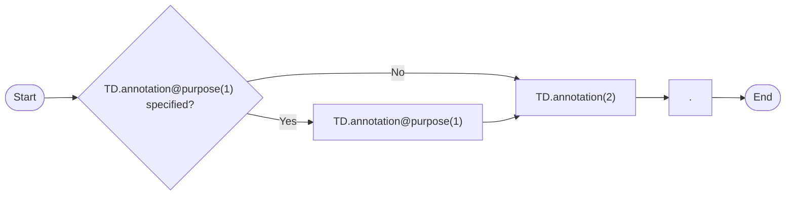

# Item E - annotations

Annotations represent free text notes that complement the structured data with explanations, descriptions, warnings that are primarily addresses to humans involved in aeronautical operations. The AIXM model enables the encoding of annotations in multiple languages and it also enables a basic classification of the annotation purpose, as defined by the `Note` class.

In the Event scenarios, annotations are used for encoding information that is not suitable for encoding as specific feature properties. In some situations, there might even exist dedicated features and properties that can provide the same information in a more structured format, but at the expense of significantly more encoding effort and application development cost. At the current stage of the Digital NOTAM concept implementation, it was not considered necessary to recommend that such data is provided more structured than using notes. For example, in the “Published special activity area - activation” scenario, the information about the authority to be contacted for further information on an active restricted area might be encoded as an information (service) provider Unit for that Airspace. However, taking into consideration the expected usage of this information (the pilot will manually contact the authority), it was considered sufficient to encode this information as a text annotation only.

## Decoding rules

The content of the AIXM annotations will typically be included at the end of the E) item, according to the following pattern:

### Template diagram



### Text representation of the original diagram

```text
template

           +------------------------------------+
           |                                    |
Start ---> [TD.annotation@purpose(1)] ---> [TD.annotation(2)] ---> [.] ---> End
           |                                    ^
           +------------------------------------+
```

| Reference | Rule |
|---|---|
| (1) | If specified, the `"purpose"` attribute shall be decoded as follows:<br><br>- DESCRIPTION, REMARK or OTHER => nothing<br>- WARNING => `"Warning: "`<br>- DISCLAIMER => `"Disclaimer: "` |
| (2) | The text of the annotation shall formatted in normal `"sentence case"`, with abbreviations and acronyms spelled as detailed in Appendix A - Abbreviations and acronyms |
