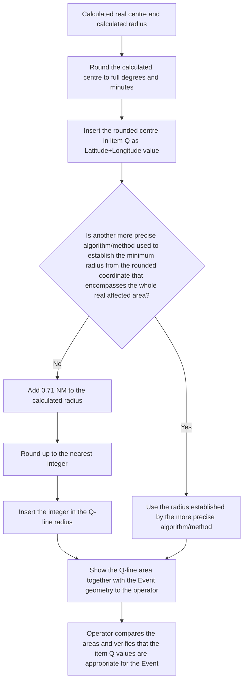

# Item Q

The item Q shall be generated automatically as described in this section. However, a Digital NOTAM encoding tool should allow an operator to manually modify the elements of the item Q based on their operational judgement. Eventually, the specification of further Q-line rules on national level should be possible, in order to minimise the need for human intervention.

## FIR

The value of this field shall be calculated in conjunction with the value of item A:

- If Item A contains the ICAO code of an airport (or the country code followed by XX, in case the airport does not have an allocated ICAO code), then insert the designator of the overlying FIR of this airport;
- If Item A contains the ICAO code (designator) of a FIR, copy that value here as well;
- If Item A contains more than one FIR, insert the first country code (one or two letters) of the issuing country followed by xx or xxx as appropriate;

## Traffic

Pre-filled according to ICAO doc 8126 NSC for the selected Q-code.

## Purpose

Pre-filled according to ICAO doc 8126 NSC for the selected Q-code.

## Scope

The rules are specified in each particular scenario.

## Lower limit / Upper limit

In general, the values to be inserted are derived from those specified for Items F & G, as indicated in the table below. Some scenarios might have particular rules. These are provided for the scenarios concerned.

| Item F/G content (see the rules provided later in this document) | Lower/Upper limit value |
|---|---|
| `"SFC"` (only in item F) | `"000"` (as Lower limit) |
| `"UNL"` (only in item G) | `"999"` (as Upper limit) |
| `"XXXXXFT AGL"` | add to the indicated value the elevation in FT of the local lowest point (for item G: the highest point) of the terrain to obtain the corresponding AMSL value; then apply the rules for Feet AMSL |
| `"XXXXXFT AMSL"` | calculate the corresponding FL value (based on standard atmosphere). The values entered for the lower limit shall be rounded down to the nearest 100 ft increment. For the upper limit, the value shall be rounded up. Rounding examples can be found in OPADD |
| `"XXXXXFT Above the WGS-84 ellipsoid"` * | from the indicated value, subtract the local `geoidUndulation` (in FT) to obtain the corresponding AMSL value; then apply the ruled for Feet AMSL |
| `"XXXXXM AGL"` | add to the indicated value the elevation in M of the local lowest point (for item G: the highest point) of the terrain to obtain the corresponding AMSL value; then apply the ruled for Metres AMSL |
| `"XXXXXM AMSL"` | calculate the corresponding FL value (based on standard atmosphere). The values entered for the lower limit shall be rounded down to the nearest 100 ft increment. For the upper limit, the value shall be rounded up. Rounding examples can be found in OPADD |
| `"XXXXXM Above the WGS-84 ellipsoid"` * | from the indicated value, subtract the local `geoidUndulation` (in M) to obtain the corresponding AMSL value; then apply the ruled for Metres AMSL |
| `"FLXXX"` | inserted the `"XXX"` value without the FL prefix and eventually left padded with `'0'` in order to have 3 digits |
| `"SMXXX"` | calculate corresponding value in FL and insert this value (rounded down for lower limit, rounded up for upper limit) |

\* ) The value `"XXXXXFT Above WGS-84 ellipsoid"` is not used in the current NOTAM practice. It has been included in this table for completeness sake.

## Location and radius

Specific rules are defined for each scenario.

### Important Note

- Because of rounding to full minutes in item Q, for events that cover a small geographical surface (such as a temporary parachute jumping area), there is a risk that the circle defined by the location/radius does not encompass the whole area! To prevent this, the following simplified algorithm can be used:

  - first, round the calculated centre to full degrees and minutes and insert that in item Q as Latitude+Longitude value;
  - then, add 0.71 NM (maximum possible displacement vector between calculated real centre and rounded Q line coordinate) to the calculated radius, round up to the nearest integer, and insert the integer in the Q-line radius; the maximum possible displacement vector does only have to be added to the calculated radius if no other more precise algorithm/method is in use to establish the minimum radius required from the rounded coordinate and which encompasses the whole real affected area.

- It is also recommended that the area is shown graphically to the operator, together with the geometry of the event, in order to allow the operator to compare and be sure that the item Q values are appropriate for the Event. An example is provided in the picture below.

### Simplified algorithm represented as a flowchart

