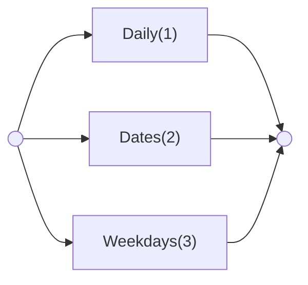

# Item D, E - Schedules

## Introduction

As explained in the data coding section, this specification supports the encoding of three types of schedules:

- daily schedules, e.g. "daily from 09:00 to 17:00";
- date based schedules, e.g. "1/10 09:00-15:00 and on 3/10 10:00-12:00";
- weekday based schedules, e.g. "every Monday from 13:00 to sunset";

This section provides rules for the automated generation of NOTAM schedules from the equivalent of such AIXM Timesheets. For most Event Scenarios, the resulting schedule is provided in item D of the generated NOTAM. However, if the Event concerns the modification of a baseline schedule, then the new/temporary schedule has to be provided in item E. This is identified in the particular scenarios concerned. The ICAO DOC 8126 and the OPADD rules have been followed in the definition of the text schedule production rules.

## Production rules

AIXM specific terms are used in this section, such as names of features and properties. The abbreviation `TS.` indicates that the corresponding data item must be taken from the `Timesheet(s)` of the TEMPDELTA or PERMDELTA `TimeSlice` created for the feature associated with the Event, as indicated for each particular scenario.

Annotations shall be translated into free text according to the Encoding annotations rules and included in item E. No schedule annotations should be included in item D.

The first step is the identification of the schedule type.

### Dispatcher

## Important Note

> The algorithms proposed for the production rules "Daily", "Dates" and "Weekdays" are the result of a theoretical analysis and they are relatively complex, in particular for "Dates" and "Weekdays". They remain to be validated in practice. Currently (Sep 2023) these algorithms are being used for the implementation of Digital NOTAM in the Eurocontrol iNM system. Feedback from this implementation will be used to validate or to correct/refine these production rules. Any other ongoing implementations are encouraged to share their findings with regard to the correctness/completeness of the proposed production rules for item D/E schedules.

| Reference | Rule |
|---|---|
| (1) | If there are `TS.Timesheet` elements that do not have `excluded='YES'` and that have `TS.startDate` empty, `TS.endDate` empty and `TS.day='ANY'`, then follow the algorithm described by *Production rule Daily*. |
| (2) | If there are `TS.Timesheet` elements that do not have `excluded='YES'` and that have `TS.startDate` and `TS.endDate` not empty, then follow the algorithm described by *Production rule Dates*. |
| (3) | If there are `TS.Timesheet` elements that do not have `excluded='YES'` and that have `TS.day` containing values different from `'ANY'`, then follow the algorithm described by *Production rule Weekdays*. |
