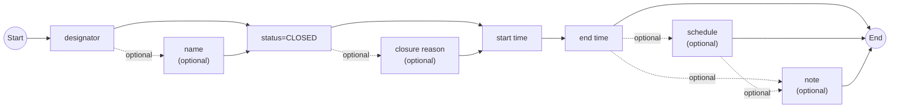

# [2.0] [AD.CLS] Aerodrome/Heliport - closure

## Definition

The temporary closure of an airport or heliport.

### Notes

This scenario covers only complete closures. If the closure comes with exceptions, such as:

- "prior permission required";
- "except home based aircraft";
- "except emergency";
- or similar exceptions,

then the `AD.LIM` scenario shall be used instead.

## Event data

The following information items are usually provided by a data originator for this kind of event.

### Input model

```ebnf
input = designator [name] "status=CLOSED" ["closure reason"] "\n"
        "start time" "end time" [schedule] "\n"
        [note].
```

### Source flowchart (textual reconstruction)

The input flowchart from page 1 of the source document is reproduced below as a Mermaid diagram. Nodes marked **optional** may be bypassed.



Equivalent line-oriented representation:

```text
START
  -> designator
  -> [name]
  -> status=CLOSED
  -> [closure reason]
  -> start time
  -> end time
  -> [schedule]
  -> [note]
  -> END

Legend: [item] = optional item
```

The original diagram groups the data over three logical input lines:

```text
Line 1: designator [name] status=CLOSED [closure reason]
Line 2: start time end time [schedule]
Line 3: [note]
```

### Data items and AIXM 5.1.1 mapping

The name of each variable in the first column is recommended for use as the label of the corresponding data field in a human-machine interface (HMI).

| Data item | Description | AIXM mapping |
|---|---|---|
| `designator` | The published designator of the airport/heliport concerned. This information, in combination with the name when available, is used to identify the airport/heliport. | `AirportHeliport.designator` |
| `name` | The published name of the airport/heliport. This information, in combination with the designator, is used to identify the airport/heliport. | `AirportHeliport.name` |
| `status=CLOSED` | The operational status of the airport. In this scenario, it is only possible to indicate a complete closure. | `AirportHeliport/AirportHeliportAvailability.operationalStatus` |
| `closure reason` | The reason for the airport/heliport closure. | `AirportHeliport/AirportHeliportAvailability.annotation`, with `propertyName="operationalStatus"` and `purpose="REMARK"`. The `warning` property of the `AirportHeliportAvailability` class is not used here because it represents a reason for caution when operation at the airport is allowed, not a reason for closure. |
| `start time` | The effective date and time when the airport closure starts. This might be further detailed in a schedule. | `Airport/AirportTimeSlice/TimePeriod.beginPosition`, `Event/EventTimeSlice.validTime/timePosition`, and `Event/EventTimeSlice.featureLifetime/beginPosition` |
| `end time` | The date and time when the airport closure ends. | `Airport/AirportTimeSlice/TimePeriod.endPosition` and `Event/EventTimeSlice.featureLifetime/endPosition`, also applying the rules for [Events with estimated end time](https://ext.eurocontrol.int/aixm_confluence/display/ACG/Event+lifetime) |
| `schedule` | A schedule may be provided when the airport/heliport is effectively closed according to a regular timetable within the overall closure period. | `AirportHeliport/AirportHeliportAvailability/Timesheet/...`, according to the rules for [Schedules](https://ext.eurocontrol.int/aixm_confluence/pages/viewpage.action?pageId=3087580) |
| `note` | A free-text note that provides further details concerning the airport closure. | `AirportHeliport/AirportHeliportAvailability.annotation`, with `purpose="REMARK"` |

## Assumptions for baseline data

It is assumed that information about the aerodrome already exists in the form of `AirportHeliport` `BASELINE` TimeSlice(s) covering the complete period of validity of the event.

The baseline availability may be coded as specified in the Coding Guidelines for the ICAO AIP Data Set.

## Data encoding rules

The rules in this section shall be followed in order to ensure harmonisation of digital encodings provided by different sources.

To the maximum possible extent, compliance with these encoding rules shall be verified using automatic data-validation rules.

### ER-01 - Event and AirportHeliport TEMPDELTA

The temporary closure of an airport/heliport shall be encoded as:

1. A new `Event` with a `BASELINE` TimeSlice:
   - `scenario="AD.CLS"`;
   - `version="2.0"`;
   - a `PERMDELTA` TimeSlice may also be provided.
2. A TimeSlice of type `TEMPDELTA` for the affected `AirportHeliport` feature.
3. The `event:theEvent` property of the `AirportHeliport` `TEMPDELTA` shall point to the `Event` instance created above.

### ER-02 - Preserve NORMAL availability and add CLOSED availability

First, all `BASELINE` instances of:

```text
AirportHeliport.availability.AirportHeliportAvailability
```

with:

```text
operationalStatus='NORMAL'
```

shall be copied into the `TEMPDELTA`, if present. See [Usage limitation and closure scenarios](https://ext.eurocontrol.int/aixm_confluence/display/DNOTAM/Usage+limitation+and+closure+scenarios).

Then, an additional:

```text
AirportHeliport.availability.AirportHeliportAvailability
```

with:

```text
operationalStatus='CLOSED'
```

shall be encoded in the `AirportHeliport` `TEMPDELTA`.

### ER-03 - Discrete closure schedules

If the airport closure is limited to a discrete schedule within the overall period between the `start time` and the `end time`, the schedule shall be encoded using as many `timeInterval/Timesheet` properties as necessary for the `AirportHeliportAvailability` that has:

```text
operationalStatus='CLOSED'
```

### ER-04 - Concerned FIR

The system shall automatically identify the FIR in which the `AirportHeliport` is located.

The FIR shall be encoded as the corresponding `concernedAirspace` property in the `Event`.

### ER-05 - Concerned airport/heliport

The `AirportHeliport` concerned by the closure shall also be encoded as the `concernedAirportHeliport` property in the `Event`.

## Encoding relationship summary

```text
Event
├── EventTimeSlice
│   ├── interpretation = BASELINE
│   ├── scenario = AD.CLS
│   ├── version = 2.0
│   ├── concernedAirspace -> FIR
│   └── concernedAirportHeliport -> AirportHeliport
│
└── referenced by AirportHeliport TEMPDELTA through event:theEvent

AirportHeliport
├── BASELINE TimeSlice(s)
│   └── existing availability, including NORMAL availability when present
│
└── TEMPDELTA TimeSlice
    ├── event:theEvent -> Event
    ├── copied NORMAL AirportHeliportAvailability element(s), when present
    └── additional AirportHeliportAvailability
        ├── operationalStatus = CLOSED
        ├── timeInterval/Timesheet element(s), when required
        ├── closure-reason annotation
        └── note annotation, when provided
```

## Examples

The following coding example is referenced by the source document:

- [DN_AD.CLS_with_daily_schedule_on_baseline_with_schedule.xml](https://github.com/aixm/Donlon_2022/blob/main/Digital%20NOTAM/DN_AD.CLS_with_daily_schedule_on_baseline_with_schedule.xml)

## Field-level compact representation

```yaml
scenario: AD.CLS
version: "2.0"
event_type: aerodrome_heliport_complete_closure
required_input:
  - designator
  - status: CLOSED
  - start_time
  - end_time
optional_input:
  - name
  - closure_reason
  - schedule
  - note
invalid_for_this_scenario:
  - prior_permission_required
  - except_home_based_aircraft
  - except_emergency
  - any_other_operational_exception
fallback_scenario_for_exceptions: AD.LIM
aixm_features:
  event:
    interpretation: BASELINE
    scenario: AD.CLS
    version: "2.0"
    relations:
      - concernedAirspace
      - concernedAirportHeliport
  airport_heliport:
    interpretation: TEMPDELTA
    relation_to_event: event:theEvent
    availability:
      preserve_from_baseline:
        operationalStatus: NORMAL
      add:
        operationalStatus: CLOSED
        schedule_property: timeInterval/Timesheet
```

---

Conversion note: This Markdown file restructures the source PDF into plain headings, tables, code blocks, links, and a compact YAML summary so that source-code assistants and text-processing tools can read it directly. The technical content follows the source document; line wrapping and visual layout have been normalised.
