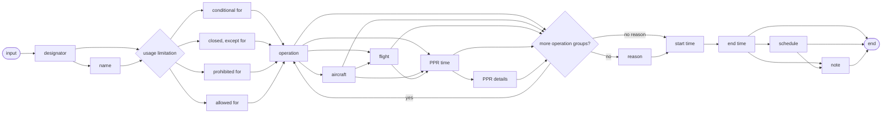

# [2.0] [AD.LIM] Aerodrome/Heliport - usage limitation change

## Definition

The temporary change of an airport or heliport usage limitation, covering both the more strict and more permissive cases.

Notes:

- *this scenario shall be used to notify limiting and prohibiting events other than complete closures of the aerodrome/heliport. For notification of aerodrome/heliport closures, refer to AD.CLS scenario*
- *this scenario shall be used when the facility operates below or above its nominal parameters.*

## Event data

The following diagram identifies the information items that are usually provided by a data originator for this kind of event.



### EBNF Code

```ebnf
input = designator [name] \n
("conditional for" | "closed, except for" | "prohibited for" | "allowed for")
("operation" ["aircraft"] ["flight"] ["PPR time" ["PPR details"]]) {"operation" ["aircraft"] ["flight"] ["PPR time" ["PPR details"]]} \n
["reason"] "start time" "end time" [schedule] \n
[note].
```

The following table provides more details about each information item contained in the diagram. It also provides the mapping of each information item within the AIXM 5.1.1 structure. The name of the variable (first column) is recommended for use as label of the data field in human-machine interfaces (HMI).

| Data item | Description | AIXM mapping |
|---|---|---|
| designator | The published designator of the airport/heliport concerned. This information, in combination with eventually the name is used to identify the airport/heliport. | `AirportHeliport.designator` |
| name | The published name of the airport/heliport. This information, in combination with the designator is used to identify the airport/heliport. | `AirportHeliport.name` |
| conditional for | The description of one or more operations (such as "landing of non-scheduled aircraft") which is permitted under special conditions, usually a prior permission requirement | `AirportHeliport.availability.AirportHeliportAvailability.operationalStatus` with value `'LIMITED'` and<br><br>`AirportHeliport/..Availability/..Usage.type` with value `'CONDITIONAL'` |
| closed, except for | Airport is closed, except for operations explicitly identified in the input data. | `AirportHeliport.availability.AirportHeliportAvailability.operationalStatus` with value `'LIMITED'` and<br><br>`AirportHeliport/..Availability/..Usage.type` with value `'RESERV'` |
| prohibited for | The description of one or more operations (such as "touch and go") that are prohibited for during the event duration. | `AirportHeliport.availability.AirportHeliportAvailability.operationalStatus` with value `'LIMITED'` and<br><br>`AirportHeliport/..Availability/..Usage.type` with value `'FORBID'` |
| additionally allowed for | The description of one or more additional operations (such as "alternate landing for aerodrome X") that are available for a specific purpose during the event duration. | `AirportHeliport.availability.AirportHeliportAvailability.operationalStatus` with value `'OTHER:EXTENDED'` and<br><br>`AirportHeliport/..Availability/..Usage.type` with value `'PERMIT'` |
| operation | The specific type of operation concerned by the usage limitation update | `AirportHeliport/..Availability/..Usage.operation` with the following list of values `CodeOperationAirportHeliportType` |
| aircraft | The description of one or more aircraft (such as "helicopter") types the airport/heliport is limited to or which are prohibited for during the event duration. | `AirportHeliport/..Availability/..Usage/..selection/..AircraftCharacteristics`<br><br>Only the following `AircraftCharacteristics` properties are allowed to be used in this scenario: `type`, `engine`, `wingSpan`, `wingSpanInterpretation`, `weight`, `weightInterpretation`. |
| flight | The description of one or more type of flight categories (such as "emergency") that the airport/heliport is limited for or are prohibited for the event duration. | `AirportHeliport/..Availability/..Usage/..selection/..FlightCharacteristics`.<br><br>Only the following `FlightCharacteristics` properties are allowed to be used in this scenario: `type`, `rule`, `status`, `military`, `origin`, `purpose`. |
| PPR time | The value (minutes, hours, days) of the prior permission request associated with a permitted operation. | `AirportHeliport/..Availability/..Usage/.priorPermission` with attribute `uom` specified. |
| PPR details | Additional information concerning the prior permission requirement. | `AirportHeliport/..Availability/..Usage.annotation` with `propertyName='priorPermission'` and `purpose='REMARK'` |
| reason | The reason for the airport/heliport usage limitation change | `AirportHeliport/AirportHeliportAvailability.annotation` with `propertyName='operationalStatus'` and `purpose='REMARK'`.<br><br>Note that the property "warning" of the `AirportHeliportAvailability` class is not used here because it represents a reason for caution when allowed to operate at the airport, not a reason for a closure. This is not included in this scenario. |
| start time | The effective date & time when the airport limitation starts. This might be further detailed in a "schedule". | `Airport/AirportTimeSlice/TimePeriod.beginPosition`, `Event/EventTimeSlice.validTime/timePosition`<br><br>and `Event/EventTimeSlice.featureLifetime/beginPosition` |
| end time | The end date & time when the airport limitation ends. | `Airport/AirportTimeSlice/TimePeriod.endPosition` and `Event/EventTimeSlice.featureLifetime/endPosition` |
| schedule | A schedule might be provided, in case the airport/heliport is effectively limited according to a regular timetable, within the overall limitation period. | `AirportHeliport/..Availability/Timesheet/...` |
| note | A free text note that provides further details concerning the airport limitation. | `AirportHeliport/..Availability.annotation` with `purpose='REMARK'` |

## Assumptions for baseline data

It is assumed that information about the aerodrome already exists in the form of AirportHeliport BASELINE TimeSlice(s) covering the complete period of validity of the event, for which the baseline availability is coded as specified in the [Coding Guidelines for the (ICAO) AIP Data Set](https://ext.eurocontrol.int/aixm_confluence/pages/viewpage.action?pageId=3087580).

## Data encoding rules

The data encoding rules provided in this section shall be followed in order to ensure the harmonisation of the digital encodings provided by different sources. To the maximum possible extent, the compliance with these encoding rules shall be verified with automatic data validation rules.

| Identifier | Data encoding rule |
|---|---|
| ER-01 | The temporary change of an airport/heliport usage limitation shall be encoded as:<br><br>- a new Event with a BASELINE TimeSlice (`scenario="AD.LIM"`, `version="2.0"`), for which a PERMDELTA TimeSlice may also be provided; and<br>- a TimeSlice of type TEMPDELTA for the affected AirportHeliport feature, for which the `event:theEvent` property points to the Event instance created above. |
| ER-02 | First, all the BASELINE `availability.AirportHeliportAvailability` (with `operationalStatus=NORMAL`), if present, shall be copied in the TEMPDELTA (see [Usage limitation and closure scenarios](https://ext.eurocontrol.int/aixm_confluence/display/DNOTAM/Usage+limitation+and+closure+scenarios)).<br><br>Then, an additional `availability.AirportHeliportAvailability` element shall be included in the AirportHeliport TEMPDELTA having:<br><br>- `operationalStatus=LIMITED` if the airport/heliport usage is "conditional for", "closed, except for", "prohibited for";<br>- `operationalStatus=OTHER:EXTENDED` if the airport/heliport usage is "allowed for". |
| ER-03 | If the airport/heliport usage is "conditional for" specified operations, flight and/or aircraft categories, then all specified limitations shall be encoded as AirportHeliportUsage child elements with `type=CONDITIONAL`. |
| ER-04 | If the airport/heliport is "closed, except for" specified operations, flight and/or aircraft categories, then all specified limitations shall be encoded as AirportHeliportUsage child elements with `type=RESERV`. |
| ER-05 | If the airport/heliport is "prohibited for" specified operations, flight and/or aircraft categories, all specified limitations shall be encoded as AirportHeliportUsage child elements with `type=FORBID`. |
| ER-06 | If the airport/heliport is "allowed for" specified operations, flight and/or aircraft categories, all specified limitations shall be encoded as AirportHeliportUsage child elements with `type=PERMIT`. |
| ER-07 | If a unique flight or aircraft is specified as part of the condition, they shall be encoded as one ConditionCombination with `logicalOperator="NONE"`.<br><br>Otherwise, each pair of flight and aircraft shall be encoded as one ConditionCombination with `logicalOperator="AND"`. |
| ER-08 | For every AirportHeliportUsage encoded, the `aixm:operation` shall be specified. |
| ER-09 | The type of operations that do not match a pre-defined value in the `FlightCharacteristics.status` shall be encoded as follows:<br><br>- emergency medical evacuation -> `status='OTHER:MEDEVAC'`<br>- fire fighting flights -> `status='OTHER:FIRE_FIGHTING'` |
| ER-10 | The system shall automatically identify the FIR where the AerodromeHeliport is located. This shall be coded as corresponding `concernedAirspace` property in the Event |
| ER-11 | The AerodromeHeliport concerned by the closure shall also be coded as `concernedAirportHeliport` property shall be coded in the Event. |

## Examples

Following coding examples can be found on GitHub (links included):

- [DN_AD.LIM_1_prohibit_tgl.xml](https://github.com/aixm/Donlon_2022/blob/main/Digital%20NOTAM/DN_AD.LIM_1_prohibit_tgl.xml)
- [DN_AD.LIM_2_limited_weight.xml](https://github.com/aixm/Donlon_2022/blob/main/Digital%20NOTAM/DN_AD.LIM_2_limited_weight.xml)
- [DN_AD.LIM_3_except_special_flights.xml](https://github.com/aixm/Donlon_2022/blob/main/Digital%20NOTAM/DN_AD.LIM_3_except_special_flights.xml)
