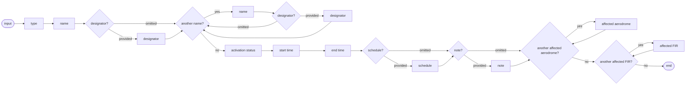

# [2.0] [ATSA.ACT] Published ATS airspace - activation or deactivation - coding

<!--
Source PDF: [2.0] [ATSA.ACT] Published ATS airspace - activation or deactivation - coding.pdf

The source railroad syntax diagram is represented below as a Mermaid flowchart.
The original EBNF is retained as the authoritative machine-readable expression.
The calendar/level illustration in ER-04 is also represented as a text schematic.
-->

## Definition

The activation or deactivation of published (pre-existing) CTR, CTA, TMA or similar airspaces.

Notes:

- the term "Published ATS Airspace" is used to encompass CTR, CTA, TMA or other airspaces of similar nature, such as TMZ and RMZ;
- this scenario includes both the temporary activation and the temporary deactivation of pre-existing ATS Airspace;
- this scenario includes the possibility to provide an activation schedule, but only "ACTIVE" times will be translated into NOTAM text;
- this scenario does not include the temporary modification of the ATS Airspace classification;
- this scenario does not include temporary modification of vertical limits of published ATS Airspace nor the activation beyond these vertical limits;
- this scenario does not include temporary modification of horizontal limits of published ATS Airspace nor the activation beyond these horizontal limits;
- this scenario does not include the permanent modification of activity status of published ATS Airspace;
- this scenario does support the activation through a single NOTAM of the sectors/parts of one ATS airspace, if same conditions apply to all. Only the designator and the name can be different.

## Event data

The following diagram identifies the information items that are usually provided by a data originator for this kind of event.

### Diagram



### EBNF Code

```ebnf
input = "type" "name" ["designator"] {"name" ["designator"]} "activation status" \n
"start time" "end time" ["schedule"] \n
["note"] {"affected aerodrome"} {"affected FIR"}.
```

The table below provides more details about each information item contained in the diagram. It also provided the mapping of each information item within the AIXM 5.1 structure. The name of the variable (first column) is recommended for use as label of the data field in human-machine interfaces (HMI).

| Data item | Description | AIXM mapping |
|---|---|---|
| type | The type of airspace concerned. Typical examples are CTR and TMA. | `Airspace.type` Not to be encoded, just used to identify the airspace concerned. To be consistent with the scenario scope and purpose, only the following types shall be used: `CTR`, `CTR_P`, `CLASS`, `ATZ`, `ATZ_P`, `HTZ`, `ADIZ`, `CTA`, `CTA_P`, `UTA`, `UTA_P`, `OCA`, `OCA_P`, `OTA`, `SECTOR`, `SECTOR_C`, `RAS`, `TMA`, `TMA_P`, `ADV`, `UADV`, `FIR`, `FIR_P`, `OTHER:TMZ`, `OTHER:RMZ`. |
| name | The published name of the area. | `Airspace.name`. Not to be encoded, just used to identify the airspace concerned. |
| designator | The published designator of the airspace concerned. If not provided, then the airspace is identified by its name. | `Airspace.designator`. Not to be encoded, just used to identify the airspace concerned. |
| activation status | The activation/de-activation status. | `Airspace/AirspaceActivation.status` with the list of values `CodeStatusAirspaceType`.<br><br>Note: only the values `'ACTIVE'` or `'INACTIVE'` can be used in this scenario. |
| start time | The effective date & time when the activation/de-activation starts. This might be further detailed in a "schedule". | `Airspace/AirspaceTimeSlice/TimePeriod.beginPosition`, `Event/EventTimeSlice.validTime/timePosition` and `Event/EventTimeSlice.featureLifetime/beginPosition` |
| end time | The end date & time when the activation/de-activation ends. It might be an estimated value, if the exact end of activation is unknown. | `Airspace/AirspaceTimeSlice/TimePeriod.endPosition`, `Event/EventTimeSlice.validTime/timePosition` and `Event/EventTimeSlice.featureLifetime/endPosition` also applying the rules for Events with estimated termination |
| schedule | A schedule might be provided, in case the area is only active according to a regular timetable, within the period between the start time and the end time. | `Airspace/AirspaceActivation/Timesheet/...` according to the rules for Schedules |
| note | A free text note that provides further instructions concerning the area activation, such as the authority to be contacted for further information, the possibility of crossing at ATC discretion, etc. | `Airspace/AirspaceActivation.annotation` with `purpose="REMARK"` |
| affected aerodrome | A reference (name, designator) to one or more airports/heliports for which the establishment of the area has an operational relevance and needs to be notified to the users thereof (if such information is known to the data originator)<br><br>*Note: a default list of 'affected airports' might need to be maintained in the application used for the Digital NOTAM coding.* | `Event.concernedAirportHeliport` |
| affected FIR | A reference (type, designator) to one or more neighboring airspace of type FIR, for which the establishment of the area has an operational relevance and needs to be notified (if such information is known to the data originator).<br><br>*Note: the FIR(s) within which the area is physically situated do not need to be provided by the data originator. They will be automatically identified by the application that enables the coding of the Event.* | `Event.concernedAirspace` |

Notes:

- *It is recommended that data input applications allow the operator to visualise graphically the horizontal shape and the vertical extent of the ATS airspace activation, in the context of the overall airspace structure of the region. If a schedule is used, the graphical interface should also have a "time slider" that allows the operator to see when the airspace is actually active.*

## Assumptions for baseline data

- It is assumed that information about the area already exists in the form of Airspace BASELINE TimeSlice(s) covering the complete period of validity of the event, coded as specified in the Coding Guidelines for the (ICAO) AIP Data Set.
- If an area has sectors, it is assumed that each sector was encoded separately, as an airspace with its own designator, so that it can be activated individually. The collapsed area should not exist as a Baseline airspace, just the sectors. If the area becomes active, the digital data encoding should activate the individual sectors as part of one event;
- It is assumed that Transponder Mandatory Zone(TMZ) and Radio Mandatory Zone (RMZ) have been encoded as Airspace features with:
  - `type=RAS`
  - `localType=TMZ`, respectively `RMZ`.

## Data encoding rules

The data encoding rules provided in this section shall be followed in order to ensure the harmonisation of the digital encodings provided by different sources. The compliance with some of these encoding rules can be checked with automatic data validation rules.

### ER-01

The activation of an airspace shall be encoded as:

- a new Event with a BASELINE TimeSlice (`scenario='ATSA.ACT'`, `version='2.0'`), for which a PERMDELTA TimeSlice may also be provided; and
- a TimeSlice of type TEMPDELTA for the corresponding Airspace feature(s), for which the `"event:theEvent"` property points to the Event instance created above;

### ER-02

The Airspace TEMPDELTA should use the values `'FLOOR'` (no `@uom` value) for `lowerLimit` and `'CEILING'` (no `@uom` value) for the `upperLimit` of the `AirspaceLayer` property associated with the `AirspaceActivation`.

### ER-03

If the area activation/de-activation is limited to a discrete schedule within the overall time period between the "start time" and the "end time", then this shall be encoded using as many as necessary `timeInterval/Timesheet` properties for the `AirspaceActivation` of the Airspace TEMPDELTA Timeslice. See the rules for Schedules [PWS].

### ER-04

In accordance with the AIXM Temporality Concept, the `AirspaceActivation` associated with the TEMPDELTA completely replaces all the BASELINE AirspaceActivation information, during the TEMPDELTA time of applicability. Therefore, if the activation/deactivation only concerns certain times, then the other times (when the airspace eventually remains with the same status as in the Baseline data) shall be explicitly included in the TEMPDELTA. The calculation of the necessary additional AirspaceActivation elements to be included in the TEMPDELTA shall be automatically done by the applications implementing this specification. All AirspaceActivation elements that are copied from the BASELINE data for completeness sake shall get an associated Note with `purpose=REMARK` and the `text="Baseline data copy. Not included in the NOTAM text generation"`. This is based on the current NOTAM practice which consists of including in the NOTAM only the changed information and not explicitly including the static data that remains valid during the NOTAM applicability. It is recommended that the input interface provides a "calendar/level" view of the airspace activity, enabling the operator to graphically check the status of the airspace at different times and levels, such as in the example below:

#### Calendar/level view represented as text

The following text diagram preserves the information conveyed by the source illustration. It is schematic and not to scale.

```text
Vertical extent: GND to FL 30

Legend:
  █ Event data
  ▒ Baseline data

                  Monday      Tuesday     Wednesday    Thursday      Friday       Saturday       Sunday
                  Apr 11      Apr 12       Apr 13       Apr 14       Apr 15        Apr 16         Apr 17
FL 30  ┌─────────────────────────────────────────────────────────────────────────────────────────────────┐
       │▒▒▒▒▒▒▒▒▒▒▒▒▒▒▒▒▒▒▒▒▒▒▒▒▒▒▒▒▒▒▒▒▒▒▒ BASELINE: ACTIVE ▒▒▒▒▒▒▒▒▒▒▒▒▒▒▒▒▒▒▒▒▒▒▒▒▒▒▒▒▒▒▒▒▒▒▒▒│
       │                                                        █ EVENT: ACTIVE █ ▒ BASELINE: INACTIVE ▒│
       │                                                                              █ EVENT: ACTIVE █ │
GND    └─────────────────────────────────────────────────────────────────────────────────────────────────┘
                                                                <----------- Event validity ----------->
```

In the calendar view, the Baseline information that remains valid during the Event validity time shall be visibly identified from the information that is specific to the Event, for example by using a different colour fill pattern.

### ER-05

The system shall automatically identify the FIR(s) intersected by the horizontal projection of the area. They shall be coded as corresponding `concernedAirspace` property(ies) in the Event

If any different "affected FIR" from the one(s) determined above is(are) provided by the data originator, then corresponding `concernedAirspace` property(ies) shall be coded in the Event.

### ER-06

If an "affected aerodrome" is provided by the data originator, then a corresponding `concernedAirportHeliport` property shall be coded in the Event.

## Examples

Following coding examples can be found on GitHub (links attached):

- `DN_ATSA.ACT_sectors.xml`
