# [2.0] [ATSA.NEW] Ad-hoc ATS airspace - creation - coding

<!--
Source PDF: [2.0] [ATSA.NEW] Ad-hoc ATS airspace - creation - coding.pdf

The source wording, terminology, identifiers, data mappings, EBNF expression,
encoding rules, and example filename are retained. The railroad syntax diagram
is represented as a Mermaid flowchart so that it remains directly readable by
Codex and other text-based tools.
-->

## Definition

The establishment of a new temporary ATS area, which did not exist as a published (static data) airspace.

Notes:

- *this can take the form of either a specified airspace type (such as a CTR) or an airspace with a specified class (such as a class A airspace);*
- *this scenario does not include the establishment of temporary P, D, R or similar areas; see the dedicated scenario: Ad-hoc special activity area - creation.*
- *the creation of a permanent ATS area by NOTAM shall be an exceptional situation, as such events are expected to be managed through static data amendments. However, this is supported in this scenario as the same data requirements and rules apply and it helps ensuring that all the airspace created by NOTAM are made available digitally, not only the temporary ones;*
- *this scenario does not support the use of geographical or administrative features (such as State borders, rivers, sea shores, etc.) in the definition of horizontal projection. If operationally necessary, this can be done by providing a simplified polygon larger than the area and excluding a neighboring FIR, for example;*
- *this scenario is limited to the creation of a temporary area with a unique airspace class value for the whole area;*
- *this scenario does not support the creation of airspace with conditional lower/upper limit, such as "6000 FT AMSL, but at least 1000 FT AGL".*

## Event data

The following diagram identifies the information items that are usually provided by a data originator for this kind of event.

### Input diagram

```mermaid
flowchart TD
    START([input]) --> TYPE_Q{"type?"}
    TYPE_Q -->|provided| TYPE["type"]
    TYPE_Q -->|omitted| CLASS["class"]
    TYPE --> CLASS

    CLASS --> DESIGNATOR_Q{"designator?"}
    DESIGNATOR_Q -->|provided| DESIGNATOR["designator"]
    DESIGNATOR_Q -->|omitted| NAME_Q{"name?"}
    DESIGNATOR --> NAME_Q

    NAME_Q -->|provided| NAME["name"]
    NAME_Q -->|omitted| STATUS["activation status"]
    NAME --> STATUS

    STATUS --> LOCATION_Q{"location note?"}
    LOCATION_Q -->|provided| LOCATION["location note"]
    LOCATION_Q -->|omitted| GEOMETRY_Q{"horizontal geometry"}
    LOCATION --> GEOMETRY_Q

    GEOMETRY_Q -->|polygon| POLYGON["polygon"]
    GEOMETRY_Q -->|circle| CIRCLE["circle"]
    GEOMETRY_Q -->|corridor| CENTRELINE["corridor centreline"]
    CENTRELINE --> WIDTH["width"]

    POLYGON --> EXCLUDED_Q{"another excluded airspace?"}
    CIRCLE --> EXCLUDED_Q
    WIDTH --> EXCLUDED_Q

    EXCLUDED_Q -->|yes| EXCLUDED["excluded airspace"]
    EXCLUDED --> EXCLUDED_Q
    EXCLUDED_Q -->|no| LOWER["lower limit"]

    LOWER --> UPPER["upper limit"]
    UPPER --> START_TIME["start time"]
    START_TIME --> END_TIME["end time"]

    END_TIME --> SCHEDULE_Q{"schedule?"}
    SCHEDULE_Q -->|provided| SCHEDULE["schedule"]
    SCHEDULE_Q -->|omitted| CONTROLLING_Q{"controlling unit note?"}
    SCHEDULE --> CONTROLLING_Q

    CONTROLLING_Q -->|provided| CONTROLLING["controlling unit note"]
    CONTROLLING_Q -->|omitted| NOTE_Q{"note?"}
    CONTROLLING --> NOTE_Q

    NOTE_Q -->|provided| NOTE["note"]
    NOTE_Q -->|omitted| AERODROME_Q{"another affected aerodrome?"}
    NOTE --> AERODROME_Q

    AERODROME_Q -->|yes| AERODROME["affected aerodrome"]
    AERODROME --> AERODROME_Q
    AERODROME_Q -->|no| FIR_Q{"another affected FIR?"}

    FIR_Q -->|yes| FIR["affected FIR"]
    FIR --> FIR_Q
    FIR_Q -->|no| END_NODE([end])
```



### EBNF Code

```ebnf
input = ["type"] "class" ["designator"] ["name"] "activation status" ["location note"] \n
("polygon" | "circle" | ("corridor centreline" "width")) {"excluded airspace"} "lower limit" "upper limit" \n
"start time" "end time" ["schedule"] \n
["controlling unit note"] ["note"] {"affected aerodrome"} {"affected FIR"}.
```

The table below provides more details about each information item contained in the diagram. It also provided the mapping of each information item within the AIXM 5.1 structure. The name of the variable (first column) is recommended for use as label of the data field in human-machine interfaces (HMI).

| Data item | Description | AIXM mapping |
|---|---|---|
| type | The type of area, although this is rarely provided. Typical examples are CTR, AWY or "no type". | `Airspace.type`. To be consistent with the scenario scope and purpose, only the following types shall be used: `CTR`, `CLASS`, `ATZ`, `HTZ`, `ADIZ`, `CTA`, `UTA`, `OCA`, `OTA`, `AWY`, `SECTOR`, `SECTOR_C`, `RAS`, `TMA`, `ADV`, `UADV`, `FIR`, `OTHER:TMZ`, `OTHER:RMZ`. |
| class | The airspace classification of the area | `Airspace/AirspaceLayerClass.classification` |
| designator | A designator allocated to the area. However, it is unlikely that such designators are provided by the data originator. It is more likely that the designator will be allocated by the publication office. | `Airspace.designator` |
| name | The name of a geographical feature or location, which is also used for identifying the area | `Airspace.name` |
| activation status | The activation status. The typical term is "active", occasionally could be "intermittent". | `Airspace/AirspaceActivation.status` |
| location note | A free text note that indicates the location of the area in relation with relevant geographical or aeronautical features, such as "AT FARNBOROUGH AIRFIELD", etc. | `Airspace.annotation` with `propertyName='geometryComponent'` and `purpose='REMARK'` |
| polygon | A polygon representing the horizontal shape of the area (before considering, if present, the airspace exclusions specified as "excluded airspace"). | `Airspace/AirspaceVolume.horizontalProjection` following the rules for encoding for encoding polygons as specified in the Geometrical and geographical data. |
| circle | A circle representing the horizontal shape of the area (before considering, if present, the airspace exclusions specified as "excluded airspace"). | `Airspace/AirspaceVolume.horizontalProjection` following the rules for encoding for encoding circles as specified in the Geometrical and geographical data. |
| corridor centreline | The centreline of a corridor representing the horizontal shape of the area (before considering, if present, the airspace exclusions specified as "excluded airspace"). | `Airspace/AirspaceVolume.centreline` following the rules for encoding for encoding curves as specified in the Geometrical and geographical data. |
| width | The total width of the corridor representing the horizontal shape of the area.<br><br>Note that the current NOTAM practice is to indicate the "half-width" (either side of the centreline) while in AIXM the full width is coded. | `Airspace/AirspaceVolume.width` |
| excluded airspace | A reference (type, designator, name) to one or more airspace that are excluded (subtracted) from the volume described by the aggregation of the horizontal limits specified for the area; for example: "EXCLUDING THE HEATHROW CTR". | `Airspace/AirspaceVolume.contributorAirspace` |
| lower limit | The lower limit (value, unit of measurement and vertical reference) of the area. | `Airspace/AirspaceVolume.lowerLimit` and `lowerLimitReference` |
| upper limit | The upper limit (value, unit of measurement and vertical reference) of the area. | `Airspace/AirspaceVolume.upperLimit` and `upperLimitReference` |
| start time | The effective date & time when the area becomes established and active. This might be further detailed in a "schedule". | `Airspace/AirspaceTimeSlice.featureLifetime/beginPosition`, `Airspace/AirspaceTimeSlice/validTime/timePosition`, `Event/EventTimeSlice.validTime/timePosition` and `Event/EventTimeSlice.featureLifetime/beginPosition` |
| end time | The end date & time when the area ceases to exist. It might be an estimated value, if the exact end of activation is unknown. It may also be indeterminate for a permanent area. | `Airspace/AirspaceTimeSlice.featureLifetime/endPosition`, `Event/EventTimeSlice.featureLifetime/endPosition` also applying the rules for Events with estimated end time |
| schedule | A schedule might be provided in case the area is only active according to a regular timetable, within the overall period when it exists. | `Airspace/AirspaceActivation/Timesheet/...` according to the rules for Schedules |
| controlling unit note | A free text note that provides information about the unit or service that provides ATS services in the area. | `Airspace/AirspaceActivation.annotation` with `propertyName='status'` and `purpose='REMARK'`, according to the rules for encoding annotations |
| note | A free text note that provides further instructions concerning the area, such as the reason that led to the area establishment, etc. | `Airspace/AirspaceActivation.annotation` with `purpose='REMARK'`, according to the rules for encoding annotations |
| affected aerodrome | A reference (name, designator) to one or more airports/heliports for which the establishment of the area has an operational relevance and needs to be notified to the users thereof (if such information is known to the data originator).<br><br>In order to facilitate the work of the operator, the Digital NOTAM data provider interface should attempt to identify airport/heliports that might be affected by the ATS area:<br><br>- if the area has a `lowerLimit` equal or less than 1000 FT from SFC, then automatically identify the AirportHeliport that have their ARP located within 5 NM (configurable parameter) and `locationIndicatorICAO` not null.<br><br>In all situations, the operator shall be allowed to take the final decision by selecting the airports which are affected by the area. This might include additional ones, which have not been identified automatically by the spatial checks but have an operationally significant relation with the area. | `Event.concernedAirportHeliport` |
| affected FIR | A reference (type, designator) to one or more neighboring airspace of type FIR, for which the establishment of the area has an operational relevance and needs to be notified (if such information is known to the data originator).<br><br>Note: the FIR(s) within which the area is physically situated do not need to be provided by the data originator. They will be automatically identified by the application that enables the coding of the Event. | `Event.concernedAirspace` |

Notes:

- *It is recommended that data input applications allow the operator to visualise graphically the horizontal shape and the vertical extent of the special activity area. If a schedule is used, the graphical interface should also have a "time slider" that allows the operator to see when the area is actually active.*

## Assumptions for baseline data

- It is assumed that no baseline data exists for this area.

## Data encoding rules

The data encoding rules provided in this section shall be followed in order to ensure the harmonisation of the digital encodings provided by different sources. The compliance with some of these encoding rules can be checked with automatic data validation rules.

### ER-01

The special activity area shall be encoded as:

- a new Event with a BASELINE TimeSlice (`scenario='ATSA.NEW'`, `version='2.0'`), for which a PERMDELTA TimeSlice may also be provided; and
- new Airspace BASELINE TimeSlice for which a PERMDELTA TimeSlice may also be provided; the property `"event:theEvent"` of the Airspace TimeSlices shall refer to the Event mentioned above.

### ER-02

The Airspace BASELINE shall contain one `AirspaceActivation` object with `status='ACTIVE'` or `'INTERMITTENT'` (as appropriate) which shall have the values `'FLOOR'` for `lowerLimit` (no `uom` value) and `'CEILING'` for the `upperLimit` (no `uom` value) of the associated `AirspaceLayer`.

### ER-03

The Airspace BASELINE shall contain one `AirspaceLayerClass` object which shall have the values `'FLOOR'` for `lowerLimit` (no `uom` value) and `'CEILING'` for the `upperLimit` (no `uom` value) of the associated `AirspaceLayer`.

### ER-04

If the area activity is limited to a discrete schedule within the overall time period between the `"start time"` and the `"end time"`, then this shall be encoded using as many as necessary `timeInterval/Timesheet` properties for the `AirspaceActivation` with status `'ACTIVE'/'INTERMITTENT'` of the BASELINE Timeslice. See also the rules for Event Schedules.

### ER-05

If a schedule is provided, then the Airspace BASELINE shall contain a second `AirspaceActivation` object with `status='INACTIVE'`, which shall explicitly specify the times not covered by the activity schedule.

This could be done automatically by the system and should not be visible to the operator.

It is recommended that the HMI of a data provider application allows to provide a schedule only in relation with active times, because only these will be translated into NOTAM text.

### ER-06

If one or more `"excluded airspace"` are specified, each shall be encoded as an `AirspaceGeometryComponent` with `operation='SUBTR'`, `operationSequence` as dictated by the order of the element, `contributorAirspace/AirspaceVolumeDependency.dependency='FULL_GEOMETRY'` and pointing to the airspace concerned. See the Geometry of Airspace coding rules for further details.

Note: in this case, it is important that the `geometryComponent` parent of the `AirspaceVolume` created with the `horizontalLimit` data has `operation='BASE'` and `operationSequence='1'`.

### ER-07

If the `type` is not provided by the data originator, then it shall be encoded as a `'CLASS'` type airspace.

### ER-08

It is recommended that an alphanumeric `Airspace.designator` is allocated to a temporary area, in order to facilitate it's identification on graphical representations (such as airspace activity maps) and verbal communication. The composition rule is derived from the CTR and TMA designators - `"CCCCnnnnyy"`, where:

- CCCC corresponds to one of the following (in this order of preference):
  - the ICAO location indicator associated with the place (city, island, etc.) that appears in the `"location note"`, then use that one as coded identifier (for example, FARNBOROUGH = `'EGLF'`)
  - the ICAO location indicator of the ATC centre which provides air traffic control services in the airspace;
  - the ICAO location indicator of one major airport situated within the airspace;
  - a 4 letter code using the first two letters of the country code and the last two letters so that they are not duplicating another airspace identifier of the same type.
- (to be added only in case of a temporary area) nnnn is a number, unduplicated during the same year, within the State or territory concerned; this could also be the NOTAM number;
- (to be added only in case of a temporary area) yy are the last two digits of the year date when the area becomes effective.

### ER-09

The system shall automatically identify the FIR(s) intersected by the horizontal projection of the area. They shall be coded as corresponding `concernedAirspace` property(ies) in the Event.

If any different `"affected FIR"` from the one(s) determined above is(are) provided by the data originator, then corresponding `concernedAirspace` property(ies) shall be coded in the Event.

### ER-10

If an `"affected aerodrome"` is provided by the data originator, then a corresponding `concernedAirportHeliport` property shall be coded in the Event.

> **Note:** The objective is to full automatic generation, without human intervention. However, the implementers of the specification might consider reducing the cost of a fully automated generation by allowing the operator to fine-tune the text in order to improve its readability (with the inherent risk for human error, when re-typing is allowed).

## Examples

Following coding examples can be found on GitHub (links attached):

- `DN_ATSA.NEW_in_use.xml`
