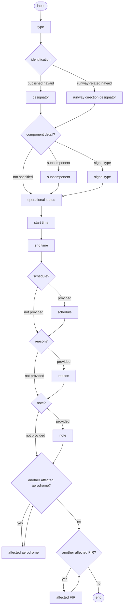
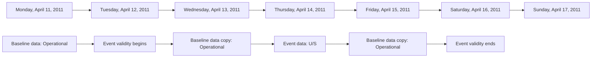

# [2.0] [NAV.UNS] Navaid unserviceable - coding

<!--
Source PDF: [2.0] [NAV.UNS] Navaid unserviceable - coding.pdf

The source wording, terminology, identifiers, code values, tables, and EBNF
expressions are retained. The railroad syntax diagram and the calendar/status
illustration are represented in text-readable Mermaid form for Codex.
-->

## Definition

The unavailability of a ground based radio navigation equipment and service, both if used for en-route or for airport.

Notes:

- *this scenario enables the encoding of the information about the unavailability (or limited availability) of a complete navaid or of one of its component equipments. In case a component is concerned, this is limited to the unavailability of a single component;*
- *in order to keep the digital encoding consistent with the current practices, the term "primary component" is used in the case of composite navaids (such as VOR/DME, ILS, etc.) The principle is that the unavailability of composite navaid is considered directly related only to the unavailability of its primary components. The unavailability of a non-primary component (such as a MKR used by an ILS) needs to be encoded separately;*
- *this scenario does not cover the downgrading of an ILS category;*
- *this scenario does not support the modification of information about navaid coverage/range. Although this data can be encoded digitally using AIXM 5.1(.1), no immediate usage has been identified and therefore that scenario is left for being defined later.*

## Event data

The following diagram identifies the information items that are usually provided by a data originator for this kind of event.

The table below provides more details about each information item contained in the diagram. It also provides the mapping of each information item within the AIXM 5.1 structure. The name of the variable (first column) is recommended for use as label of the data field in human-machine interfaces (HMI).

### Input diagram



### EBNF Code

```ebnf
input = "type" ( "designator" | "runway direction designator" ) [("subcomponent" | "signal type")] \n
"operational status" "start time" "end time" ["schedule"] \n
["reason"] ["note"] {"affected aerodrome"} {"affected FIR"}.
```

### Editorial Note

In order to not list each time all of its specialisations and to keep the coding rules short, the abstract `NavaidEquipment` class is used on this page as placeholder. In practice, the data will need to be coded using the appropriate specialised class: `Azimuth`, `DME`, `DirectionFinder`, `Elevation`, `Glidepath`, `Localizer`, `MarkerBeacon`, `NDB`, `SDF`, `TACAN`, `VOR`

### Event data items and AIXM mapping

| Data item | Value | AIXM mapping |
|---|---|---|
| type | The type of navaid service. In combination with other items, this is used to identify the Navaid and/or the NavaidEquipment specialistaion concerned. | `Navaid.type` and one or more related `NavaidEquipment` specialisations |
| designator | The published designator of the navaid. In combination with other items, this is used to identify the Navaid and/or NavaidEquipment specialisation concerned. | `Navaid.designator` and one or more related `NavaidEquipment.designator` |
| runway direction designator | The designator of the runway direction that is served by the navaid (especially for ILS). In combination with other items, this is used to identify the Navaid concerned. | `Navaid.runwayDirection` |
| subcomponent | A specific navaid equipment, used as part of a composed navaid service, in case the unserviceable status affects only this component. In combination with other items, this is used to identify the NavaidEquipment specialisation and eventually other Navaid(s) concerned. | One of the non-abstract specialisations of `NavaidEquipment` |
| signal type | A specific sub-signal of a composed navaid service, in case the unserviceable status affects only this signal type. In this scenario, this is limited to the Azimuth or Distance indication of a TACAN Navaid. | `NavaidOperationalStatus.signalType`. This can be specified only if the navaid is a TACAN or VORTAC and only the values `"AZIMUTH"` or `"DISTANCE"` may be used from its list of values (`CodeRadioSignalType`) |
| operational status | The operational status. The typical value is "unserviceable", also abbreviated "U/S". Other values are possible, such as "on test, do not use", "false indication possible", etc. | `Navaid/NavaidOperationalStatus.operationalStatus` and (one or more related) `NavaidEquipment/NavaidOperationalStatus.operationalStatus` |
| start time | The effective date & time when the event starts | `Navaid/TimeSlice/TimePeriod.beginPosition`, (one or more related) `NavaidEquipment/TimeSlice/TimePeriod.beginPosition`, `Event/EventTimeSlice.validTime/beginPosition`, `Event/EventTimeSlice.featureLifetime/beginPosition` |
| end time | The end date & time when the event ends. It might be an estimated value. | `Navaid/TimeSlice/TimePeriod.endPosition`, (one or more related) `NavaidEquipment/TimeSlice/TimePeriod.endPosition`, `Event/EventTimeSlice.validTime/endPosition`, `Event/EventTimeSlice.featureLifetime/endPosition` also applying the rules for Events with estimated end time |
| schedule | A schedule might be provided, in case the navaid status changes according to a regular timetable, within the period between the start time and the end time. | (`Navaid/NavaidOperationalStatus/Timesheet/...`; (one or more related) `NavaidEquipment/TimeSliceNavaidOperationalStatus/Timesheet/...`) according to the rules for Event Scheduled |
| reason | A reason for the navaid operational status change | `Navaid/NavaidOperationalStatus.annotation` with `propertyName='operationalStatus'` and `purpose='REMARK'` |
| note | A free text note that provides further instructions concerning the navaid operational status situation. | `Navaid/NavaidOperationalStatus.annotation` with `purpose='REMARK'` |
| affected aerodrome | A reference (name, designator) to one or more airports/heliports for which the operational status of the navaid has an operational relevance and needs to be notified to the users thereof (if such information is known to the data originator)<br><br>Note: a default list of 'affected airports' might need to be maintained in the application used for the Digital NOTAM coding. | `Event.concernedAirportHeliport` |
| affected FIR | A reference (type, designator) to one or more neighboring airspace of type FIR, for which the operational status of the navaid has an operational relevance and needs to be notified (if such information is known to the data originator).<br><br>Note: the FIR(s) within which the navaid is physically situated do not need to be provided by the data originator. They will be automatically identified by the application that enables the coding of the Event. | `Event.concernedAirspace` |

Notes:

- The word "locator" is expected to be used for low power NDB in the operational language.

## Assumptions for baseline data

- It is assumed that information about the Navaid and NavaidEquipment specialisations concerned covering the complete period of validity of the event exists and it was coded as specified in the Coding Guidelines for the (ICAO) AIP Data Set - Navaid [NAV].
- In addition, it is assumed that:
  - all primary components (NavaidEquipment specialisations) exist and are associated with the Navaid;
  - no NavaidEquipment specialisation exists without being used as component for at least one Navaid;
  - all Navaid of type 'ILS' or 'MLS' are associated with at least one runway direction.

## Data encoding rules

The data encoding rules provided in this section shall be followed in order to ensure the harmonisation of the digital encodings provided by different sources. To the maximum possible extent, the compliance with these encoding rules shall be verified with automatic data validation rules.

Note that, in the case of composite Navaid (that have more than one navaid component) the term "primary components" has the following meaning:

| Navaid type | Primary components<br>[for data encoding purpose in this scenario] |
|---|---|
| VOR, DME, NDB, TACAN, MKR, VORTAC, VOR_DME, NDB_DME, TLS, LOC, LOC_DME, NDB_MKR, DF, SDF, OTHER | All NavaidEquipment that compose the Navaid |
| ILS | Localizer and Glidepath |
| ILS_DME | Localizer, Glidepath and DME |
| MLS | Azimuth and Elevation |
| MLS_DME | Azimuth, Elevation and DME |

### ER-01

First, create a new Event with a BASELINE TimeSlice (`scenario='NAV.UNS'`, `version='2.0'`) for which a PERMDELTA TimeSlice may also be provided

### ER-02

Second, identify the NavaidEquipment specialisations that are affected, as follows:

- if neither a subcomponent nor a signal type was specified by the data originator, then it is assumed that all its primary components (NavaidEquipment specialisations) are affected;
- if a subcomponent was specified by the data originator, then it is assumed that only the corresponding NavaidEquipment specialisation component is affected;
- if a signal type was specified by the data originator (only possible for 'TACAN' or 'VORTAC' Navaid), then it is assumed that the related TACAN component is affected only for that signal type.

For each of the NavaidEquipment specialisations identified as explained above:

- encode a new TimeSlice of type TEMPDELTA, in which the `"event:theEvent"` property points to the Event instance created according to ER-01. The TEMPDELTA shall contain at least one NavaidOperationalStatus object with `operationalStatu` value specified by the data originator. The rule ER-11 (special encoding in case of schedules) shall apply to each equipment individually.

### ER-03

Third, identify the Navaid affected by considering all Navaid which use one or more of the NavaidEquipment identified applying ER-02 as primary component.

> **Important Note:** if more than one Navaid is concerned, this scenario shall be applied for each such Navaid separately. In that very particular case, the NavaidEquipment TEMPDELTA will be associated with only one of the Events, because it cannot be associated in the same time with two (or more) distinct Events. The additional Event can be a " consequence" of the first Event.

For the corresponding Navaid:

- encode a new TimeSlice of type TEMPDELTA, in which the `"event:theEvent"` property points to the Event instance created according to ER-01. The TEMPDELTA shall contain at least one NavaidOperationalStatus object, with its `operationalStatus` property taking one of the values proposed in ER-08.

### ER-04

The value `'PARTIAL'` can only be used only for the `operationalStatus` of a TACAN and for the associated Navaid with `type=('TACAN' or 'VORTAC')` if just one of its `signalType` (`'AZIMUTH'` or `'DISTANCE'`) is affected.

### ER-05

The values `'FALSE_POSSIBLE'`, `'CONDITIONAL'` and `'DISPLACED'` cannot be used in this scenario.

### ER-06

The value `'UNSERVICEABLE'` shall be used only if the navaid does not emit any signal. Otherwise, the value `'ON_TEST'` shall be used (which will be decoded as "On test, do not use. False indication possible").

### ER-07

If no component was specified in the input data for a Navaid that has more than one component, then its `NavaidOperationalStatus.operationalStatus` shall get the value specified by the "operational status" input parameter.

### ER-08

In the case of a Navaid for which only one of its components (primary or not primary) NavaidEquipment specialisations is affected (has a temporarily changed operational status) but not all, then the TEMPDELTA TimeSlice of the Navaid shall have the value indicated in the following table (priority from top to bottom):

| NavaidEquipment operationalStatus | Recommended Navaid operationalStatus |
|---|---|
| at least one `'FALSE_INDICATION'` | `'FALSE_INDICATION'` |
| at least one `'ONTEST'` | `'ONTEST'` |
| at least one `'UNSERVICEABLE'` | `'PARTIAL'` |
| at least one `'INTERRUPT'` | `'INTERRUPT'` |
| at least one `'PARTIAL'` or `'IN_CONSTRUCTION'` | `'PARTIAL'` |
| at least one `'OTHER'` | `'OTHER'` |

For example, if a VOR (equipment) component of a VOR/DME Navaid (service) is unserviceable, then the Navaid (of type VOR/DME) shall have a TEMPDELTA TimeSlice with `operationalStatus='PARTIAL'`. In the same time, the VOR (NavaidEquipment) will have a TEMPDELTA TimeSlice with `operationalStatus='UNSERVICEABLE'`.

Note: This scenario is limited to one Navaid and either one or all its primary components. Thus, the first column in the table above applies to that single primary component being affected by the temporary situation.

### ER-09

In the case of a Navaid that has a NavaidEquipment specialisation component with a changed `operationalStatus` equal to `'UNSERVICEABLE'`, `'ON_TEST'`, `'FALSE_INDICATION'` or `'IN_CONSTRUCTION'`, while the other primary component(s) exist and have an unmodified `operationalStatus`, then the nature of the navaid service may change. If this is the case, then the TEMPDELTA TimeSlice encoded for the Navaid shall also temporarily change the type of the Navaid. For example, if the DME component of a VOR/DME navaid is unserviceable, then the Navaid TEMPDELTA TimeSlice shall also indicate that `type="VOR"` only and the `operationalStatus` shall be `"PARTIAL"`. The table below provides the specific cases where this rule applies:

| Navaid.type | NavaidComponent operational status (`'UNSERVICEABLE'`, `'ON_TEST'`, `'FALSE_INDICATION'` or `'IN_CONSTRUCTION'`) | Navaid temporarily changed type |
|---|---|---|
| VOR_DME | VOR | DME |
| VOR_DME | DME | VOR |
| NDB_MKR | MKR | NDB |
| NDB_MKR | NDB | MKR |
| VORTAC | VOR | TACAN |
| VORTAC | TACAN | VOR |
| NDB_DME | DME | NDB |
| NDB_DME | NDB | DME |
| ILS | Glidepath | LOC |
| ILS_DME | Glidepath | LOC_DME |

### ER-10

If the Navaid or NavaidEquipment status change is limited to a discrete schedule within the overall time period between the "start time" and the "end time", then this shall be encoded using as many as necessary `timeInterval/Timesheet` properties for the `NavaidOperationalStatus` of their TEMPDELTA Timeslice. See also the rules for Event Schedules. It is recommended that the HMI of a data provider application allows to provide a schedule only in relation with active times, because only these will be translated into NOTAM text.

### ER-11

In accordance with the AIXM Temporality Concept (see sections 3.4 and 3.5 in version 1.0), the NavaidOperationalStatus associated with the TEMPDELTA replaces all the BASELINE NavaidOperationalStatus information, during the TEMPDELTA time of applicability. Therefore, if the modified operational status only concerns certain times, the other times when the navaid or equipment eventually remains with the same status as in the Baseline data, shall be explicitly included in the TEMPDELTA. The calculation of the necessary additional NavaidOperationalStatus elements to be included in the TEMPDELTA shall be automatically done by the applications implementing this specification.

All NavaidOperationalStatus elements that are copied from the BASELINE data for completeness sake shall get an associated Note with `purpose='REMARK'` and the `text='Baseline data copy. Not included in the NOTAM text generation'`. This is based on the current NOTAM practice which consists of including in the NOTAM only the changed information and not explicitly including the static data that remains valid during the NOTAM applicability. It is recommended that the input interface provides a "calendar/level" view of the navaid/equipment unserviceability, enabling the operator to graphically check the navaid/equipment operational status at different times, such as in the example below:

#### Calendar/status illustration



Text representation of the same figure:

```text
Monday 11 Apr 2011                                              Sunday 17 Apr 2011
|-------------------- BASELINE: Operational --------------------|
                                      |------ Event validity -----|
                                      | Operational | U/S | Operational |
                                        baseline     event   baseline
                                        data copy    data    data copy
```

Legend from the source figure:

- Event data
- Baseline data

In the calendar view, the Baseline information that remains valid during the Event validity time shall be visibly identified from the information that is specific to the Event, for example by using a different colour fill pattern.

### ER-12

The system shall automatically identify the FIR where the Navaid is located. This shall be coded as corresponding `concernedAirspace` property in the Event

If any different "affected FIR" from the one determined above is provided by the data originator, then corresponding `concernedAirspace` property(ies) shall be coded in the Event.

### ER-13

If an "affected aerodrome" is provided by the data originator, then a corresponding `concernedAirportHeliport` property shall be coded in the Event.

## Examples

Following coding examples can be found on GitHub (links attached):

- `DN_NAV.UNS_all_components.xml`
