# [2.0] [RWY.LIM] Runway - usage limitation change

<!--
Source PDF: [2.0] [RWY.LIM] Runway - usage limitation change.pdf

The document content below preserves the source document's wording, terminology,
field mappings, examples, and encoding rules. The source railroad syntax diagram
is represented as a Mermaid flowchart, while the original EBNF remains the
authoritative machine-readable expression.
-->

## Definition

The temporary change of a runway usage limitation, covering both the more strict and more permissive cases.

Notes:

- *this scenario shall be used to notify limiting and prohibiting events other than complete closures of the runway. For notification of aerodrome/heliport closures, refer to RWY.CLS scenario*
- *this scenario shall be used when the facility operates below or above its nominal parameter*

## Event data

The following diagram identifies the information items that are usually provided by a data originator for this kind of event. Note that the "excepted operations" branch is optional, but can be used more than once. A similar situation occurs for the aircraft/flight branch, where the "other combination" can be used to return and insert additional aircraft/flight conditions.

### Diagram

```mermaid
flowchart TD
    START([input]) --> AIRPORT_DESIGNATOR["airport designator"]

    AIRPORT_DESIGNATOR --> AIRPORT_NAME_Q{"airport name?"}
    AIRPORT_NAME_Q -->|provided| AIRPORT_NAME["airport name"]
    AIRPORT_NAME_Q -->|omitted| TARGET_Q{"runway or runway direction"}
    AIRPORT_NAME --> TARGET_Q

    TARGET_Q -->|runway| RUNWAY["runway"]
    TARGET_Q -->|runway direction| RUNWAY_DIRECTION["runway direction"]

    RUNWAY --> SURFACE_Q{"runway surface composition?"}
    RUNWAY_DIRECTION --> SURFACE_Q
    SURFACE_Q -->|provided| SURFACE["runway surface composition"]
    SURFACE_Q -->|omitted| LIMITATION_TYPE_Q{"limitation type"}
    SURFACE --> LIMITATION_TYPE_Q

    LIMITATION_TYPE_Q -->|conditional for| CONDITIONAL["conditional for"]
    LIMITATION_TYPE_Q -->|closed, except for| RESERV["closed, except for"]
    LIMITATION_TYPE_Q -->|prohibited for| FORBID["prohibited for"]
    LIMITATION_TYPE_Q -->|allowed for| PERMIT["allowed for"]

    CONDITIONAL --> OPERATION["operation"]
    RESERV --> OPERATION
    FORBID --> OPERATION
    PERMIT --> OPERATION

    OPERATION --> AIRCRAFT_Q{"aircraft?"}
    AIRCRAFT_Q -->|provided| AIRCRAFT["aircraft"]
    AIRCRAFT_Q -->|omitted| FLIGHT_Q{"flight?"}
    AIRCRAFT --> FLIGHT_Q

    FLIGHT_Q -->|provided| FLIGHT["flight"]
    FLIGHT_Q -->|omitted| PPR_TIME_Q{"PPR time?"}
    FLIGHT --> PPR_TIME_Q

    PPR_TIME_Q -->|provided| PPR_TIME["PPR time"]
    PPR_TIME_Q -->|omitted| MORE_OPERATION_Q{"another operation?"}
    PPR_TIME --> PPR_DETAILS_Q{"PPR details?"}
    PPR_DETAILS_Q -->|provided| PPR_DETAILS["PPR details"]
    PPR_DETAILS_Q -->|omitted| MORE_OPERATION_Q
    PPR_DETAILS --> MORE_OPERATION_Q

    MORE_OPERATION_Q -->|yes| OPERATION
    MORE_OPERATION_Q -->|no| REASON_Q{"reason?"}

    REASON_Q -->|provided| REASON["reason"]
    REASON_Q -->|omitted| START_TIME["start time"]
    REASON --> START_TIME

    START_TIME --> END_TIME["end time"]
    END_TIME --> SCHEDULE_Q{"schedule?"}
    SCHEDULE_Q -->|provided| SCHEDULE["schedule"]
    SCHEDULE_Q -->|omitted| NOTE_Q{"another note?"}
    SCHEDULE --> NOTE_Q

    NOTE_Q -->|yes| NOTE["note"]
    NOTE --> NOTE_Q
    NOTE_Q -->|no| END_NODE([end])
```



### EBNF Code

```ebnf
input = "airport designator" ["airport name"] ("runway" | "runway direction") ["runway surface composition"] \n
("conditional for" | "closed, except for" | "prohibited for" | "allowed for")
("operation" ["aircraft"] ["flight"] ["PPR time" ["PPR details"]]) {"operation" ["aircraft"] ["flight"] ["PPR time" ["PPR details"]]} \n
[reason] "start time" "end time" [schedule] \n
{note}.
```

The table below provides more details about each information item contained in the diagram. It also provides the mapping of each information item within the AIXM 5.1.1 structure. The name of the variable (first column) is recommended for use as label of the data field in human-machine interfaces (HMI).

| Data item | Value | AIXM mapping |
|---|---|---|
| airport designator | The published designator of the airport where the runway is located, used in combination with airport name, runway or landing direction in order to identify the runway concerned. | `AirportHeliport.designator` |
| airport name | The published name of the airport where the runway is located, used in order to identify the runway concerned. | `AirportHeliport.name` |
| runway | The published designator of the runway (or FATO) concerned. This information is used in combination with the airport designator/name in order to identify the runway (or FATO), for which it is assumed that both landing directions are concerned by the limitation. | `Runway.designator` |
| runway direction | The published designator of the runway direction concerned. This information is used in combination with the airport designator/name in order to identify the concerned landing direction. | `RunwayDirection.designator` |
| runway surface composition | In cases where there are two runways with the same designator but different surfaces (for instance RWY 07/25, one concrete and the second gravel or grass), the surface composition needs to be provided. | `Runway.surfaceProperties/SurfaceCharacteristics.composition` |
| conditional for | The description of one or more operations (such as "landing of non-scheduled aircraft") which is permitted under special conditions, usually a prior permission requirement | `RunwayDirection.availability.ManoeuvringAreaAvailability.operationalStatus` with value `'LIMITED'` and<br><br>`RunwayDirection/..Availability/..Usage.type` with value `'CONDITIONAL'` |
| closed, except for | Runway is closed, except for operations explicitly identified in the input data. | `RunwayDirection.availability.ManoeuvringAreaAvailability.operationalStatus` with value `'LIMITED'` and<br><br>`RunwayDirection/..Availability/..Usage.type` with value `'RESERV'` |
| prohibited for | The description of one or more operations (such as "touch and go") that are prohibited for during the event duration. | `RunwayDirection.availability.ManoeuvringAreaAvailability.operationalStatus` with value `'LIMITED'` and<br><br>`RunwayDirection/..Availability/..Usage.type` with value `'FORBID'` |
| additionally allowed for | The description of one or more additional operations (such as "180 deg turn allowed for acft" or "touch-and-go allowed") that are available for a specific purpose during the event duration. | `RunwayDirection.availability.ManoeuvringAreaAvailability.operationalStatus` with value `'OTHER:EXTENDED'` and<br><br>`RunwayDirection/..Availability/..Usage.type` with value `'PERMIT'` |
| operation | The specific type of operation concerned by the usage limitation update | `RunwayDirection/..Availability/..Usage.operation` with the following list of values `CodeOperationManoeuvringAreaType` |
| aircraft | The description of one or more aircraft (such as "helicopter") types are permitted or prohibited (depending on the limitation type) during the event duration. | `AirportHeliport/..Availability/..Usage/..selection/..AircraftCharacteristics`<br><br>Only the following `AircraftCharacteristics` properties are allowed to be used in this scenario: `type`, `engine`, `wingSpan`, `wingSpanInterpretation`, `weight`, `weightInterpretation`. |
| flight | The description of one or more type of flight categories (such as "emergency") that are permitted or prohibited (depending on the limitation type) during the event duration. | `AirportHeliport/..Availability/..Usage/..selection/..FlightCharacteristics`.<br><br>Only the following `FlightCharacteristics` properties are allowed to be used in this scenario: `type`, `rule`, `status`, `military`, `origin`, `purpose`. |
| PPR time | The value (minutes, hours, days) of the prior permission request associated with a permitted operation. | `RunwayDirection/..Availability/..Usage/.priorPermission` with attribute `uom` specified. |
| PPR details | Additional information concerning the prior permission requirement. | `RunwayDirection/..Availability/..Usage.annotation` with `propertyName='priorPermission'` |
| reason | The reason for the runway usage limitation. | `RunwayDirection/ManoeuvringAreaAvailability.annotation` with `propertyName="operationalStatus"` and `purpose="REMARK"`. Note that the property `"warning"` of the `ManoeuvringAreaAvailability` class is not used here because it represents a reason for caution when allowed to operate on the runway, not a reason for a limitation. |
| start time | The effective date & time when the runway limitation starts. This might be further detailed in a "schedule". | `RunwayDirection/RunwayDirectionTimeSlice/TimePeriod.beginPosition`, `Event/EventTimeSlice.validTime/timePosition` and `Event/EventTimeSlice.featureLifetime/beginPosition` |
| end time | The end date & time when the runway limitation ends. | `RunwayDirection/RunwayDirectionTimeSlice/TimePeriod.endPosition` and `Event/EventTimeSlice.featureLifetime/endPosition` also applying the rules for `{{Events with estimated end time}}` |
| schedule | A schedule might be provided, in case the runway's usage is effectively limited according to a regular timetable, within the overall limitation period. | `RunwayDirection/ManoeuvringAreaAvailability/Timesheet/...` according to the rules for `{{Schedules}}` |
| note | A free text note that provides further details concerning the runway limitation. | `RunwayDirection/ManoeuvringAreaAvailability.annotation` with `purpose="REMARK"` |

## Assumptions for baseline data

It is assumed that following BASELINE TimeSlices covering the entire duration of the event exist and have been coded as specified in the Coding Guidelines for the (ICAO) AIP Data Set:

- AirportHeliport BASELINE as specified in the Basic Data for Airport/Heliport,
- Runway BASELINE according to the coding rules for Basic Data for Runway;
- RunwayDirection BASELINE according to the coding rules for Basic Data Runway Direction, including the coding rules for Runway usage.

## Data encoding rules

The data encoding rules provided in this section shall be followed in order to ensure the harmonisation of the digital encodings provided by different sources. The compliance with some of these encoding rules can be checked with automatic data validation rules. When this is the case, the number of the encoding rule is mentioned in the data validation rule.

| Identifier | Data encoding rule |
|---|---|
| ER-01 | The temporary limitation of a runway shall be encoded as:<br><br>- a new Event with a BASELINE Timeslice (`scenario="RWY.LIM"`, `version="2.0"`) for which a PERMDELTA TimeSlice may also be provided and<br>- a TimeSlice of type TEMPDELTA for each affected RunwayDirection feature, for which the `"event:theEvent"` property points to the Event instance created above. Note that in case a full runway is concerned by the limitation, then a TEMPDELTA shall be encoded for each of its RunwayDirection features. |
| ER-02 | First, all the BASELINE `availability.ManoeuvringAreaAvailability` (with `operationalStatus=NORMAL`), if present, shall be copied in the TEMPDELTA (see Usage limitation and closure scenarios).<br><br>Then, an additional `availability.ManoeuvringAreaAvailability` element shall be included in the RunwayDirection TEMPDELTA having:<br><br>- `operationalStatus=LIMITED` if the runway usage is `"conditional for"`, `"closed, except for"`, `"prohibited for"`;<br>- `operationalStatus=OTHER:EXTENDED` if the runway usage is `"allowed for"`. |
| ER-03 | If the runway usage is `"conditional for"` specified operations, flight and/or aircraft categories, then all specified limitations shall be encoded as `ManoeuvringAreaUsage` child elements with `type=CONDITIONAL`. |
| ER-04 | If the runway is `"closed, except for"` specified operations, flight and/or aircraft categories, then all specified limitations shall be encoded as `ManoeuvringAreaUsage` child elements with `type=RESERV`. |
| ER-05 | If the runway usage is `"prohibited for"` specified operations, flight and/or aircraft categories, all specified limitations shall be encoded as `ManoeuvringAreaUsage` child elements with `type=FORBID`. |
| ER-06 | If the runway usage is `"allowed for"` specified operations, flight and/or aircraft categories, all specified limitations shall be encoded as `ManoeuvringAreaUsage` child elements with `type=PERMIT`. |
| ER-07 | If a unique flight or aircraft is specified as part of the condition, they shall be encoded as one `ConditionCombination` with `logicalOperator="NONE"`.<br><br>Otherwise, each pair of flight and aircraft shall be encoded as one `ConditionCombination` with `logicalOperator="AND"`. |
| ER-08 | For every `ManoeuvringAreaUsage` encoded, the `aixm:operation` shall be specified. |
| ER-09 | If PPR time is specified, the `uom` attribute shall also be specified. |
| ER-10 | If the limitation concerns only a discrete schedule within the overall time period between the `"start time"` and the `"end time"`, then this shall be encoded using as many as necessary `timeInterval/Timesheet` properties for the `ManoeuvringAreaAvailability` (with `operationalStatus='LIMITED'` or `'OTHER:EXTENDED'`) of all affected RunwayDirection TEMPDELTA Timeslice(s). See the rules for Event Schedules. |
| ER-11 | The system shall automatically identify the FIR where the AerodromeHeliport is located. This shall be coded as corresponding concerned Airspace property in the Event |
| ER-12 | The AirportHeliport concerned by the closure shall also be coded as concernedAirportHeliport property in the Event. |

## Examples

- `DN_RWY.LIM_1_limited_weight.xml`
