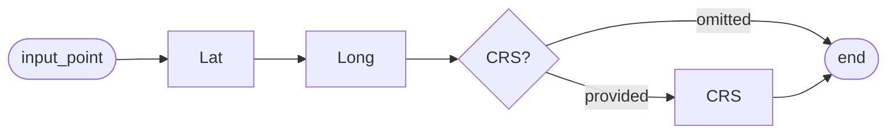
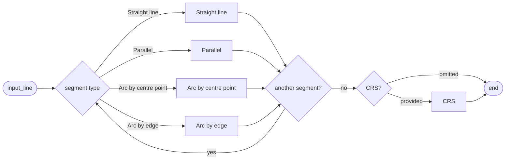
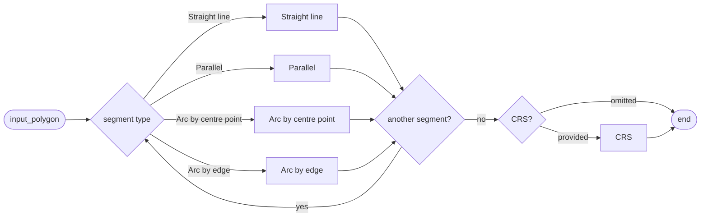
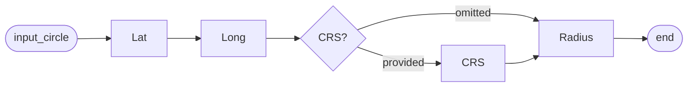
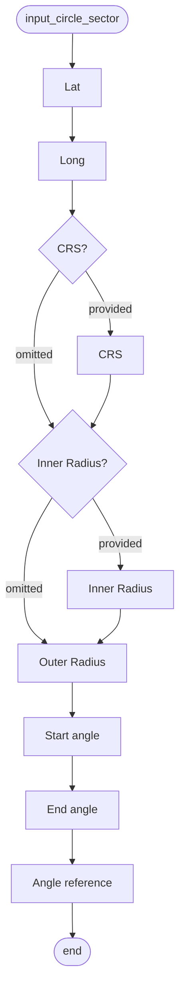
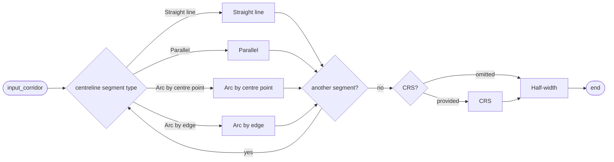

# Geometrical and geographical data

<!--
Source PDF: DNOTAM-Geometricalandgeographicaldata-270726-0214-28462.pdf

The source wording, terminology, structure, and data encoding rules are retained.
The railroad syntax diagrams in the PDF are represented as Mermaid flowcharts
so that they remain directly readable by Codex and other text-based tools.
-->

## Introduction

AIXM uses the OGC Geographical Markup Language (GML) version 3.2.1 for the encoding of positional and shape data of aeronautical information items, such as airspace, runway thresholds, navaids, etc. GML is an implementation of the ISO 19107 spatial schema, which contains an extensive list of geometries, geometric properties and operations.

GML can provide geographical data in a format that is suitable for spatial calculations and for direct graphical representation. For example, all latitude/longitude values are typically encoded as pairs in numerical format (degrees with decimals). By contrast, the information provided by aeronautical data originators and included in NOTAM messages is less "mathematical" and more descriptive. For example, arcs are sometimes described as "from point X, to point Y, with centre C and radius R", which contains more information than necessary. Typically, the radius information is rounded and the centre position is not exactly at the same distance from the start and end of the arc. This information needs to be translated into precise GML encodings, as explained in the AIXM 5 common coding rules for geometry.

There are three types of geometries that can be used in the description of the location/geometry of aeronautical data features: points, lines and polygons. Lines and polygons can be defined with straight lines, arcs of circle or parallels (points of constant latitude on the surface of the Earth). Apart from the general case of an arbitrary polygon, there are some sub-types of polygons for which the encoding/decoding needs to be defined separately: full circle, sector of circle and corridor (centreline and width). The purpose of this section is to define the coding patterns for the typical geographical and feature shape information that may appear in Digital NOTAM events.

It is recommended that the input forms of a data encoding application enables the graphical visualisation of the geometry that is encoded, with a suitable background. For geometries of type polygon, corridor and line, it is recommended that the input forms also enable to paste a series of lat/long positions at once, instead of requiring the input of each individual lat/long position in a separate input field.

## Geometry types

### Point

A Point is a single geographical position (such as the location of an obstacle, etc.) expressed as a pair of a latitude/longitude values, possibly with reference to a specific horizontal (geodetic) reference system. The following diagram indicates the typical elements provided by the data originator for a point location.

#### `input_point`

Point data shall be coded applying the general AIXM coding rules for Point data. Each scenario will indicate if a Point or an ElevatedPoint is necessary, in which case an elevation or similar input element would also appear in the input data for that scenario.

According to ICAO Annex 15, all aeronautical geographical data shall be expressed with reference with the WGS-84 reference system. Therefore, the WGS-84 CRS should appear as default in a data encoding interface. If another reference system is used, a corresponding `srsName` might need to be identified. For practical reasons, applications might need to limit the number of reference systems other than WGS-84 that are supported.

### Line

A Line is defined as a series of points connected through straight lines, arcs or parallels, located on the surface of the Earth or in a plane parallel with the surface of the Earth. The lat/long position of all points might be with reference to a specific geodetic reference system. An example of such as shape is the centreline of a taxiway. Each scenario concerned indicates if a Curve or an ElevatedCurve is necessary, in which case an elevation or similar input element would also appear in the input data for that scenario. The following diagram indicates the typical elements provided by the data originator for a line geometry.

#### `input_line`

The four options that are specified in the diagram are coded applying the general AIXM coding rules:

- **Straight Lines** - when using the shortest path between two points on the Surface of the Earth or in a plane parallel with the Surface of the Earth. Expressed as two lat/long pairs. Note that the two points should be at the same elevation.
- **Parallels** - when using a path that keeps a constant Latitude value on the Surface of the Earth or in a plane parallel with the surface of the Earth. Expressed as two lat/long pairs, in which the lat value is the same for both points.
- **Arc by Edge** - when using a path that keeps a constant geodesic distance from a specified centre point. Expressed as a lat/long value (the start of the arc) followed by a lat/long value for the position of the arc centre, a radius values and a lat/long value corresponding to the end of the arc.
- **Arc By Centre Point** - when using path that keeps a constant geodesic distance from a specified centre point. Expressed as a lat/long value (the start of the arc) followed by a lat/long value for the position of the arc centre, a radius values and a lat/long value corresponding to the end of the arc.

### Polygon

A Polygon is represented by series of points connected through straight lines, arcs or parallels, located on the surface of the Earth or in a plane parallel with the surface of the Earth. The first and the last position in these series of points are identical. Each scenario concerned indicates if a Surface or an ElevatedSurface is necessary, in which case an elevation or similar input element would also appear in the input data for that scenario. The following diagram indicates the typical elements provided by the data originator for a polygonal geometry, which are similar to the Line input data.

#### `input_polygon`

In fact, a polygon is coded as a sequence of lines which define a closed surface and which do not intersect. The coding guidelines for the four line options are indicated in the previous Line section. In addition, a polygon used in Digital NOTAM could also use a Navaid as centre point of an arc. In this particular case, the Navaid reference shall be encoded as explained in the coding guidelines for point references, using a point annotation.

The use of geographical or administrative features (such as State borders, rivers, sea shores, etc.) in the definition of polygon geometries is not supported. Individual scenarios concerned by this aspect (such as Ad-hoc special activity area - creation) provide suggestions/workarounds for the encoding of situations;

### Circle

A Circle is a type of polygon in which all the points are located at constant geodesic distance from the centre of the circle. An example of such a shape could be a CTR airspace. The following diagram indicates the typical elements provided by the data originator for a circle geometry.

#### `input_circle`

Circles shall be encoded as indicated in the general coding guidelines for Circle by Center Point.

### Circle Sector

A Circle Sector is a type of polygon that consists in part of a circle situated between two specified angular values and eventually between an inner and an outer radius. For example, an airspace defined as "a sector of 55 NM radius centred on VOR/DME REN between RDL 140 and 230 DEG". The following diagram indicates the typical elements provided by the data originator for a circle sector geometry.

#### `input_circle_sector`

A circle sector shall be coded as a sequence of:

- a geodesic from the centre to the start of the arc
- followed by an arc by centre point
- followed by a geodesic from the end of the arc to the arc centre.

> **Note:** the encoding of Circle Sector will result in a polygon that, when decoded into a textual description, will be described as a polygon, not as a sector of a circle. This is a limitation of the current specification. Identifying that a particular polygon is in fact a sector of a circle would require very complex rules, which might be defined in a future version of the specification.

### Corridor

A Corridor is a type of polygon for which the outer border is not defined explicitly but as the result of offsetting a centreline with a specified distance ("half-width") to the left and to the right of that centreline. The two lines are connected by arcs of circle.The following diagram indicates the typical elements provided by the data originator for a corridor geometry.

#### `input_corridor`

Corridors are supported only in the definition of an Airspace border and shall be coded as indicated in the general coding guidelines for Corridor geometries.

## SignificantPoint reference (using pointProperty)

As explained in the general AIXM guidance for coding geometrical and geographical data, the geometry of certain airspace might be defined in relation with a significant point:

- a DesignatedPoint could be part of the Surface that defines the horizontal projection of an Airspace;
- a Navaid or an AirportHeliport reference point could be the centre of a circular Airspace border;
- etc.

In Digital NOTAM such references can only be coded as `pointProperty.annotation` (see Point reference (pointProperty) - Point annotations) and only for the following data input elements:

- Line/Curve/Corridor `"straight line"` positions
- Line/Curve/Corridor `"parallel"` positions
- Line/Curve/Corridor `"Arc by centre point"` as centre position
- Circle/CircleSector as position of the centre of the circle/arc

## Data encoding rules

The data encoding rules provided in this section shall be followed in order to ensure the harmonisation of the digital encodings provided by different sources. The compliance with some of these encoding rules can be checked with automatic data validation rules (see next section).

| Identifier | Data encoding rules |
|---|---|
| ER-01 | If the geodetic reference system for coordinates is not specified, then it is assumed to be WGS-84. |
| ER-02 | In the case of a circle sector, if the reference angle is `"True North"`, then the values of the start angle and end angle shall be used as such in the GML encoding of the `ArcByCentrePoint`. |
| ER-03 | In the case of a circle sector, if the reference angle is `"Magnetic North"`, then the values of the start angle and end angle shall be automatically adjusted with the local magnetic variation in order to convert them into angles with reference to the True North, which will be used in the GML encoding of the `ArcByCentrePoint`. |
| ER-04 | In the case of a circle sector, if the reference angle is `"Radial"`, then a SignificantPoint reference must be provided (as `pointReference.annotation`) and it shall be a Navaid that includes a VOR or TACAN element. The values of the start angle and end angle shall be automatically adjusted with the declination value of the reference navaid in order to convert them into angles with reference to the True North, which will be used in the GML encoding of the `ArcByCentrePoint`. If the navaid declination is not known, then the local magnetic variation at the site of the navaid shall be used. |
