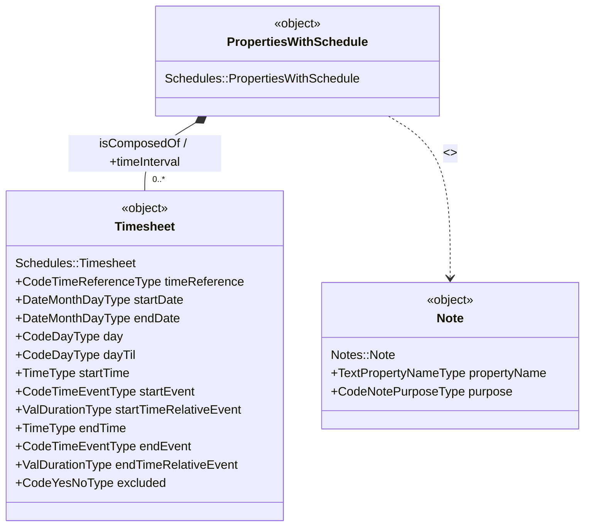
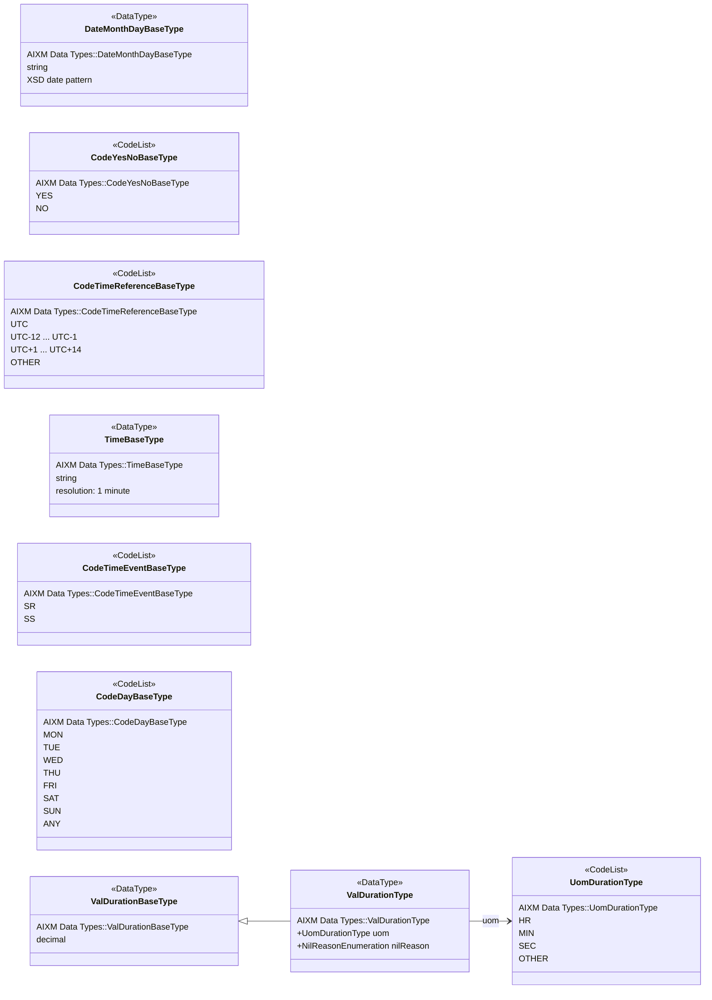
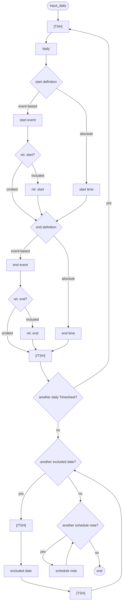
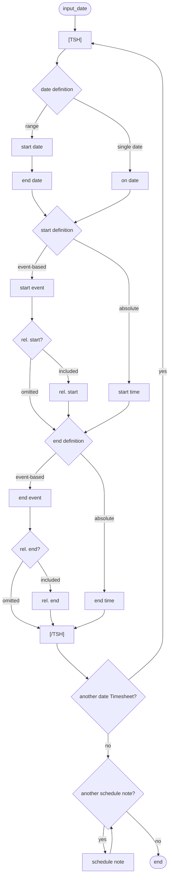
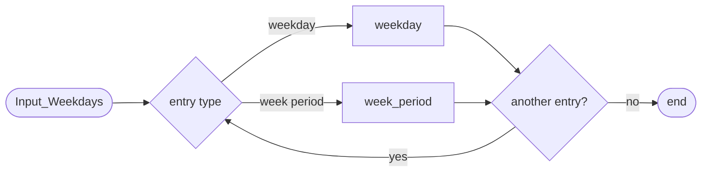
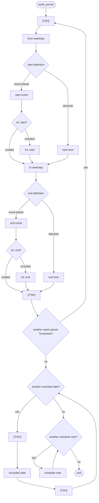
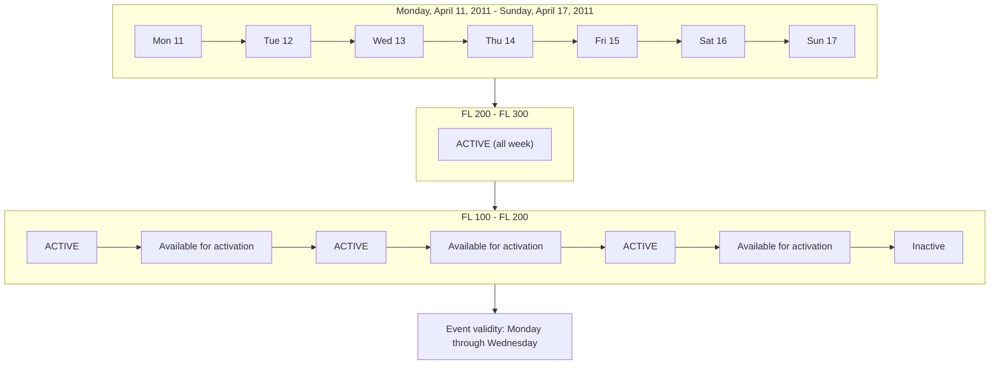

# Schedules

<!--
Source PDF: Schedules.pdf

Conversion principles:
- Source wording, terminology, identifiers, code values, EBNF, and tables are retained.
- Railroad syntax diagrams are represented as Mermaid flowcharts.
- UML diagrams are represented as Mermaid class diagrams plus explicit value tables.
- The calendar/level illustration is represented as Mermaid and a plain-text matrix.
-->

## Restrictions

The coding guidelines for the ICAO Data Sets include general coding rules for Schedules [PWS]. These are also applicable to Digital NOTAM Events.

However, more restrictive rules apply to NOTAM schedules, such as:

- the first/last time period of a schedule shall start/end at the start/end of validity of the Event. This needs to be verified with business rules;
- excluding the possibility to use `'HOL'` and other special dates.

This limitations lead to a smaller number of coding patterns for Digital NOTAM Event schedules, which are presented in this section.

### Contents

- [Supported schedules](#supported-schedules)
- [Not supported schedules](#not-supported-schedules)
- [UML class diagrams representation](#uml-class-diagrams-representation)
- [Specific coding patterns for Digital NOTAM](#specific-coding-patterns-for-digital-notam)
  - ["Daily" based schedules](#daily-based-schedules)
  - ["Date" based schedules](#date-based-schedules)
  - ["Days of the week" based schedules](#days-of-the-week-based-schedules)
- [Data input elements](#data-input-elements)
- [HMI aspects](#hmi-aspects)
  - [Grouping of similar daily schedules](#grouping-of-similar-daily-schedules)
  - [TEMPDELTA - additional versus complete hours](#tempdelta---additional-versus-complete-hours)
- [Data verification rules](#data-verification-rules)

## Supported schedules

There are three types of schedules supported for Digital NOTAM Events:

- daily schedules;
  - e.g. `"daily from 09:00 to 17:00"`;
- date based schedules, including `"on date"` and `"date range"` options;
  - e.g. `"1/10 09:00-15:00 and on 3/10 10:00-12:00"`;
- days of the week based schedules, including `"on weekday"`, or `"from weekday...to weekday"` options;
  - e.g. `"every Monday from 13:00 to sunset"`.

## Not supported schedules

Combining different schedule types in a single NOTAM is forbidden. It is considered that such combined schedules could become too complex for being understood and would have a high potential for providing conflicting information. For example, `"daily 0900-1700 and each MON 1900-2300"` would not have a clear meaning. Is the schedule for Mondays just 1900-2300, or is it both 0900-1700 and 1900-2300? Therefore, such combined schedules are not supported.

Note that the concept of `"weekday ranges"` (such as `"MON-WED"`) is also not supported in this specification. However, the automatic NOTAM generation rules for item D ensure that a set of consecutive weekdays with a similar start/end time will generate a `"weekday range"`, according to the OPADD recommendations. This does not exclude implementing an HMI that allows the input of weekday ranges, for efficiency reasons. They will have to be converted into individual weekday records in AIXM.

Also not supported are schedules that use both `startTime` and `StartEvent` or both `endTime` and `endEvent`, such as `"SR or 07:00, whichever is earliest"`. Such schedules are sometimes encountered for static data, as they need to cover longer time periods. It is not justified to use such combinations in a NOTAM schedule.

In addition, according to the OPADD, item D is not allowed to exceed 200 characters. The application interface should check the length of the item D that results from the schedule encoding and invite the operator to split the NOTAM into two separate events in case this limit is exceeded. The HMI should allow copying a draft event into a second draft event.

## UML class diagrams representation

The limitations identified above correspond to a subset of the general AIXM model for schedules. The following UML diagram shows only the classes and properties which may be used for Digital NOTAM coding. For reference, the full AIXM schedules model is described here: AIXM - Schedules).

### Schedule object model



### Data types and allowable value subsets

The data type or the sub-sets of allowable values that may be used in a Digital NOTAM encoding are shown below.



| Data type | Allowed values / notes |
|---|---|
| `AIXM Data Types::DateMonthDayBaseType` | A date value without year indication. Same each year. For example, `15-02`, `29-04`. |
| `AIXM Data Types::CodeYesNoBaseType` | `YES`, `NO`. A code for a logical value: Yes or No. |
| `AIXM Data Types::CodeTimeReferenceBaseType` | `UTC`, `UTC-12`, `UTC-11`, `UTC-10`, `UTC-9`, `UTC-8`, `UTC-7`, `UTC-6`, `UTC-5`, `UTC-4`, `UTC-3`, `UTC-2`, `UTC-1`, `UTC+1`, `UTC+2`, `UTC+3`, `UTC+4`, `UTC+5`, `UTC+6`, `UTC+7`, `UTC+8`, `UTC+9`, `UTC+10`, `UTC+11`, `UTC+12`, `UTC+13`, `UTC+14`, `OTHER`. A coded indication of a time reference system - UTC or local. |
| `AIXM Data Types::TimeBaseType` | A time (hours and minutes) value with a resolution of 1 minute. For example, `12:45`, `14:30`, `00:00`. |
| `AIXM Data Types::CodeTimeEventBaseType` | `SR`, `SS`. A code indicating an event occurrence during any day. For example, sunrise, sunset. |
| `AIXM Data Types::CodeDayBaseType` | `MON`, `TUE`, `WED`, `THU`, `FRI`, `SAT`, `SUN`, `ANY`. A code indicating a particular day. |
| `AIXM Data Types::ValDurationType` | Uses `uom: UomDurationType` and `nilReason: NilReasonEnumeration`. |
| `AIXM Data Types::UomDurationType` | `HR`, `MIN`, `SEC`, `OTHER`. |

## Specific coding patterns for Digital NOTAM

The Common coding patterns apply also for Digital NOTAM Event schedules, but with the limitations specified above. This means that only three types of schedules can be used in Digital NOTAM Events - `"Daily"`, `"date based"` or `"Weekday based"`.

## "Daily" based schedules

This applies to schedules that occur every day during the validity period of the data. However, it is possible to exclude specific dates from the applicable times of the schedule. For example:

- `"daily from 09:00 to 12:00 and from17:00 to 21:00"`
- `"daily from SR until 18:00 "`
- `"daily from 22:00 until 07:00"` (past midnight)
- `"daily from 07:00 to 23:00 except for 25 Dec and 1st Jan"`

The data input elements that are specified for such schedules are indicated in the diagram below.

### `input_daily` diagram



### EBNF source code

```ebnf
input_daily = "[TSH]" ("'daily'") ("start time" | ("start event" ["rel. start"])) ("end time" | ("end event"
["rel. end"])) "[/TSH]" { "[TSH]" ("'daily'") ("start time" | ("start event" ["rel. start"])) ("end time" |
("end event" ["rel. end"])) "[/TSH]"} \n
{"[TSH]" "excluded date" "[/TSH]"} {"schedule note"}.
```

## "Date" based schedules

This applies to schedules that occur on specific dates during the validity period of the data, without distinction between weekdays. It is not possible to specify a `"date/time period"` (such as `"from 09 SEP 07:00 until 16 SEP 16:00"`), only dates can be used (such as `"from 09 SEP until 16 SEP and on 18 SEP"`). For example:

- `"from 09 until 16 SEP and on 18 SEP, daily from SR until 18:00"` (note that this would require two separate Timesheets, one for 9-16 SEP and one for 18 SEP, as it is not possible to specify multiple `startTime/endTime` on a single Timesheet).

Although it would theoretically be possible to exclude dates from a date range, that might result into confusing item D values. Therefore, the possibility to exclude dates/days from this type of schedule is removed.

The data input elements that are specified for such schedules are indicated in the diagram below.

### `input_date` diagram



### EBNF source code

```ebnf
input_date = "[TSH]" (("start date" "end date") | "on date") ("start time" | ("start event" ["rel. start"]))
("end time" | ("end event" ["rel. end"])) "[/TSH]" { "[TSH]" (("start date" "end date") | "on date") ("start
time" | ("start event" ["rel. start"])) ("end time" | ("end event" ["rel. end"])) "[/TSH]"} {"schedule
note"}.
```

## "Days of the week" based schedules

This applies to schedules that occur with a weekly pattern, during the validity period of the data. It is possible to specify both individual weekdays (`MON`, `TUE`, etc.) and weekday periods (from `FRI 17:00` to `MON 07:00`). It is possible to exclude specific dates (but not holidays or other special dates!) from the applicable times of the schedule. For example:

- `"MON, TUE, WED, THU, FRI from 13:00 to sunset; SAT, SUN. from 13:00 to 15:00"` (this requires seven distinct Timesheet);
- `"SUN, 2300 (2200) to MON, 0500 (0400)"`
- `"MON to FRI, 09:00 to 17:00, excluding 09 SEP"` (`"MON to FRI"` is coded as five distinct Timesheet, but which have identical values for all fields, except for the `day` property)

The data input elements that are specified for such schedules are indicated in the following diagram.

### `Input_Weekdays` dispatcher



where:

### `weekday` diagram


### `week_period` diagram



### EBNF source code for the diagrams

```ebnf
Input_Weekdays = ("weekday" | "week_period") {"weekday" | "week_period"}.

weekday = "[TSH]" "on weekday" ("start time" | ("start event" ["rel. start"])) ("end time" | ("end event"
["rel. end"])) "[/TSH]" { "[TSH]" "on weekday" ("start time" | ("start event" ["rel. start"])) ("end time" |
("end event" ["rel. end"])) "[/TSH]"} \n
{"[TSH]" "excluded date" "[/TSH]"} {"schedule note"}.

week_period = "[TSH]" "from weekday" ("start time" | ("start event" ["rel. start"])) "to weekday" ("end
time" | ("end event" ["rel. end"])) "[/TSH]" { "[TSH]" "from weekday" ("start time" | ("start event" ["rel.
start"])) "to weekday" ("end time" | ("end event" ["rel. end"])) "[/TSH]"} \n
{"[TSH]" "excluded date" "[/TSH]"} {"schedule note"}.
```

## Data input elements

The following table provides the mapping of each information item within the AIXM 5.1.1 structure. The name of the variable (first column) is recommended for use as label of the data field in human-machine interfaces (HMI).

| Data Item | Coding | Comments |
|---|---|---|
| `[TS]` and `[/TS]` | All the elements that appear between `[TS]` and `[/TS]` are encoded as a single timesheet | |
| daily | `day='ANY'` | `Timesheet.startDate` and `Timesheet.endDate` should be left empty.<br><br>If the end time is 24:00, then the convention for `"end of day"` needs to be applied (coded as 00:00 of the next day or date), which means that `dayTil='ANY'`.<br><br>If the value of `"end time"` or `"end event"` is before the value of `"start time"` or `"start event"`, then it means that the Timesheet spans over midnight, which shall be coded with both `day='ANY'` and `dayTil='ANY'`. |
| start date | `Timesheet.startDate`<br><br>`Timesheet.day='ANY'` | |
| end date | `Timesheet.endDate` | `Timesheet.dayTil` should be left empty, unless:<br><br>- the end time is 24:00 - then the convention for `"end of day"` needs to be applied (coded as 00:00 of the next date and in addition `dayTil='ANY'`;<br>- the end time is past midnight - then `dayTil='ANY'` as well. |
| on date | `Timesheet.startDate` and `Timesheet.endDate`<br><br>`Timesheet.day='ANY'` | `"on date"` needs to be coded with both `startDate` and `endDate` having the same value, unless the end time is 24:00, in which case the convention for `"end of day"` needs to be applied and the `endDate` gets the value of the next date after the `startDate`.<br><br>`Timesheet.dayTil` should be left empty, unless the end time is 24:00, then the convention for `"end of day"` needs to be applied (in which case `dayTil='ANY'`). |
| on weekday | `Timesheet.day` | `Timesheet.dayTil` should be left empty, unless the end time is 24:00, then the convention for `"end of day"` needs to be applied:<br><br>- if `day='ANY'`, then `dayTil='ANY'`;<br>- if `day='MON'`, `'TUE'`, etc. then `dayTil` should get the value corresponding to the next week day (`'TUE'`, `'WED'`, etc.). |
| from weekday | `Timesheet.day` | |
| to weekday | `Timesheet.dayTil` | If the end time is 24:00, then the convention for `"end of day"` needs to be applied (coded as 00:00 of the next day). |
| start time | `Timesheet.startTime` | |
| start event | `Timesheet.startEvent` | |
| relative start | `Timesheet.startTimeRelativeEvent` | Positive values indicate that the actual start time is after the event. |
| end time | `Timesheet.endTime` | If the end time is 24:00, then the convention for `"end of day"` needs to be applied (coded as 00:00 of the next day or date). |
| end event | `Timesheet.endEvent` | |
| relative end | `Timesheet.endTimeRelativeEvent` | Positive values indicate that the actual end time is after the event. |
| excluded date | `Timesheet` | Each excluded date is coded as a separate Timesheet with `excluded='YES'`, `startDate` equal the `"excluded date"`, `endDate` equal to `"excluded date +1 day"`, `day='ANY'`, `dayTill='ANY'`, `startTime='00:00'`, `endTime='00:00'`, `timeReference='UTC+/-X'` (local time as UTC zone). |
| schedule note | Note associated with the class that owns the schedule | The Note shall have `propertyName='timeInterval'` and `purpose='REMARK'`. |

## HMI aspects

### Grouping of similar daily schedules

As it can be seen from the examples provided for each Digital NOTAM coding pattern for schedules, when several weekdays or several dates have the same daily schedule, the coding requires a separate Timesheet for each of these days or dates. For example:

- `"from 09 until 16 SEP and on 18 SEP, daily from SR until 18:00"` - requires two separate Timesheets, one for 9-16 SEP and one for 18 SEP, as it is not possible to specify multiple `startTime/endTime` on a single Timesheet).
- `"MON, TUE, WED, THU, FRI from 13:00 to sunset; SAT, SUN. from 13:00 to 15:00"` - requires five distinct Timesheet, but which have identical values for all fields, except for the `day` property)

Human operators using an HMI for coding/visualising schedules would expect to be able to input and see the data in a compact form, not as individual Timesheets. A similar grouping needs to be done for NOTAM production of schedules that appear in Item D, E - Schedules.

### TEMPDELTA - additional versus complete hours

As explained in the general coding rules for schedules - Relation with TimeSlice validity, a TEMPDELTA shall contain a complete description of the operating times.

Schedules are usually used when encoding availability or activation information, such as in the SAA.ACT, RTE.CLS, AD.CLS, etc. scenarios. In this situation, it is recommended that the input interface provides a `"calendar/level"` view of the activation/availability, enabling the operator to graphically visualise the status of the feature different times and levels (if applicable), such as in the example below.

#### Calendar/level illustration



Plain-text representation of the same source figure:

```text
                    Mon 11   Tue 12   Wed 13   Thu 14   Fri 15   Sat 16   Sun 17
FL 300  -------------------------------------------------------------------------
         |                         ACTIVE (all week)                           |
FL 200  -------------------------------------------------------------------------
         | ACTIVE | avail. | ACTIVE | avail. | ACTIVE | available | INACTIVE |
FL 150
FL 100  -------------------------------------------------------------------------

Event validity: from Monday through Wednesday.
Legend: Event data / Baseline data.
```

In the calendar view, the BASELINE information that remains valid during the Event validity time shall be visibly identified from the information that is specific to the Event, for example by using a different color and fill pattern.

The TEMPDELTA shall contain the complete definition of the activity times, including any eventual time ranges that are recuperated from the BASELINE schedules. Note that according to the OPADD, notification of a schedule modification by NOTAM shall be done by including the new schedule in item E, not in item D. Therefore, the list of Event Scenarios has to include separate scenarios for such situations.

## Data verification rules

The data verification rules provided in this section shall be followed in order to ensure the harmonisation of the digital encodings provided by different sources. These rules shall be used as complementing the General coding rules for Schedules defined in AIXM Coding Overview - Common Coding Rules - Common coding patterns. In case of contradiction, the rules described below are superseding the general ones.

| Identifier | Data encoding rule | Remarks (column to be deleted at the end) |
|---|---|---|
| `TSH.EVT-01` | Any Timesheet that is part of a TimeSlice associated with an Event that `isNotifiedBy NOTAM` shall have `timeReference='UTC'` (except if has `excluded='Yes'`) | In NOTAM is mandatory to use UTC times only. |
| `TSH.EVT-02` | Any Timesheet that is part of a TimeSlice associated with an Event that `isNotifiedBy NOTAM` shall have `daylightSavingAdjust='NO'` | In NOTAM it is not allowed to use auto-adjusted summer time values. |
| `TSH.EVT-03` | Any Timesheet that is part of a TimeSlice associated with an Event that `isNotifiedBy NOTAM` and that has assigned values for `startDate` and `endDate`, must have `day` equal-to `'ANY'`. | In NOTAM it is not possible to mix date ranges with week days. |
| `TSH.EVT-04` | Any Timesheet that is part of a TimeSlice associated with an Event that `isNotifiedBy NOTAM` cannot use `'WORK_DAY'`, `'BEF_WORK_DAY'`, `'AFT_WORK_DAY'`, `'HOL'`, `'BEF_HOL'`, `'AFT_HOL'` and `'BUSY_FRI'` as `day` or `dayTill` values. | HOL and similar are not allowed in NOTAM schedules |
| ~~`TSH.EVT-05`~~ | ~~It is not allowed to use `"overnight"` time periods in Event Schedules.~~ | ~~It is not allowed to use `"overnight"` time periods in Schedules, e.g. `2200-0600`. These shall be split into two separate time periods, e.g. `2200-2400` and `0000-0600`.~~ |
| `new` | The `startTimeRelativeEvent@uom` cannot be other-than `'MIN'` | proposed by Indra/Avitech, based on OPADD 4.1, section 2.3.20.2 |
| `new` | The `endTimeRelativeEvent@uom` cannot be other-than `'MIN'` | proposed by Indra/Avitech, based on OPADD 4.1, section 2.3.20.2 |
| `new` | The `startTimeRelativeEvent` value cannot be higher-than 99 | proposed by Indra/Avitech, based on OPADD 4.1, section 2.3.20.2 |
| `new` | The `endTimeRelativeEvent` value cannot be higher-than 99 | proposed by Indra/Avitech, based on OPADD 4.1, section 2.3.20.2 |
| `new` | It is not allowed to have both `startTime` and `startEvent` in the same Timesheet | following comments made in the decoding scenarios |
| `new` | It is not allowed to have both `endTime` and `endEvent` in the same Timesheet | following comments made in the decoding scenarios |
| `new` | It is not allowed to code annotations for Timesheet. | there is no obvious way for decoding such notes in relation with a pareticular element of the item D, knowing that the note itself would go in item E. Any schedule notes should be coded at the level of the parent object. |
